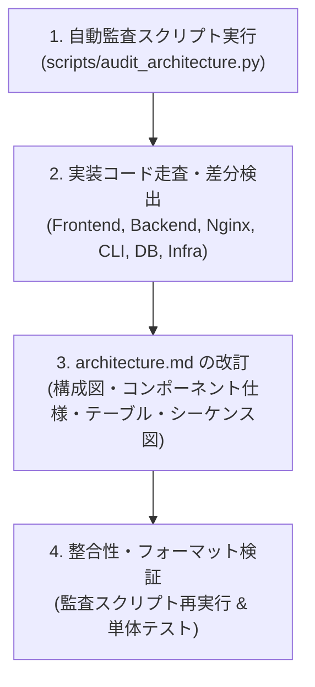

# update-architecture-doc (game-db アーキテクチャ設計書更新スキル)

本スキルは、`game-db` プロジェクトの実装コード（フロントエンド、バックエンド、リバースプロキシ、データベース、CLI、ストレージ仕様）を走査・監査し、システムアーキテクチャ設計書（[`docs/architecture.md`](file:///Volumes/DataDrive/programs/game-db/docs/architecture.md)）を最新の実装と完全に整合した状態に更新するための runbook です。

---

## 1. ワークフロー概要



---

## 2. 手順

### ステップ 1: 自動監査ツールの実行

まずは同梱の自動監査ツールを実行し、現在の `docs/architecture.md` と実装コードの間の乖離（未記載の API エンドポイント、画面コンポーネント、スキーマカラム、旧コンポーネント名など）を素早く特定します。

```sh
python .agents/skills/update-architecture-doc/scripts/audit_architecture.py
```

- スクリプト参照: [audit_architecture.py](./scripts/audit_architecture.py)
- チェックリスト参照: [architecture-checklist.md](./references/architecture-checklist.md)

---

### ステップ 2: 実装レイヤー別の詳細監査

以下の対応表に従って各レイヤーの実装コードを確認し、ドキュメントに反映すべき変更点・追加機能を整理します。

| レイヤー | 主要実装ファイル | 監査・確認ポイント |
| :--- | :--- | :--- |
| **フロントエンド** | `my-qa-dashboard/src/App.tsx`<br/>`src/components/*.tsx`<br/>`src/router/*.ts`<br/>`src/hooks/useDuckDB.ts` | ・新画面 (`ComparePage`, `TrendsPage`) の機能・差分集計ロジック<br/>・メディア閲覧 (`MediaViewer`) と動画/画像ギャラリー<br/>・アーティファクト管理 (`ArtifactsPanel`) と `client-zip` 一括圧縮<br/>・ディープリンク (`useAppRouter`) とクエリパラメータ同期<br/>・チャート・動画のミリ秒タイムライン双方向同期<br/>・コード分割 (`React.lazy`, `Suspense`) と Rollup チャンク構成<br/>・リグレッション判定しきい値 (`config/thresholds.ts`) |
| **バックエンド API** | `onprem/backend/main.py`<br/>`onprem/backend/db.py`<br/>`onprem/backend/cleanup.py` | ・全エンドポイント (`/api/health`, `/api/storage/*`, `/api/search`, `/api/keys`, `/api/upload/*`)<br/>・ディスククォータ監視 (`HTTP 507`) と改ざん防止 (`HTTP 409`, `--overwrite`)<br/>・`cleanup.py` による定期パージ仕様（動画/ダンプ削除、メタデータ恒久保護）<br/>・匿名アップロード (`ALLOW_ANONYMOUS_UPLOAD`)・CORS 設定 |
| **リバースプロキシ** | `onprem/nginx/nginx.conf`<br/>`onprem/docker-compose.yml` | ・各パスの配信仕様（`/`, `/duckdb-wasm/`, `/data/runs/`, `/api/upload/`, `/api/`）<br/>・OAuth2-Proxy 連携 (`auth_request`) と CLI 用認証バイパス<br/>・ゼロコピー配信 (`sendfile`, `aio threads`, Range リクエスト) |
| **アップロード CLI** | `cli/qa_upload.py`<br/>`cli/README.md` | ・サブコマンド (`upload`, `login`)<br/>・オンプレミス HTTP ストリーミング と AWS S3 のデュアル対応<br/>・Google OAuth 2.0 PKCE 認証とトークンキャッシュ (`~/.config/game-qa/token.json`)<br/>・ffmpeg 自動トランスコード (`capture_web.mp4`)<br/>・Manifest v2.0 と 9 種別のアーティファクト分類 |
| **データベース** | `onprem/backend/db.py` | ・SQLite WAL モード (`PRAGMA journal_mode = WAL;`)<br/>・`test_runs` テーブル定義、全カラム、複合インデックス<br/>・`api_keys` テーブル定義、ハッシュ照合インデックス |
| **ストレージ & 成果物** | `public/sample_data/`<br/>`scripts/generate_sample_data.py` | ・`/data/runs/{run_id}/` ディレクトリ構造<br/>・`manifest.json` のフラットなトップレベル構造 (`schema_version: "2.0"`) |
| **クラウドインフラ** | `infra/README.md`<br/>`infra/lib/main-stack.ts` | ・旧 AWS CDK スタックの**廃止 (Deprecated / Retired)** 状況とオンプレミス移行の経緯 |

---

### ステップ 3: `docs/architecture.md` の改訂

設計書を最新化する際は、以下のルールを遵守してください。

1. **システム構成図 (Mermaid) の更新**:
   - フロントエンド（SPA）の主要画面・機能（Search, Compare, Trends, MediaViewer, ArtifactsPanel, Router, DuckDB-WASM）を明記。
   - バックエンド API（Upload, Search, Keys, Storage & Cleanup, Health）を反映。
   - CLI のデュアルモード（HTTP ストリーミング / AWS S3）およびトランスコード機能を反映。
2. **画面機能一覧の正確性**:
   - `VideoPlayer` ではなく `MediaViewer`（動画シーク再生 + スクリーンショットギャラリー + タイムライン同期）。
   - `ApiKeyModal` ではなく `AccessKeyModal`。
   - `ComparePage`（2-run 横並び比較、FPS/Memory 差分、回帰検知しきい値、ファイル競合防止）。
   - `TrendsPage`（複数 Run 時系列品質トレンド、合格率・平均FPS・ピークメモリ KPI サマリ）。
   - `ArtifactsPanel`（全アーティファクト一覧、カテゴリフィルタ、ブラウザ内プレビュー、`client-zip` 一括圧縮）。
   - ルーティングとディープリンク（URL クエリパラメータ双方向同期、1 クリック共有）。
3. **API 仕様の完全性**:
   - `GET /api/health`, `GET /api/storage/status`, `POST /api/storage/cleanup`, `GET /api/search` を追記。
4. **`manifest.json` スキーマの整合性**:
   - `summary` ネストではなく、トップレベルの `avg_fps`, `total_size_bytes`, `duration_seconds`, `device_model`, `triggered_by`, `schema_version: "2.0"` を正確に記載。
5. **旧 AWS クラウドインフラの廃止明記**:
   - DynamoDB / CDK スタックがオンプレミス SQLite WAL に完全移行・廃止された旨の明記。

---

### ステップ 4: 検証と完了確認

ドキュメント更新後、以下の検証を実施して抜け漏れがないことを確認します。

1. **自動監査ツールの再実行**:
   ```sh
   python .agents/skills/update-architecture-doc/scripts/audit_architecture.py
   ```
   → `✓ All architectural components and features are accurately documented!` が出力されること。
2. **既存テストスイートの実行**:
   ```sh
   # フロントエンド単体テスト & ビルド
   cd my-qa-dashboard && npm run test && npm run lint && npm run build && cd ..

   # バックエンド単体テスト
   python3 -m unittest discover -s onprem/backend -p 'test_*.py'

   # CLI 単体テスト
   python3 -m unittest cli/test_qa_upload.py
   ```
3. **コミット規約の遵守**:
   - Git コミットメッセージは**日本語**で作成すること（例: `docs: システムアーキテクチャ設計書を最新実装に合わせて更新`）。
