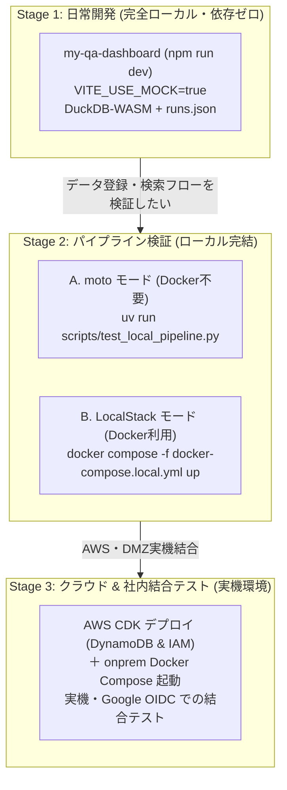

# Game QA Analytics Dashboard

ゲーム開発向けのクライアントサイド QA アナリティクスダッシュボードと、社内オンプレミス運用環境および AWS DynamoDB 連携を統合したリポジトリです。

ブラウザ内の **DuckDB-WASM** による超高速なローカル集計・可視化を中核とし、社内 DMZ / オンプレミス環境（Nginx + OAuth2-Proxy + FastAPI）による Web 認証・大容量データストレージ（30GB制限完全撤廃）・API、**AWS DynamoDB による検索インデックス**、および **個人用 API キー連携によるアップロード CLI** のハイブリッド構成をとっています。

---

## 目次

1. [リポジトリ構成](#リポジトリ構成)
2. [アーキテクチャ概要](#アーキテクチャ概要オンプレミス--aws-ハイブリッド)
3. [推奨する 3 段階の開発フロー](#推奨する-3-段階の開発フロー)
   - [Stage 1: 日常開発 / フロントエンド・分析機能（完全ローカル・依存ゼロ）](#stage-1-日常開発--フロントエンド分析機能完全ローカル依存ゼロ)
   - [Stage 2: パイプライン検証 / CLI 〜 オンプレミス バックエンド 〜 DynamoDB 〜 検索（ローカル完結）](#stage-2-パイプライン検証--cli--オンプレミス-バックエンド--dynamodb--検索ローカル完結)
   - [Stage 3: クラウド & 社内結合テスト / 実機環境デプロイ（AWS DynamoDB + オンプレミス連携）](#stage-3-クラウド--社内結合テスト--実機環境デプロイaws-dynamodb--オンプレミス連携)
4. [クイックスタート・コマンド集](#クイックスタートコマンド集)
5. [ドキュメント一覧](#ドキュメント一覧)

---

## リポジトリ構成

```text
game-db/
├── my-qa-dashboard/     # React 19 + TypeScript + Vite 8 + DuckDB-WASM ダッシュボード
│   ├── src/             # フロントエンドソースコード (ECharts, LogTable, Auth, Search, KeyModal)
│   ├── public/          # モックデータ (runs.json) およびサンプル実行データ (run-XXX/)
│   └── scripts/         # サンプルデータ生成スクリプト (generate_sample_data.py)
├── onprem/              # 社内オンプレミス運用環境 (Docker Compose)
│   ├── docker-compose.yml # Nginx + OAuth2-Proxy + Backend (FastAPI) 3コンテナ構成
│   ├── nginx/           # 内部 Nginx 設定 (SPA配信, /data/* 高速直配信, OAuth2-Proxy連携)
│   ├── backend/         # バックエンド API (検索, 大容量ストリーミングアップロード, APIキー管理)
│   └── .env.example     # 環境変数サンプル (Google OAuth, AWS DynamoDB, DMZ設定)
├── cli/                 # QA テスト結果アップロード CLI (Python)
│   ├── qa_upload.py     # アップロードスクリプト (HTTPオンプレミス/S3マルチパート対応, 30GB制限撤廃)
│   ├── test_qa_upload.py# CLI 単体テスト
│   └── README.md        # CLI 詳細ドキュメント
├── infra/               # AWS CDK (TypeScript) インフラコード & ポリシー
│   ├── onprem-dynamodb-policy.json # オンプレミス連携用 DynamoDB 最小権限 IAM ポリシー
│   ├── lib/             # CDK スタック定義 (DynamoDB 検索インデックスおよびオンプレミス用 IAM ユーザー)
│   └── bin/             # CDK アプリエントリポイント
├── scripts/             # ローカル開発・検証支援スクリプト
│   ├── test_local_pipeline.py # Stage 2 パイプライン検証テスト (moto / LocalStack)
│   └── init-localstack.sh     # LocalStack 初期化スクリプト
├── docs/                # 詳細設計ドキュメント
│   ├── dmz-reverse-proxy-guide.md # 社内 DMZ 側リバースプロキシ (HTTPS終端) 設定ガイド
│   └── aws-architecture.md   # AWS クラウドデプロイアーキテクチャ設計書
├── docker-compose.local.yml   # LocalStack 開発用 Compose 定義
└── README.md            # 本ドキュメント
```

---

## アーキテクチャ概要（オンプレミス + AWS ハイブリッド）

社内向けサービス特化、CloudFront の 30GB 単一ファイルサイズ制限の撤廃、およびクラウド転送・ストレージコスト削減のため、**データ保存と Web サービスホスティングを社内 DMZ / オンプレミス環境へ移行**し、**検索インデックス（AWS DynamoDB）および Google アカウント認証（Google OIDC）とハイブリッド連携**する構成をとっています。

- **データエンジン**: **DuckDB-WASM** がブラウザ内で直接動作。Nginx から配信されるローカルディスク/社内NAS上の大容量 CSV/JSON/ログ/動画を仮想ファイルシステムに読み込み、ミリ秒単位で集計・可視化。
- **Web 認証 & ホスティング**: **社内 DMZ リバースプロキシ（HTTPS 終端）+ OAuth2-Proxy + Nginx**。Google アカウントによる組織ドメイン制限とセッション Cookie で SPA・データ・API を一元保護。
- **大容量データストレージ (30GB制限撤廃)**: サーバー上のローカルストレージまたは社内 NAS 領域に直接保存。Nginx の `sendfile` / Range リクエスト機能により、数十GB超のゲームプレイ動画もゼロコピーで超高速シーク再生が可能。
- **検索インデックス**: **AWS DynamoDB**（`GameQaDashboard-SearchIndex`）をそのまま継続利用。オンプレミスバックエンドが最小権限 IAM ポリシーで連携。
- **CLI アップロード**: Web 画面で発行した **個人用 API キー** による非対話アップロード。バックエンドのストリーミング API への PUT により、巨大ファイルもメモリ負荷なく保存され、`manifest.json` アップロード時に DynamoDB へ自動インデックス。

詳細な DMZ リバースプロキシ連携仕様は [`docs/dmz-reverse-proxy-guide.md`](docs/dmz-reverse-proxy-guide.md) を参照してください。

---

## 推奨する 3 段階の開発フロー

AWS サービスや Google OAuth に依存する機能を効率よく開発・検証するため、**「モック中心の超高速開発」から「実機クラウド結合」までの 3 段階のフロー** を整備しています。



---

### Stage 1: 日常開発 / フロントエンド・分析機能（完全ローカル・依存ゼロ）

**作業対象の 9 割（UI改善、グラフ描画、DuckDB SQL チューニング、ログビューア拡張、ローカルファイル読み込み機能）はこのステージで完結します。**

- **特徴**:
  - AWS アカウント、Google アカウント、Docker すべて**不要**。
  - `VITE_USE_MOCK=true`（デフォルト）により、認証ガードは自動バイパスされ、ログイン画面を介さずダッシュボードへ直行します。
  - 検索データは `public/mock_data/runs.json`、メトリクスデータは `public/sample_data/run-XXX/` から読み込まれます。

- **起動方法**:

  ```sh
  cd my-qa-dashboard
  npm install
  npm run dev
  ```

  ブラウザで `http://localhost:5173` を開くだけで即座に開発できます。

- **モックデータの再生成**:
  異なる条件（FPS低下、メモリリーク、テスト失敗など）のテストデータを増やしたい場合は、Python スクリプトで簡単に再生成できます：

  ```sh
  cd my-qa-dashboard
  uv run scripts/generate_sample_data.py
  ```

---

### Stage 2: パイプライン検証 / CLI 〜 オンプレミス バックエンド 〜 DynamoDB 〜 検索（ローカル完結）

**アップロード CLI の変更、FastAPI による大容量ストリーミング保存、manifest 自動パース & DynamoDB インデックス、検索 API の連携を一気通貫でローカル検証したい場合のステージです。**

#### 方法 A: インメモリ軽量テスト（Docker 不要・最速）

`moto` を利用して DynamoDB をインメモリでエミュレートし、テスト用 FastAPI バックエンドサーバーに対して CLI から HTTP アップロード・検索検証を自動実行します。Docker デーモン不要で数秒で全行程をテストできます。

```sh
# リポジトリルートから実行
uv run scripts/test_local_pipeline.py
```

実行される内容:

1. モック DynamoDB テーブル (`GameQaDashboard-SearchIndex` + 3つの GSI) を初期化
2. バックエンド FastAPI サーバーをローカル一時ポートで起動し、テスト用ストレージと API キーを準備
3. テスト用の run 成果物（CSV, ログ, 動画ダミー等）を生成
4. `qa_upload.py` を実行して HTTP 経由で直接ストリーミングアップロード
5. ローカルストレージへの保存および DynamoDB への自動インデックス登録を検証
6. 検索 API (`/api/search`) を各検索フィルタ条件で呼び出し、結果サマリを検証

#### 方法 B: LocalStack コンテナ環境（Docker 利用）

実際にバックグラウンドで DynamoDB エミュレータを常駐させ、オンプレミス環境や CLI コマンドを手動で叩いて動作確認したい場合に使用します。

1. **LocalStack の起動**:

   ```sh
   docker compose -f docker-compose.local.yml up -d
   ```

   ※初期化スクリプト (`scripts/init-localstack.sh`) により、GSI 付き DynamoDB テーブルが自動作成されます。

2. **パイプラインテストの実行**:

   ```sh
   uv run scripts/test_local_pipeline.py --endpoint-url http://localhost:4566
   ```

---

### Stage 3: クラウド & 社内結合テスト / 実機環境デプロイ（AWS DynamoDB + オンプレミス連携）

**AWS 側の DynamoDB 検索インデックスを CDK でデプロイし、オンプレミス Docker Compose 環境（OAuth2-Proxy, Nginx, Backend）と結合して最終検証するステージです。**

#### 1. 前提準備 (Google Cloud Console)

- [Google API Console](https://console.developers.google.com/) でプロジェクトを作成し、OAuth 同意画面を設定。
- **Web アプリケーション クライアント**: OAuth2-Proxy 用（承認済みのリダイレクト URI に `https://<your-domain>/oauth2/callback` を登録）。

#### 2. AWS クラウドリソースのデプロイ (CDK)

```sh
# 1. CDK で DynamoDB テーブルとオンプレミス用 IAM ユーザーをデプロイ
npm --prefix infra run build
npx --prefix infra cdk deploy

# 2. 作成された IAM ユーザー (GameQaDashboardOnpremUser) のアクセスキーを発行
```

#### 3. オンプレミス Docker Compose 環境の起動

```sh
# 1. SPA を本番ビルド (Nginx で静的ホスティング)
npm --prefix my-qa-dashboard run build

# 2. 環境変数を設定 (Google OAuth クライアントID/シークレット、AWS クレデンシャル)
cp onprem/.env.example onprem/.env
# onprem/.env を編集してアクセスキー等を設定

# 3. Docker Compose 起動 (Nginx, OAuth2-Proxy, Backend)
docker compose -f onprem/docker-compose.yml up -d
```

#### 4. Web 画面で API キーを発行して CLI アップロード

ブラウザでダッシュボードを開いて右上の「API Keys」から個人用 API キーを発行し、CLI からアップロードします：

```sh
export QA_SERVER_URL="http://localhost:8080"
export QA_API_KEY="gqa_live_xxxxxxxxxxxxxxxxxxxxxxxx"

uv run cli/qa_upload.py upload \
  --server-url "$QA_SERVER_URL" \
  --api-key "$QA_API_KEY" \
  --run-dir ./my-qa-dashboard/public/sample_data/run-001 \
  --run-id run-cloud-001 \
  --game-version v1.0.0 \
  --platform PS5 \
  --test-name Cloud_Verification \
  --result PASSED \
  --avg-fps 60.0
```

### オンプレミス本番・検証運用 (`onprem/`)

社内 DMZ リバースプロキシ配下で稼働する Docker Compose 環境の起動手順です。

```sh
# 1. SPA を本番ビルド (Nginx で静的ホスティング)
npm --prefix my-qa-dashboard run build

# 2. 環境変数を設定 (初回のみ)
cp onprem/.env.example onprem/.env
# onprem/.env を編集して Google OAuth / AWS DynamoDB の設定を入力

# 3. Docker Compose 起動 (Nginx, OAuth2-Proxy, Backend)
docker compose -f onprem/docker-compose.yml up -d

# 4. CLI からのオンプレミス直接アップロード (Web画面で発行した API キーを使用)
export QA_SERVER_URL="http://localhost:8080" # または DMZ 経由の https://qa-dashboard...
export QA_API_KEY="gqa_live_xxxxxxxxxxxxxxxxxxxxxxxx"

uv run cli/qa_upload.py upload \
  --server-url "$QA_SERVER_URL" \
  --api-key "$QA_API_KEY" \
  --run-dir ./my-qa-dashboard/public/sample_data/run-001 \
  --run-id run-onprem-001 \
  --game-version v1.0.0 \
  --platform PS5 \
  --test-name Onprem_Verification \
  --result PASSED \
  --avg-fps 60.0
```

---

## クイックスタート・コマンド集

### フロントエンド (`my-qa-dashboard/`)

```sh
npm run dev      # 開発サーバー起動 (Vite, http://localhost:5173)
npm run build    # 型チェック (tsc -b) & 本番ビルド (vite build)
npm run lint     # oxlint による高速静的解析
npm run preview  # ビルド成果物のローカルプレビュー
```

### アップロード CLI (`cli/`)

```sh
uv run cli/qa_upload.py --help          # コマンド一覧・ヘルプ
uv run cli/qa_upload.py login --help    # ログインオプション
uv run cli/qa_upload.py whoami          # 現在の認証アカウントと有効期限
uv run cli/qa_upload.py logout          # トークンキャッシュ削除
python3 cli/test_qa_upload.py           # CLI 単体テスト (25テスト)
```

### インフラ & パイプライン検証

```sh
uv run scripts/test_local_pipeline.py   # Stage 2 パイプライン検証 (moto)
docker compose -f docker-compose.local.yml up -d # LocalStack 起動
npm --prefix infra run build            # CDK コードの TypeScript コンパイル
```

---

## ドキュメント一覧

- [今後の開発計画書 (`docs/plan.md`)](docs/plan.md): 自動テスト収集・リグレッション分析に向けた課題分析・目標アーキテクチャ・ロードマップ。
- [AWS デプロイ構成案 (`docs/aws-architecture.md`)](docs/aws-architecture.md): Google OIDC / Lambda@Edge / WAF / S3 / DynamoDB の全体設計書。
- [QA Upload CLI ドキュメント (`cli/README.md`)](cli/README.md): CLI の詳細オプション、Google OAuth 認証仕様、トークン管理。
- [インフラ CDK アプリ ドキュメント (`infra/README.md`)](infra/README.md): CDK のデプロイ手順、スタック構成。
- [リポジトリ運用ルール (`AGENTS.md`)](AGENTS.md): コーディング規約、DuckDB-WASM 運用ルール、サンプルデータ生成規則。
