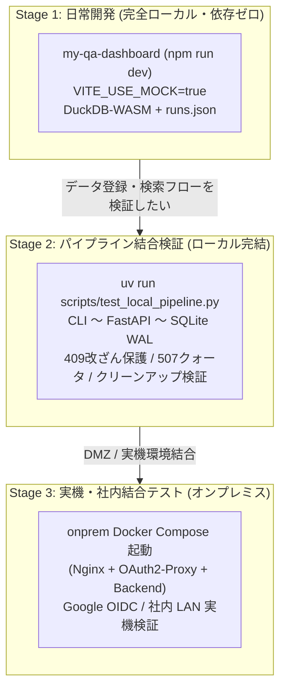

# Game QA Analytics Dashboard

ゲーム開発向けのクライアントサイド QA アナリティクスダッシュボードと、社内オンプレミス運用環境を統合したリポジトリです。

ブラウザ内の **DuckDB-WASM**（自前配信）による超高速なローカル集計・可視化を中核とし、社内 DMZ / オンプレミス環境（Nginx + OAuth2-Proxy + FastAPI + SQLite WALモード）による Web 認証・大容量データストレージ（30GB制限完全撤廃）・ディスク容量クォータ保護・改ざん防止・自動クリーンアップ、および **個人用 API キー連携によるアップロード CLI** の完全自律型オンプレミス構成をとっています。

---

## 目次

1. [リポジトリ構成](#リポジトリ構成)
2. [アーキテクチャ概要（完全オンプレミス自律構成）](#アーキテクチャ概要完全オンプレミス自律構成)
3. [推奨する 3 段階の開発フロー](#推奨する-3-段階の開発フロー)
   - [Stage 1: 日常開発 / フロントエンド・分析機能（完全ローカル・依存ゼロ）](#stage-1-日常開発--フロントエンド分析機能完全ローカル依存ゼロ)
   - [Stage 2: パイプライン検証 / CLI 〜 オンプレミス バックエンド 〜 SQLite 〜 検索（ローカル完結）](#stage-2-パイプライン検証--cli--オンプレミス-バックエンド--sqlite--検索ローカル完結)
   - [Stage 3: 実機・社内結合テスト / オンプレミス環境デプロイ（Docker Compose）](#stage-3-実機社内結合テスト--オンプレミス環境デプロイdocker-compose)
4. [クイックスタート・コマンド集](#クイックスタートコマンド集)
5. [ドキュメント一覧](#ドキュメント一覧)

---

## リポジトリ構成

```text
game-db/
├── my-qa-dashboard/     # React 19 + TypeScript + Vite 8 + DuckDB-WASM ダッシュボード
│   ├── src/             # フロントエンドソースコード (ECharts, LogTable, Auth, Search, KeyModal)
│   ├── public/          # モックデータ (runs.json) および DuckDB-WASM セルフホストバイナリ
│   └── scripts/         # サンプルデータ生成スクリプト (generate_sample_data.py)
├── onprem/              # 社内オンプレミス運用環境 (Docker Compose)
│   ├── docker-compose.yml # Nginx + OAuth2-Proxy + Backend (FastAPI) 3コンテナ構成 (Healthcheck, Logging)
│   ├── deploy.sh        # 本番環境デプロイ & 検証スクリプト (Pre-flight チェック付き)
│   ├── scripts/         # 運用スクリプト (backup_db.sh, run_cleanup.sh)
│   ├── nginx/           # 内部 Nginx 設定 (SPA配信, /data/* 高速直配信, Gzip, セキュリティヘッダー, 監視バイパス)
│   ├── backend/         # バックエンド API (検索, 大容量ストリーミングアップロード, APIキー管理, backup.py, cleanup.py)
│   ├── .env.example     # 環境変数サンプル (Google OAuth, ストレージクォータ, 永続化ホストパス)
│   └── README.md        # オンプレミス本番運用・障害復旧ガイド
├── cli/                 # QA テスト結果アップロード CLI (Python)
│   ├── qa_upload.py     # アップロードスクリプト (HTTPストリーミング, 30GB制限撤廃, --overwrite改ざん保護対応)
│   ├── test_qa_upload.py# CLI 単体テスト (28テスト)
│   └── README.md        # CLI 詳細ドキュメント
├── infra/               # [DEPRECATED / 廃止] 旧 AWS CDK インフラコード (破棄手順案内)
├── scripts/             # ローカル開発・検証支援スクリプト
│   └── test_local_pipeline.py # Stage 2 パイプライン結合テスト (FastAPI + SQLite WAL + 409/507保護)
├── docs/                # 詳細設計ドキュメント
│   ├── architecture.md  # システムアーキテクチャ設計書 (完全オンプレミス自律構成)
│   └── dmz-reverse-proxy-guide.md # 社内 DMZ 側リバースプロキシ (HTTPS終端) 設定ガイド
└── README.md            # 本ドキュメント
```

---

## アーキテクチャ概要（完全オンプレミス自律構成）

社内向けサービス特化、CloudFront の 30GB 単一ファイルサイズ制限の撤廃、クラウド転送・ストレージコストの全廃、および外部 CDN 障害リスクを根絶するため、**データ保存、検索インデックス（SQLite WAL）、および DuckDB-WASM 配信をすべて社内 DMZ / オンプレミス環境へ集約**した自律型アーキテクチャです。

- **データエンジン**: **DuckDB-WASM**（自前配信バイナリ）がブラウザ内で直接動作。Nginx から配信される大容量 CSV/JSON/ログ/動画を仮想ファイルシステムに読み込み、ミリ秒単位で集計・可視化。
- **Web 認証 & ホスティング**: **社内 DMZ リバースプロキシ（HTTPS 終端）+ OAuth2-Proxy + Nginx**。Google アカウントによる組織ドメイン制限とセッション Cookie で SPA・データ・API を一元保護。
- **大容量データストレージ (30GB制限撤廃)**: サーバー上のローカルストレージまたは社内 NAS 領域に直接保存。Nginx の `sendfile` / Range リクエスト機能により、数十GB超のゲームプレイ動画もゼロコピーで超高速シーク再生が可能。
- **ストレージ保護 & 自動クリーンアップ**:
  - **ディスク容量クォータ監視**: アップロード時に空き容量（10%未満または1GB未満）をチェックし、不足時は `HTTP 507 Insufficient Storage` で安全に拒絶。
  - **大容量ファイル自動パージ (`cleanup.py`)**: 保持期間（デフォルト30日）を超過した過去 Run の大容量ファイル（動画・ダンプ）を自動削除し、CSV メトリクス・ログ・manifest は恒久保存。
  - **Run 改ざん保護 (409 Conflict)**: `manifest.json` が確定済みの Run に対する上書きを原則禁止。再アップロード時は明示的な `--overwrite` フラグを要求。
- **検索インデックス**: **SQLite (WALモード)**。高速なインデックス付きクエリにより、数千件以上の Run に対する柔軟な複合検索・ソート・ページネーションを完全ローカルで実現。
- **CLI アップロード**: Web 画面で発行した **個人用 API キー** による非対話アップロード。バックエンドの非同期ストリーミング API（`aiofiles`）への PUT により、巨大ファイルもイベントループをブロックせず保存され、`manifest.json` アップロード時に SQLite へ即座に自動インデックス。

詳細な DMZ リバースプロキシ連携仕様は [`docs/dmz-reverse-proxy-guide.md`](docs/dmz-reverse-proxy-guide.md) を参照してください。

---

## 推奨する 3 段階の開発フロー

外部クラウド依存を排し、**「モック中心の超高速開発」から「実機オンプレミス結合」までの 3 段階のフロー** を整備しています。



---

### Stage 1: 日常開発 / フロントエンド・分析機能（完全ローカル・依存ゼロ）

**作業対象の 9 割（UI改善、グラフ描画、DuckDB SQL チューニング、ログビューア拡張、ローカルファイル読み込み機能）はこのステージで完結します。**

- **特徴**:
  - AWS アカウント、Google アカウント、Docker すべて**不要**。
  - `VITE_USE_MOCK=true`（デフォルト）により、認証ガードは自動バイパスされ、ログイン画面を介さずダッシュボードへ直行します。
  - 検索データは `public/mock_data/runs.json`、メトリクスデータは `public/sample_data/run-XXX/` から読み込まれます。

- **起動方法**:

  ```sh
  cd my-qa-dashboard
  npm install
  npm run dev
  ```

  ブラウザで `http://localhost:5173` を開くだけで即座に開発できます。

- **モックデータの再生成**:
  異なる条件（FPS低下、メモリリーク、テスト失敗など）のテストデータを増やしたい場合は、Python スクリプトで簡単に再生成できます：

  ```sh
  cd my-qa-dashboard
  uv run scripts/generate_sample_data.py
  ```

---

### Stage 2: パイプライン検証 / CLI 〜 オンプレミス バックエンド 〜 SQLite 〜 検索（ローカル完結）

**アップロード CLI の変更、FastAPI による大容量ストリーミング保存、manifest 自動パース & SQLite インデックス、改ざん保護（409 Conflict）、容量クォータ（507）、自動クリーンアップ、検索 API の連携を一気通貫でローカル検証するステージです。**

クラウドサービスや Docker デーモンは一切不要で、数秒で全行程をテストできます。

```sh
# リポジトリルートから実行
uv run scripts/test_local_pipeline.py
```

実行される全 15 ステップの検証内容:
1. バックエンド FastAPI サーバーをローカル一時ポートで起動（SQLite WAL 初期化）
2. 個人用 API キーの発行 (`POST /api/keys`)
3. API キー一覧取得・検証 (`GET /api/keys`)
4. テスト用 run 成果物（CSV, ログ, 動画ダミー等）の準備
5. `qa_upload.py` による HTTP ストリーミングアップロード
6. ディスク上の成果物と `manifest.json` の保存確認
7. SQLite `test_runs` テーブルのインデックスレコード検証
8. 検索 API (`POST /api/search`) のフィルタ検索検証
9. 単一 Run 詳細 API (`GET /api/runs/{run_id}`) の検証
10. 条件不一致検索（0件返却）の検証
11. **改ざん保護**: 確定済み Run への無許可上書き試行が `HTTP 409 Conflict` で正しく拒絶されることの検証
12. **上書き許可**: `?overwrite=true` 指定時に上書きが許可されることの検証
13. **ストレージ監視 & クォータ**: 容量情報取得および閾値不足時の `HTTP 507 Insufficient Storage` 拒絶の検証
14. **自動クリーンアップ**: 期限切れ Run の大容量動画・ダンプ削除と、メトリクス・ログ保護、SQLite `video_url` 更新の検証
15. API キーの削除 (`DELETE /api/keys/{key_id}`) と失効確認（401 Unauthorized）

---

### Stage 3: 実機・社内結合テスト / オンプレミス環境デプロイ（Docker Compose）

**社内オンプレミス環境（Nginx + OAuth2-Proxy + FastAPI + SQLite）を Docker Compose で起動し、Google OIDC 認証と結合して本番運用・検証するステージです。**

#### 1. 前提準備 (Google Cloud Console)

- [Google API Console](https://console.developers.google.com/) でプロジェクトを作成し、OAuth 同意画面を設定。
- **Web アプリケーション クライアント**: OAuth2-Proxy 用（承認済みのリダイレクト URI に `https://<your-domain>/oauth2/callback` を登録）。

#### 2. オンプレミス Docker Compose 環境の起動

```sh
# 1. 環境変数を設定 (初回のみ)
cp onprem/.env.example onprem/.env
# onprem/.env を編集して Google OAuth のクライアントID/シークレット、永続ストレージパス等を設定

# 2. デプロイスクリプトを実行 (事前チェック・SPA自動ビルド・コンテナ起動・ヘルスチェック)
cd onprem && ./deploy.sh
```

手動で起動する場合は以下を実行します：
```sh
npm --prefix my-qa-dashboard run build
docker compose -f onprem/docker-compose.yml up -d
```

#### 3. Web 画面で API キーを発行して CLI アップロード

ブラウザでダッシュボード（`http://localhost:8080` または社内ドメイン）を開き、右上の「API Keys」から個人用 API キーを発行して CLI からアップロードします：

```sh
export QA_SERVER_URL="http://localhost:8080"
export QA_API_KEY="gqa_live_xxxxxxxxxxxxxxxxxxxxxxxx"

uv run cli/qa_upload.py upload \
  --server-url "$QA_SERVER_URL" \
  --api-key "$QA_API_KEY" \
  --run-dir ./my-qa-dashboard/public/sample_data/run-001 \
  --run-id run-001 \
  --game-version v1.0.0 \
  --platform PS5 \
  --test-name BossFight \
  --result PASSED \
  --avg-fps 60.0
```

#### 4. 定期ストレージクリーンアップの運用

保持期間（例: 30日）を超過した過去 Run の大容量ファイル（動画・ダンプ）をクリーンアップするには、コンテナ内で `cleanup.py` を実行（cron やジョブスケジューラから呼び出し）します：

```sh
# ドライラン (削除シミュレーション)
docker compose -f onprem/docker-compose.yml exec backend python cleanup.py --days 30 --dry-run

# 実削除の実行 (動画・ダンプのみ削除、メトリクス・ログ・manifestは維持)
docker compose -f onprem/docker-compose.yml exec backend python cleanup.py --days 30
```

---

## クイックスタート・コマンド集

### フロントエンド (`my-qa-dashboard/`)

```sh
npm run dev      # 開発サーバー起動 (Vite, http://localhost:5173)
npm run build    # 型チェック (tsc -b) & 本番ビルド (vite build)
npm run lint     # oxlint による高速静的解析
npm run test     # node --experimental-strip-types による単体テスト
npm run preview  # ビルド成果物のローカルプレビュー
```

### アップロード CLI (`cli/`)

```sh
uv run cli/qa_upload.py --help          # コマンド一覧・ヘルプ
uv run cli/qa_upload.py login --help    # ログインオプション
uv run cli/qa_upload.py whoami          # 現在の認証アカウントと有効期限
uv run cli/qa_upload.py logout          # トークンキャッシュ削除
python3 -m unittest cli/test_qa_upload.py # CLI 単体テスト (28テスト)
```

### バックエンド & パイプライン検証

```sh
# SQLite & クリーンアップ単体テスト
PYTHONPATH=onprem/backend python3 -m unittest onprem/backend/test_db.py onprem/backend/test_cleanup.py

# パイプライン結合テスト (全15ステップ自動検証)
uv run scripts/test_local_pipeline.py

# ストレージクリーンアップ実行 (30日超過の動画・ダンプをパージ)
PYTHONPATH=onprem/backend python3 onprem/backend/cleanup.py --days 30 --dry-run
```

---

## ドキュメント一覧

- [システムアーキテクチャ設計書 (`docs/architecture.md`)](docs/architecture.md): システム構成、コンポーネント仕様、SQLite (WALモード) スキーマ、DuckDB-WASM セルフホスト、データフロー、運用保守設計。
- [社内 DMZ リバースプロキシ設定ガイド (`docs/dmz-reverse-proxy-guide.md`)](docs/dmz-reverse-proxy-guide.md): 社内 DMZ 側リバースプロキシ (HTTPS終端) 設定ガイド。
- [QA Upload CLI ドキュメント (`cli/README.md`)](cli/README.md): CLI の詳細オプション、Google OAuth 認証仕様、トークン管理、`--overwrite` 上書き保護。
- [インフラ CDK アプリ ドキュメント (`infra/README.md`)](infra/README.md): [廃止] 旧 DynamoDB CDK スタックのリソース破棄手順 (`cdk destroy`)。
- [リポジトリ運用ルール (`AGENTS.md`)](AGENTS.md): コーディング規約、DuckDB-WASM 運用ルール、サンプルデータ生成規則。
