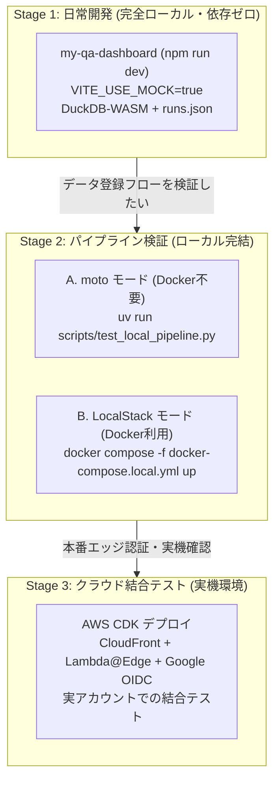

# Game QA Analytics Dashboard

ゲーム開発向けのクライアントサイド QA アナリティクスダッシュボードと、AWS クラウドインフラおよびデータアップロード CLI を統合したリポジトリです。

ブラウザ内の **DuckDB-WASM** による超高速なローカル集計・可視化を中核とし、クラウド側は **Google アカウントによる OIDC 認証（CloudFront + Lambda@Edge）**、**S3 イベント駆動の DynamoDB 検索インデックス**、および **AWS STS Web Identity 連携によるアップロード CLI** で構成されています。

---

## 目次

1. [リポジトリ構成](#リポジトリ構成)
2. [アーキテクチャ概要](#アーキテクチャ概要)
3. [推奨する 3 段階の開発フロー](#推奨する-3-段階の開発フロー)
   - [Stage 1: 日常開発 / フロントエンド・分析機能（完全ローカル・依存ゼロ）](#stage-1-日常開発--フロントエンド分析機能完全ローカル依存ゼロ)
   - [Stage 2: パイプライン検証 / CLI 〜 S3 〜 インデクサ 〜 検索（ローカル完結）](#stage-2-パイプライン検証--cli--s3--インデクサ--検索ローカル完結)
   - [Stage 3: クラウド結合テスト / 開発環境デプロイ（実機・Google OIDC）](#stage-3-クラウド結合テスト--開発環境デプロイ実機google-oidc)
4. [クイックスタート・コマンド集](#クイックスタートコマンド集)
5. [ドキュメント一覧](#ドキュメント一覧)

---

## リポジトリ構成

```text
game-db/
├── my-qa-dashboard/     # React 19 + TypeScript + Vite 8 + DuckDB-WASM ダッシュボード
│   ├── src/             # フロントエンドソースコード (ECharts, LogTable, Auth, Search)
│   ├── public/          # モックデータ (runs.json) およびサンプル実行データ (run-XXX/)
│   └── scripts/         # サンプルデータ生成スクリプト (generate_sample_data.py)
├── cli/                 # QA テスト結果アップロード CLI (Python)
│   ├── qa_upload.py     # アップロードスクリプト (Google OAuth 2.0 PKCE, STS, S3 マルチパート)
│   ├── test_qa_upload.py# CLI 単体テスト
│   └── README.md        # CLI 詳細ドキュメント
├── infra/               # AWS CDK (TypeScript) インフラコード
│   ├── bin/             # CDK エントリポイント (EdgeStack [us-east-1] + MainStack [ap-northeast-1])
│   ├── lib/             # CDK スタック・コンストラクト定義 (WAF, S3, DynamoDB, API GW, OIDC)
│   └── lambda/          # Lambda 関数 (manifest-indexer, search, auth-cookie)
├── scripts/             # ローカル開発・検証支援スクリプト
│   ├── test_local_pipeline.py # Stage 2 パイプライン検証テスト (moto / LocalStack)
│   └── init-localstack.sh     # LocalStack 初期化スクリプト (S3バケット・DynamoDBテーブル作成)
├── docs/                # 詳細設計ドキュメント
│   └── aws-architecture.md   # AWS クラウドデプロイアーキテクチャ設計書
├── docker-compose.local.yml   # LocalStack 開発用 Compose 定義
└── README.md            # 本ドキュメント
```

---

## アーキテクチャ概要

- **データエンジン**: **DuckDB-WASM** がブラウザ内で直接動作。S3/CloudFront 上の CSV や JSON、UE ログを仮想ファイルシステムに読み込み、SQL でミリ秒単位のクエリを実行。
- **Web 認証**: **CloudFront + Lambda@Edge（OpenID Connect）**。Viewer Request で Google アカウント認証を検証。未認証時は Google ログイン画面へ 302 リダイレクトし、セッション Cookie で SPA、データ、API を一元保護。
- **CLI 認証**: **Google OAuth 2.0 PKCE + AWS STS `AssumeRoleWithWebIdentity`**。初回のブラウザ認証後は、保存されたリフレッシュトークンで自動サイレント更新。IAM アクセスキーの端末配布は不要。
- **データ登録 & 検索**: CLI が子ファイル（FPS/メモリ/ログ/動画）→ `manifest.json` の順に PUT。S3 の `ObjectCreated` イベントが Lambda を起動し、DynamoDB 検索インデックスへ自動反映。

詳細な構成図と仕様は [`docs/aws-architecture.md`](docs/aws-architecture.md) を参照してください。

---

## 推奨する 3 段階の開発フロー

AWS サービスや Google OAuth に依存する機能を効率よく開発・検証するため、**「モック中心の超高速開発」から「実機クラウド結合」までの 3 段階のフロー** を整備しています。



---

### Stage 1: 日常開発 / フロントエンド・分析機能（完全ローカル・依存ゼロ）

**作業対象の 9 割（UI改善、グラフ描画、DuckDB SQL チューニング、ログビューア拡張、ローカルファイル読み込み機能）はこのステージで完結します。**

- **特徴**:
  - AWS アカウント、Google アカウント、Docker すべて**不要**。
  - `VITE_USE_MOCK=true`（デフォルト）により、認証ガードは自動バイパスされ、ログイン画面を介さずダッシュボードへ直行します。
  - 検索データは `public/mock_data/runs.json`、メトリクスデータは `public/sample_data/run-XXX/` から読み込まれます。

- **起動方法**:

  ```sh
  cd my-qa-dashboard
  npm install
  npm run dev
  ```

  ブラウザで `http://localhost:5173` を開くだけで即座に開発できます。

- **モックデータの再生成**:
  異なる条件（FPS低下、メモリリーク、テスト失敗など）のテストデータを増やしたい場合は、Python スクリプトで簡単に再生成できます：

  ```sh
  cd my-qa-dashboard
  uv run scripts/generate_sample_data.py
  ```

---

### Stage 2: パイプライン検証 / CLI 〜 S3 〜 インデクサ 〜 検索（ローカル完結）

**アップロード CLI の変更、マニフェスト形式の拡張、DynamoDB インデクサ Lambda、検索 API の連携を一気通貫でローカル検証したい場合のステージです。**

Google 認証と AWS STS は `--mock-auth` フラグでバイパスし、ローカルストレージに対してパイプラインを走らせます。

#### 方法 A: インメモリ軽量テスト（Docker 不要・最速）

`moto` を利用して、S3 と DynamoDB をインメモリで完全にエミュレートします。Docker デーモンすら起動していない環境でも 1 秒でパイプライン全行程をテストできます。

```sh
# リポジトリルートから実行
uv run scripts/test_local_pipeline.py
```

実行される内容:

1. モック S3 バケット (`qa-data`) と DynamoDB テーブル (`GameQaDashboard-SearchIndex` + 3つの GSI) を初期化
2. テスト用の一時 run フォルダを生成
3. `qa_upload.py` を実行して子ファイル群と `manifest.json` を PUT
4. `manifest-indexer` Lambda ハンドラを S3 イベントで呼び出し、DynamoDB に自動インデックス
5. `search` Lambda ハンドラを各検索フィルタ条件で呼び出し、結果サマリを検証

#### 方法 B: LocalStack コンテナ環境（Docker 利用）

実際にバックグラウンドで S3 / DynamoDB エミュレータを常駐させ、CLI コマンドを手動で叩いて動作確認したい場合に使用します。

1. **LocalStack の起動**:

   ```sh
   docker compose -f docker-compose.local.yml up -d
   ```

   ※初期化スクリプト (`scripts/init-localstack.sh`) により、`qa-data` バケットと GSI 付き DynamoDB テーブルが自動作成されます。

2. **CLI から LocalStack へアップロード**:
   `--endpoint-url` と `--mock-auth` を指定してアップロードします：

   ```sh
   uv run cli/qa_upload.py upload \
     --bucket qa-data \
     --run-dir ./my-qa-dashboard/public/sample_data/run-001 \
     --run-id run-local-test \
     --game-version v1.0.0 \
     --platform PS5 \
     --test-name Local_Integration_Test \
     --result PASSED \
     --avg-fps 60.0 \
     --endpoint-url http://localhost:4566 \
     --mock-auth
   ```

3. **パイプラインテストの実行**:

   ```sh
   uv run scripts/test_local_pipeline.py --endpoint-url http://localhost:4566
   ```

---

### Stage 3: クラウド結合テスト / 開発環境デプロイ（実機・Google OIDC）

**Lambda@Edge の Cookie 制御、Google OAuth 認可画面からのリダイレクト、CloudFront 経由のキャッシュ挙動など、本番と同一のインフラ環境で最終検証するステージです。**

#### 1. 前提準備 (Google Cloud Console)

- [Google API Console](https://console.developers.google.com/) でプロジェクトを作成し、OAuth 同意画面を設定。
- **Web アプリケーション クライアント**: CloudFront + Lambda@Edge 用（承認済みのリダイレクト URI に `https://<distribution-domain>/_callback` を登録）。
- **デスクトップ アプリ クライアント**: CLI 用（承認済みのリダイレクト URI に `http://127.0.0.1` を登録）。

#### 2. フロントエンドのビルド & CDK デプロイ

```sh
# 1. SPA を本番ビルド (CloudFront アセット用)
npm --prefix my-qa-dashboard run build

# 2. CLI 用の Google クライアント ID を環境変数にセットしてデプロイ
export GOOGLE_CLIENT_ID="your-desktop-client-id.apps.googleusercontent.com"
npx --prefix infra cdk deploy --all
```

#### 3. CLI からの Google アカウント認証アップロード

```sh
# 初回のみブラウザが起動してログイン
uv run cli/qa_upload.py login --google-client-id "$GOOGLE_CLIENT_ID"

# アップロード (次回以降は保存済みトークンで自動更新・非対話実行)
uv run cli/qa_upload.py upload \
  --bucket qa-data \
  --run-dir ./my-qa-dashboard/public/sample_data/run-001 \
  --run-id run-cloud-001 \
  --game-version v1.0.0 \
  --platform PS5 \
  --test-name Cloud_Verification \
  --result PASSED \
  --avg-fps 59.9 \
  --role-arn "<CDK出力の CliUploadRoleArn>" \
  --google-client-id "$GOOGLE_CLIENT_ID"
```

---

## クイックスタート・コマンド集

### フロントエンド (`my-qa-dashboard/`)

```sh
npm run dev      # 開発サーバー起動 (Vite, http://localhost:5173)
npm run build    # 型チェック (tsc -b) & 本番ビルド (vite build)
npm run lint     # oxlint による高速静的解析
npm run preview  # ビルド成果物のローカルプレビュー
```

### アップロード CLI (`cli/`)

```sh
uv run cli/qa_upload.py --help          # コマンド一覧・ヘルプ
uv run cli/qa_upload.py login --help    # ログインオプション
uv run cli/qa_upload.py whoami          # 現在の認証アカウントと有効期限
uv run cli/qa_upload.py logout          # トークンキャッシュ削除
uv run --with boto3 python -m unittest cli/test_qa_upload.py # CLI 単体テスト
```

### インフラ & パイプライン検証

```sh
uv run scripts/test_local_pipeline.py   # Stage 2 パイプライン検証 (moto)
docker compose -f docker-compose.local.yml up -d # LocalStack 起動
npm --prefix infra run build            # CDK コードの TypeScript コンパイル
```

---

## ドキュメント一覧

- [AWS デプロイ構成案 (`docs/aws-architecture.md`)](docs/aws-architecture.md): Google OIDC / Lambda@Edge / WAF / S3 / DynamoDB の全体設計書。
- [QA Upload CLI ドキュメント (`cli/README.md`)](cli/README.md): CLI の詳細オプション、Google OAuth 認証仕様、トークン管理。
- [インフラ CDK アプリ ドキュメント (`infra/README.md`)](infra/README.md): CDK のデプロイ手順、スタック構成。
- [リポジトリ運用ルール (`AGENTS.md`)](AGENTS.md): コーディング規約、DuckDB-WASM 運用ルール、サンプルデータ生成規則。
