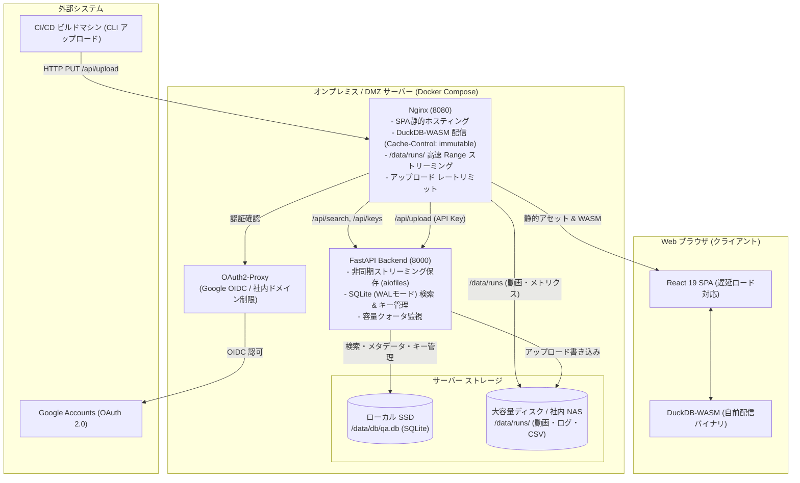
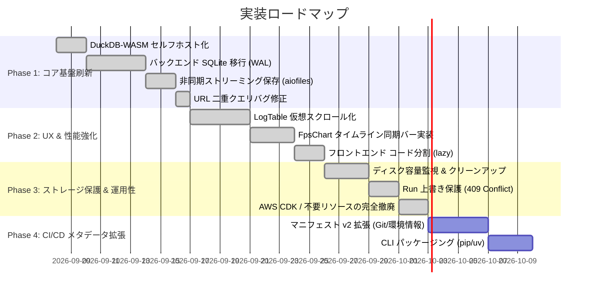

# Game QA Analytics Dashboard — アーキテクチャレビューと改善ロードマップ

- **作成日**: 2026-09-07
- **ステータス**: 承認済み・今後の作業予定 (Approved Backlog)
- **対象プロダクト**: Game QA Analytics Dashboard (`game-db`)
- **想定読者**: コア開発者、インフラ/SRE、QA エンジニア

---

## 目次

1. [背景と基本方針決定](#1-背景と基本方針決定)
   - [1.1 アーキテクチャの現状と移行の経緯](#11-アーキテクチャの現状と移行の経緯)
   - [1.2 重要決定事項 1: AWS DynamoDB から 完全オンプレミス SQLite への移行](#12-重要決定事項-1-aws-dynamodb-から-完全オンプレミス-sqlite-への移行)
   - [1.3 重要決定事項 2: DuckDB-WASM の自前バンドル・セルフホスト化](#13-重要決定事項-2-duckdb-wasm-の自前バンドルセルフホスト化)
2. [アーキテクチャ俯瞰レビューと課題一覧](#2-アーキテクチャ俯瞰レビューと課題一覧)
   - [2.1 最優先課題 (Priority: High)](#21-最優先課題-priority-high)
   - [2.2 パフォーマンス・UX課題 (Priority: Medium)](#22-パフォーマンスux課題-priority-medium)
   - [2.3 セキュリティ・運用性課題 (Priority: Medium)](#23-セキュリティ運用性課題-priority-medium)
   - [2.4 CI/CD・拡張性課題 (Priority: Low)](#24-cicd拡張性課題-priority-low)
3. [目標アーキテクチャ設計](#3-目標アーキテクチャ設計)
   - [3.1 全体システム構成図 (完全オンプレミス構成)](#31-全体システム構成図-完全オンプレミス構成)
   - [3.2 SQLite スキーマ設計 (`test_runs`, `api_keys`)](#32-sqlite-スキーマ設計-test_runs-api_keys)
   - [3.3 ストレージマウント構成 (ローカルSSD vs NAS)](#33-ストレージマウント構成-ローカルssd-vs-nas)
   - [3.4 DuckDB-WASM セルフホスト配信構成](#34-duckdb-wasm-セルフホスト配信構成)
4. [段階的実装ロードマップ (Phase 1 〜 Phase 4)](#4-段階的実装ロードマップ-phase-1--phase-4)
5. [作業タスク・チェックリスト](#5-作業タスクチェックリスト)

---

## 1. 背景と基本方針決定

### 1.1 アーキテクチャの現状と移行の経緯
本リポジトリは当初、AWS 上で完結するサーバーレス構成（S3 + CloudFront + Lambda@Edge + DynamoDB）として設計されていました。しかし、ゲーム開発の自動テストでは動画（30GB超）や Unreal Engine の詳細ログ・プロファイルデータ（数十万行）が日常的に出力されるため、以下の課題が生じました：
- CloudFront の単一オブジェクト 30GB 制限に抵触する。
- クラウドへのアップロード転送コストおよびストレージ保管コストの肥大化。

これを解決するため、**データ保存（大容量ファイル）と Web ホスティングを社内 DMZ / オンプレミス環境（Nginx + OAuth2-Proxy + FastAPI）へ移行** しました。その結果、検索インデックス（AWS DynamoDB）のみがクラウド側に残るハイブリッド構成となっていました。

### 1.2 重要決定事項 1: AWS DynamoDB から 完全オンプレミス SQLite への移行
社内向けのクローズドサービスである前提を踏まえ、**AWS DynamoDB を廃止し、バックエンド組み込みの SQLite（WALモード）へ移行** します。

- **移行の理由**:
  1. **クエリ表現力の向上**: DynamoDB の KVS 的制約（日付範囲検索や複数条件フィルタ、自由なソート、集計が困難）から解放され、SQL による柔軟かつ正確な検索・集計が可能になる。
  2. **アンチパターンの根本解消**: DynamoDB で発生していた「`Limit: 200` と `FilterExpression` によるデータ取りこぼし」や「`gsiAllPk = "ALL"` によるホットパーティション問題」を根絶する。
  3. **クラウド依存と管理コストの全廃**: AWS アカウント、IAM ユーザー、アクセスキーの定期ローテーション、CDK コードの保守が不要となり、社内ネットワーク完結のセキュアな運用が実現する。
  4. **データとメタデータの一元管理**: 実ファイル（`/data/runs/`）とインデックス（`qa.db`）が同一環境に配置され、バックアップや環境複製の整合性が完全に保たれる。

### 1.3 重要決定事項 2: DuckDB-WASM の自前バンドル・セルフホスト化
ユーザー環境が通常のインターネット接続を持つ場合であっても、外部 CDN（jsDelivr）依存を撤廃し、**サービス側（Nginx / Vite 静的アセット）で DuckDB-WASM を自前バンドル（セルフホスト）** します。

- **セルフホストの理由**:
  1. **社内 LAN による初回ロードの劇的高速化**: 約 15MB〜30MB の WASM バイナリを社内 LAN（1Gbps〜10Gbps）帯域で転送することで、初期ローディング待ち時間を 0.1〜0.3 秒に短縮。
  2. **外部 CDN 障害による業務停止（SPOF）の排除**: jsDelivr のアクセス障害、DNS 障害、レート制限（429）によるダッシュボード起動不能リスクをゼロにする。
  3. **バージョン固定と再現性**: `package.json` で管理されるバージョンと完全一致するバイナリが確実に配信され、サプライチェーンリスクを抑止。
  4. **CSP (Content Security Policy) の強化**: `script-src` や `worker-src` を自社オリジン（`'self'`）のみで厳格に設定可能。

---

## 2. アーキテクチャ俯瞰レビューと課題一覧

### 2.1 最優先課題 (Priority: High)

#### [Issue-01] DuckDB-WASM の外部 CDN 依存
- **対象**: `my-qa-dashboard/src/hooks/useDuckDB.ts`
- **問題**: `duckdb.getJsDelivrBundles()` により起動時に `cdn.jsdelivr.net` へアクセスしている。閉域網や社内プロキシ環境、CDN 障害時に初期化エラーとなり全機能が停止する。
- **対応**: npm パッケージ内の WASM / Worker バイナリを `public/duckdb-wasm/` に配置し、相対パスで初期化する。

#### [Issue-02] DynamoDB 検索におけるデータ取りこぼし & ホットパーティション
- **対象**: `onprem/backend/main.py`, `infra/lib/main-stack.ts`
- **問題**:
  - `main.py` の `_execute_search` で `Limit: 200` を設定しているため、DynamoDB はフィルタ前の 200 件を読み込んだ時点で停止し、条件一致するレコードを取りこぼす。また、ページネーショントークンを返却していない。
  - 全レコードに `gsiAllPk = "ALL"` を付与しており、レコード増加に伴い 1,000 WCU / 3,000 RCU のスループット上限に抵触する。
- **対応**: DynamoDB を廃止し、後述の SQLite スキーマへ移行。インデックス付き SQL クエリによる正確なページネーションと柔軟な検索を実現。

#### [Issue-03] ストリーミングアップロード時のイベントループ閉塞 (Disk I/O)
- **対象**: `onprem/backend/main.py` (`upload_file` 関数)
- **問題**:
  ```python
  with open(temp_file, "wb") as f:
      async for chunk in request.stream():
          if chunk:
              f.write(chunk)  # 同期ブロッキング I/O
  ```
  数十 GB の巨大ファイル書き込み中に同期 I/O で FastAPI (asyncio) のメインイベントループが長時間ブロックされ、他の全 API（検索、キー管理、ヘルスチェック）がフリーズする。
- **対応**: `aiofiles` または `anyio.to_thread.run_sync` を使用して、ファイル書き込み処理を非同期ワーカー・スレッドプールに逃がす。

#### [Issue-04] 大容量ストレージの容量枯渇対策・クォータ・自動パージの欠如
- **対象**: `onprem/docker-compose.yml`, `onprem/backend/main.py`
- **問題**: 30GB 制限を撤廃して大容量動画やダンプのアップロードを可能にしたが、ディスク残量監視や自動削除ポリシーが存在せず、ディスク 100% 使用によるサーバーダウンの危険がある。
- **対応**:
  - アップロード API に「ディスク空き容量チェック」（空き容量 10% 未満時は `507 Insufficient Storage`）を導入。
  - 保持期間（例: 30日）を超過した過去 Run の大容量ファイル（動画・ダンプ）を自動パージ、またはコールドストレージへ退避するクリーンアップスクリプトを整備。

#### [Issue-05] API キー管理 (`keys.json`) の排他制御欠如と競合リスク
- **対象**: `onprem/backend/main.py` (`_load_keys`, `_save_keys`)
- **問題**: 単一の JSON ファイルに対してロックなしで直接読み書きしているため、複数リクエストが重なると Race Condition でキーが破損・消失する。
- **対応**: SQLite への移行に伴い、API キー情報を同一の SQLite データベース内テーブル（`api_keys`）へ統合し、ACID トランザクションで安全に管理する。

---

### 2.2 パフォーマンス・UX課題 (Priority: Medium)

#### [Issue-06] ログビューア (`LogTable`) の描画性能 (仮想スクロール未導入)
- **対象**: `my-qa-dashboard/src/components/LogTable.tsx`
- **問題**: SQL クエリで `LIMIT 2000` を取得し、2000 行分の DOM（数万個のノード）を一括で React レンダリングしているため、検索やリサイズ時に UI がカクつく。
- **対応**: `@tanstack/react-virtual` を導入し、画面内に見える 30〜50 行のみを動的描画する仮想スクロール（Windowing）を実装する。

#### [Issue-07] タイムライン同期 (Timeline Sync) の未完成
- **対象**: `my-qa-dashboard/src/components/FpsChart.tsx`, `MemoryChart.tsx`
- **問題**:
  - `FpsChart` に現在再生時刻（`currentTime`）を示す垂直 markLine や、クリックで動画シークを行う連携が存在しない。
  - `MemoryChart` の X 軸がサンプルの連番インデックスになっており、時間軸での同期が取れない。
- **対応**:
  - `FpsChart` に `currentTime` プロップスを追加し、動画再生・ログ選択と連動して動く縦バーを表示。チャートクリックで `onSeek(time)` を発火。
  - `MemoryChart` もタイムスタンプ/経過秒数を X 軸として扱えるように改修。

#### [Issue-08] ルーターにおける URL 二重クエリ生成バグ
- **対象**: `my-qa-dashboard/src/router/useAppRouter.ts`
- **問題**: `updateQueryParams` 内で `currentPath` にすでに `?a=...` が含まれている状態で `buildUrl` を呼び出しているため、`/compare?a=run-1&b=run-2?param=val` のように `?` が二重に付与される。
- **対応**: パス定義を `/compare/:runA/:runB` 形式に統一するか、`buildUrl` 内で既存クエリと新規クエリを安全にパース・マージする。

#### [Issue-09] フロントエンドのコード分割 (Code Splitting) の欠如
- **対象**: `my-qa-dashboard/vite.config.ts`, `my-qa-dashboard/src/App.tsx`
- **問題**: 単一 JS チャンクが 1.69MB (gzip 525KB) に達しており、Vite からビルド警告が出ている。
- **対応**: `React.lazy()` と dynamic `import()` を用いて、ECharts、DuckDB-WASM、`ComparePage`、`TrendsPage` をページ単位・機能単位でコード分割し、初期ロードを 600KB 以下に抑える。

#### [Issue-10] DuckDB-WASM のブラウザメモリ管理
- **対象**: `my-qa-dashboard/src/hooks/useDuckDB.ts`
- **問題**: 画面遷移や複数 Run 比較のたびに仮想 FS にファイルバッファが蓄積され、ブラウザの WASM ヒープ上限（2GB〜4GB）に達して OOM クラッシュするリスクがある。
- **対応**: 新しい Run を開く際、不要になった古い一時テーブルや仮想ファイルバッファを明示的に `dropFile` / `dropTable` してメモリを解放する。

---

### 2.3 セキュリティ・運用性課題 (Priority: Medium)

#### [Issue-11] アップロード時の Run データの冪等性・改ざん保護
- **対象**: `onprem/backend/main.py`
- **問題**: API キーがあれば、すでに完了した過去の `run_id` に対しても任意にファイルを上書き保存できてしまう。
- **対応**: `manifest.json` がすでに存在する Run に対する上書きを原則禁止（`409 Conflict`）とし、再アップロード時は明示的なフラグを要求する。

#### [Issue-12] API キーのスコープ・有効期限・レート制限
- **対象**: `onprem/backend/main.py`, `onprem/nginx/nginx.conf`
- **問題**:
  - API キーが無期限かつ全権限。
  - `/api/upload/` に対する Nginx のレート制限（`limit_req_zone`）がなく、DoS や誤作動スクリプトによる急激なストレージ圧迫に無防備。
- **対応**: Nginx 側で IP / API キー単位のレートリミットを設定し、キーに有効期限（TTL）を設定可能にする。

#### [Issue-13] CORS 設定の適正化
- **対象**: `onprem/backend/main.py`
- **問題**: `allow_origins=["*"]` と `allow_credentials=True` が同時に設定されており、モダンブラウザの仕様上非推奨または拒絶される組み合わせになっている。
- **対応**: 信頼された社内ドメイン・ローカルホストのみをオリジンとして許可する。

---

### 2.4 CI/CD・拡張性課題 (Priority: Low)

#### [Issue-14] マニフェスト v2 拡張 (Git/ビルド/環境メタデータ自動収集)
- **対象**: `cli/qa_upload.py`, `onprem/backend/main.py`
- **問題**: 引数が `--game-version`, `--platform`, `--test-name`, `--result`, `--avg-fps` のみで、Git コミット、ブランチ、ビルド番号、GPU 型番、失敗スタックトレースが記録されていない。
- **対応**: CLI に CI 環境変数（`GITHUB_SHA`, `CI_COMMIT_REF_NAME` 等）の自動検知を追加し、SQLite にメタデータを格納。

#### [Issue-15] CLI の配布性向上
- **対象**: `cli/qa_upload.py`
- **対応**: `pyproject.toml` を整備し、ビルドマシンやゲーム開発機から `pip install` / `uv tool install` で即座に利用可能にする。

---

## 3. 目標アーキテクチャ設計

### 3.1 全体システム構成図 (完全オンプレミス構成)



### 3.2 SQLite スキーマ設計 (`test_runs`, `api_keys`)

単一データベースファイル `/data/db/qa.db` にて管理。WAL モードにより並行アクセスを保証。

```sql
-- WAL モード & 高速化設定
PRAGMA journal_mode = WAL;
PRAGMA synchronous = NORMAL;
PRAGMA foreign_keys = ON;

-- 1. テスト実行サマリテーブル (検索インデックス)
CREATE TABLE IF NOT EXISTS test_runs (
    run_id TEXT PRIMARY KEY,
    executed_at TEXT NOT NULL,          -- ISO 8601 文字列 (ソート・範囲検索用)
    game_version TEXT NOT NULL,
    platform TEXT NOT NULL,
    test_name TEXT NOT NULL,
    status TEXT NOT NULL CHECK(status IN ('PASSED', 'FAILED', 'ABORTED')),
    avg_fps REAL,
    min_fps REAL,
    peak_memory_mb REAL,
    git_branch TEXT,
    git_commit TEXT,
    build_id TEXT,
    error_summary TEXT,
    artifacts_json TEXT NOT NULL,        -- 成果物一覧 (JSON配列文字列)
    fps_data_url TEXT,
    memory_data_url TEXT,
    logs_data_url TEXT,
    video_url TEXT,
    created_at TEXT DEFAULT (datetime('now'))
);

-- 検索用インデックス
CREATE INDEX IF NOT EXISTS idx_runs_executed_at ON test_runs(executed_at DESC);
CREATE INDEX IF NOT EXISTS idx_runs_platform_date ON test_runs(platform, executed_at DESC);
CREATE INDEX IF NOT EXISTS idx_runs_status_date ON test_runs(status, executed_at DESC);
CREATE INDEX IF NOT EXISTS idx_runs_test_name ON test_runs(test_name);

-- 2. API キー管理テーブル
CREATE TABLE IF NOT EXISTS api_keys (
    key_id TEXT PRIMARY KEY,
    key_hash TEXT NOT NULL UNIQUE,       -- SHA-256 ハッシュ値
    name TEXT NOT NULL,
    email TEXT NOT NULL,
    prefix TEXT NOT NULL,                -- 画面表示用のプレフィックス (例: gqa_live_1234...)
    created_at TEXT NOT NULL,
    expires_at TEXT                      -- 有効期限 (NULL = 無期限)
);

CREATE INDEX IF NOT EXISTS idx_keys_hash ON api_keys(key_hash);
CREATE INDEX IF NOT EXISTS idx_keys_email ON api_keys(email);
```

### 3.3 ストレージマウント構成 (ローカルSSD vs NAS)

SQLite は NFS / SMB 上でファイルロックの問題が起きやすいため、DB ファイルと大容量成果物のマウント先を分離します：

```yaml
# onprem/docker-compose.yml (抜粋)
services:
  backend:
    volumes:
      - qa_db:/data/db        # SQLite用: ローカル高速SSD領域
      - qa_data:/data/runs    # 成果物用: 大容量ローカルディスク or NAS
  nginx:
    volumes:
      - qa_data:/data/runs:ro # Nginx から Range ストリーミング直接配信
```

### 3.4 DuckDB-WASM セルフホスト配信構成

1. **ファイル配置**:
   `my-qa-dashboard/public/duckdb-wasm/` に以下のファイルを配置：
   - `duckdb-mvp.wasm`
   - `duckdb-browser-mvp.worker.js`
   - `duckdb-eh.wasm`
   - `duckdb-browser-eh.worker.js`
2. **Nginx キャッシュヘッダー設定**:
   ```nginx
   location /duckdb-wasm/ {
       root /usr/share/nginx/html;
       add_header Cache-Control "public, max-age=31536000, immutable";
   }
   ```
3. **クライアント初期化**:
   `useDuckDB.ts` でローカルのバンドルマップを指定してインスタンス化。

---

## 4. 段階的実装ロードマップ (Phase 1 〜 Phase 4)



---

## 5. 作業タスク・チェックリスト

### Phase 1: コア基盤刷新（最優先・安定化）
- [x] **Task 1.1: DuckDB-WASM の自前バンドル**
  - [x] `@duckdb/duckdb-wasm` の WASM/Worker を `my-qa-dashboard/public/duckdb-wasm/` に配置するビルド/コピー手順を追加
  - [x] `useDuckDB.ts` を修正し、ローカル相対パスからバンドルを読み込むように改修
  - [x] 外部インターネット未接続環境での起動テスト
- [x] **Task 1.2: バックエンドの SQLite 移行**
  - [x] `onprem/backend/db.py`（または `main.py` 内）に SQLite 接続管理とテーブル初期化を実装（WALモード）
  - [x] `_index_manifest` を SQLite `test_runs` テーブルへの `INSERT OR REPLACE` に改修
  - [x] `_execute_search` を SQL クエリ（`WHERE ... ORDER BY executed_at DESC LIMIT ? OFFSET ?`）に改修
  - [x] `keys.json` を廃止し、`api_keys` テーブルによるキー作成・検証・削除を実装
  - [x] `boto3` および AWS DynamoDB 依存をバックエンドから削除
- [x] **Task 1.3: 非同期ストリーミングアップロード**
  - [x] `aiofiles` を導入し、ファイル書き込み処理を非同期化してイベントループの閉塞を防止
- [x] **Task 1.4: ルーターの URL 二重クエリバグ修正**
  - [x] `useAppRouter.ts` の `buildUrl` およびパス構築ロジックを修正し、`?` の重複を防止

### Phase 2: パフォーマンス & UX 強化
- [x] **Task 2.1: LogTable の仮想スクロール対応**
  - [x] `@tanstack/react-virtual` を導入
  - [x] 2000 行以上のログでも 60fps で滑らかにスクロールできる構造へ改修
- [x] **Task 2.2: タイムライン同期エンジンの完成**
  - [x] `FpsChart` に `currentTime`（再生位置）の垂直 markLine を描画
  - [x] `FpsChart` クリック時に動画再生位置を同期シークするコールバックを実装
  - [x] `MemoryChart` の X 軸を経過時間ベースに変更
- [x] **Task 2.3: フロントエンドのコード分割 (Vite)**
  - [x] `ComparePage`, `TrendsPage`, `ECharts` 関連の `React.lazy()` 化
  - [x] 初期ロード JS サイズを 600KB 以下に削減

### Phase 3: ストレージ保護 & 運用性向上
- [x] **Task 3.1: ディスク容量クォータ & 自動クリーンアップ**
  - [x] アップロード時に空きディスク容量をチェックし、閾値未満なら 507 エラーを返却
  - [x] 一定期間（例: 30日）経過した Run の大容量ファイル（動画等）を自動削除するメンテナンスタスクを作成
- [x] **Task 3.2: Run データの改ざん防止**
  - [x] 既存の `manifest.json` が存在する Run に対する上書きをデフォルト拒絶（`409 Conflict`）
- [x] **Task 3.3: AWS CDK / 不要コードの整理**
  - [x] DynamoDB スタックおよびオンプレミス用の IAM ユーザー定義を整理・廃止

### Phase 4: CI/CD 連携 & メタデータ拡張
- [ ] **Task 4.1: マニフェスト v2 拡張**
  - [ ] `manifest.json` に Git 情報（コミット、ブランチ、PR）、ビルド番号、エラーサマリを追加
  - [ ] CLI (`qa_upload.py`) で CI 環境変数を自動収集してマニフェストに埋め込む
  - [ ] フロントエンドの検索画面・ヘッダーに Git / ビルド情報を表示
- [ ] **Task 4.2: CLI パッケージング**
  - [ ] `pyproject.toml` を作成し、`uv tool install` または `pip install` でグローバルに導入可能にする
