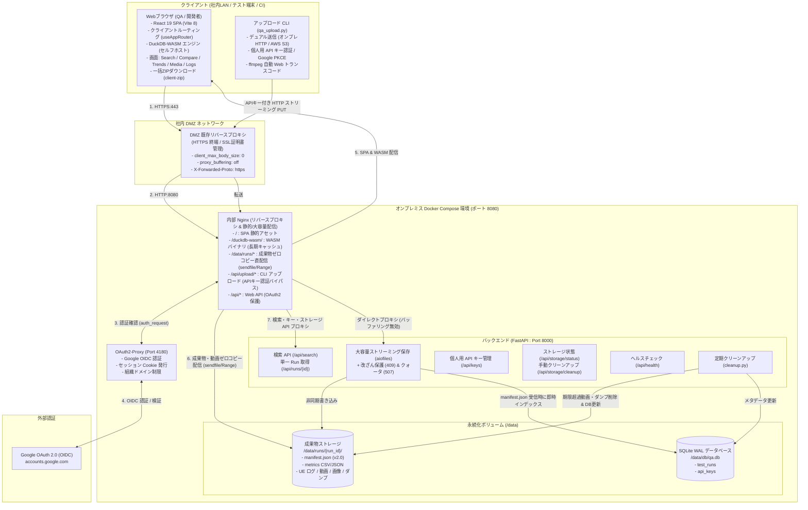
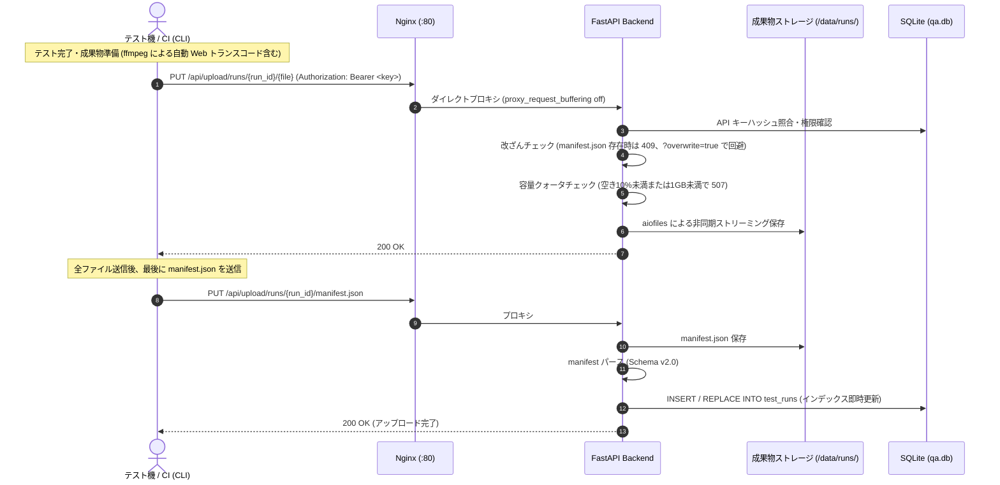
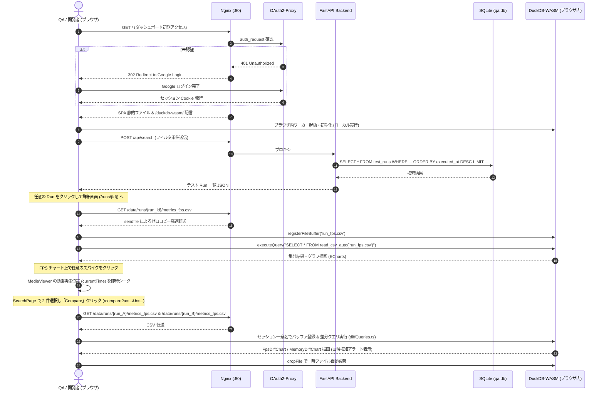

# Game QA Analytics Dashboard — システムアーキテクチャ設計書

本ドキュメントは、Game QA Analytics Dashboard（`game-db`）のシステムアーキテクチャ、コンポーネント構成、データモデル、および運用仕様を定義する設計資料です。

---

## 1. システム概要

### 1.1 目的
Game QA Analytics Dashboard は、ゲーム開発における日々の自動テスト（スモークテスト、長時間ソークテスト、性能ベンチマーク、ボット自動プレイ等）から出力されるログ、プロファイルデータ（FPS・メモリ使用量）、画面キャプチャ動画、クラッシュダンプ等を中央集約し、Web ブラウザ上で横断的に検索・分析・可視化するための統合プラットフォームです。

### 1.2 コア設計思想
- **クライアントサイド超高速分析 (DuckDB-WASM)**:
  サーバー側で大容量メトリクスやログの集約処理を行わず、ブラウザ内の DuckDB-WASM 仮想ファイルシステムに生データ（CSV/JSON/ログ）を直接読み込み、クライアント端末の CPU/メモリを活用してミリ秒単位で SQL 集計・フィルタリングを実行します（No-Parquet 原則：UE 出力の生 CSV/JSON をそのまま処理）。
- **複数ラン比較・時系列品質トレンド分析**:
  2 つのテストランの FPS・メモリ推移を横並びで差分比較（回帰検知しきい値アラート付き）する機能や、長期的な合格率・FPS・メモリ消費の推移を俯瞰するトレンド分析をクライアント完結で提供します。
- **完全自律型オンプレミス運用**:
  社内 DMZ リバースプロキシ配下の Docker Compose（Nginx + OAuth2-Proxy + FastAPI + SQLite WAL）により、社内 LAN 帯域（1Gbps〜10Gbps+）を最大限に活かした大容量動画・成果物の高速配信と安全なデータ保持を実現します（旧 AWS クラウド構成は完全廃止）。
- **大容量ファイル対応 (サイズ制限なし & ゼロコピー配信)**:
  数十GBを超えるゲームプレイキャプチャ動画やダンプファイルも、Nginx の `sendfile` および HTTP Range リクエスト対応により、ブラウザから即時シーク・ストリーミング再生が可能です。
- **クライアントサイド成果物一括圧縮 (`client-zip`)**:
  サーバーにアーカイブ生成負荷をかけず、ブラウザ上で直接ストリーミング形式の ZIP ファイルを生成・ダウンロード可能です。
- **データ保全とストレージ自動防護**:
  確定済みテスト結果の改ざん防止（409 Conflict / `--overwrite` 制御）、ディスク空き容量監視に基づくアップロード遮断（507 Insufficient Storage）、保持期間を超過した大容量成果物（動画・ダンプ）のみを自動パージするクリーンアップ機構を備えます。

---

## 2. 全体システム構成

### 2.1 システム構成図



---

## 3. 主要コンポーネント仕様

### 3.1 フロントエンド (`my-qa-dashboard/`)
- **技術スタック**: React 19, TypeScript, Vite 8, Tailwind CSS v4, ECharts (`echarts-for-react`), Lucide React, `client-zip`
- **DuckDB-WASM データエンジン (`src/hooks/useDuckDB.ts`)**:
  - DuckDB-WASM 公式バイナリを `public/duckdb-wasm/` にセルフホストし、同一オリジンから Blob Worker 経由で初期化。
  - リモートデータ（Nginx から配信される CSV/JSON）を `fetch` して `registerFileBuffer` で DuckDB 仮想ファイルシステムに登録。
  - `read_csv_auto` や `read_json_auto` を拡張子に応じて自動選択し、ブラウザ上で直接 SQL クエリ（`executeQuery<T>()`）を実行。
  - **並行セッション保護**: 比較画面等で同一ランまたは並行セッションが実行された際も、セッション一意のファイル名を割り当てることでテーブル名・ファイル名の衝突を防止。クエリ完了後は `dropFile` により仮想メモリを自動解放。
- **画面機能**:
  - **SearchPage (`SearchPage.tsx`)**:
    - 日付範囲、プラットフォーム、ゲームバージョン、テスト名、成否結果（PASSED / FAILED / ABORTED）による複合検索。
    - **動的クエリ上限 & ページネーション**: `limit: 500` による最大 500 件までのテストラン取得、クライアントサイド・ページネーション（25 / 50 / 100 / 全件切り替え、ページ送りコントロール）。
    - **クイックステータス絞り込み**: 成否結果（PASSED / FAILED / ABORTED / ALL）のワンクリック切り替えチップ。
    - 各カラムでのソート、フィルタのリセット、ブラウザ履歴（戻る・進む）との完全同期。
    - チェックボックスによる複数 Run 選択（ページを跨いで選択状態を維持）と、ワンクリックでの直接比較画面遷移。
  - **ComparePage (`ComparePage.tsx`)**:
    - 2 つのテスト Run（Run A vs Run B）の横並び詳細比較。
    - **FpsDiffChart**: フレームレートおよびフレームスレッド時間の差分カーブ、平均/最低 FPS の変化量（Δ）、統計サマリの可視化（`useMemo` 最適化およびコンテナ自動リサイズ）。
    - **MemoryDiffChart**: メモリ使用量のカテゴリ別差分増減の可視化（`useMemo` 最適化およびコンテナ自動リサイズ）。
    - **アーティファクト比較**: 成果物ファイル構成の差分一覧。
    - **回帰検知しきい値アラート (`config/thresholds.ts`)**: FPS 低下率やメモリ急増が許容しきい値を超えた場合の警告バッジ表示。
    - **Run 入れ替え & URL 共有**: Run A と Run B の即時スワップ、比較状態の URL 共有。
  - **TrendsPage (`TrendsPage.tsx`)**:
    - 複数 Run を時系列で横断分析する品質トレンドダッシュボード。
    - 期間絞り込み（直近 7 日 / 14 日 / 30 日 / 90 日 / 全期間、最大 1,000 件取得）およびプラットフォーム・バージョン・テスト名フィルタ。
    - KPI サマリ（合格率、平均 FPS、ピークメモリ、総テスト回数、前期間比の増減インジケータ）。
    - 日別の成否積み上げ棒グラフ、平均 FPS 推移折れ線グラフ、ピークメモリ推移グラフ（`ResizeObserver` による自動フィット）。
    - トレンドチャートからの個別 Run 詳細または 2 ラン比較への直接リンク。
  - **FpsChart / MemoryChart (`FpsChart.tsx`, `MemoryChart.tsx`)**:
    - テスト走行中のフレームレートおよびメモリ推移をミリ秒単位で描画。
    - **コンテナ追従自動リサイズ (`hooks/useChartResize.ts`)**: `ResizeObserver` を活用し、Flexbox/Grid レイアウト変化やフルスクリーン切り替えに即時追従。
    - 10 万データ点を超える長時間ログに対する仮想スクロール・ダウンサンプリング。
    - **タイムライン双方向同期 (`utils/timeHelpers.ts`)**: チャートホバー・クリック位置と `MediaViewer` の動画再生位置（秒）をミリ秒精度で完全連動。
  - **LogTable (`LogTable.tsx`)**:
    - Unreal Engine ログの全文検索・レベル別フィルタ（INFO / WARN / ERROR / FATAL）。
    - 仮想スクロールによる数万行のログの高速スクロール。
    - ローカルログファイルの手動インポート・解析対応（`ueLogParser.ts`）。
  - **MediaViewer (`MediaViewer.tsx`)**:
    - 動画およびスクリーンショット画像の統合メディアビューア。
    - **動画プレイヤー**: HTTP Range リクエストによる長時間の高解像度キャプチャ動画のシーク再生、再生速度調整、フルスクリーン表示、チャートとのタイムライン双方向同期。
    - **スクリーンショットギャラリー**: 画像の拡大・縮小・パン移動・回転・リセット機能。
    - グリッド表示 / リスト表示切り替え、メディア種別フィルタ（動画 / 静止画）。
  - **ArtifactsPanel (`ArtifactsPanel.tsx`)**:
    - Run に含まれる全成果物（FPS、Memory、ログ、動画、スクリーンショット、クラッシュダンプ、トレース、レポート等）の一覧表示とカテゴリ別フィルタ。
    - ブラウザ対応形式のインラインプレビュー（画像・動画・テキスト）。
    - **ブラウザ内一括 ZIP ダウンロード (`client-zip`)**: サーバー側に ZIP 生成負荷を一切かけず、ブラウザのメモリ上でストリーミング圧縮して一括保存。
  - **AccessKeyModal (`AccessKeyModal.tsx`)**:
    - CLI アップロード用の個人用 API キー発行・一覧・失効管理。
    - 発行時トークンの 1 回限り表示、クリップボードコピー、CLI 用環境変数形式（`export QA_API_KEY=...`）のワンクリックコピー。
- **クライアントサイドルーティング & ディープリンク (`router/useAppRouter.ts`)**:
  - HTML5 History API（`pushState` / `popstate`）による完全クライアントルーティング。
  - ルート定義: `/`（検索）、`/trends`（トレンド）、`/runs/:runId`（詳細ダッシュボード）、`/compare?a=...&b=...`（比較）。
  - URL クエリパラメータ同期: タイムライン秒数（`t`）、選択メディア（`media`）、ログ選択行（`log`）、検索条件、表示タブ等の状態を URL に反映し、チーム間での 1 クリック共有（Share ボタン）を実現。
- **パフォーマンス・最適化設計**:
  - `React.lazy` と `Suspense` によるヘビーコンポーネント（ComparePage, TrendsPage, FpsChart, MemoryChart, AccessKeyModal）のコード分割。
  - Vite / Rollup によるベンダーチャンク分割（`vendor-duckdb`, `vendor-echarts`, `vendor-virtual`）。
- **動作モード切り替え**:
  - `VITE_USE_MOCK=true`（デフォルト）: 完全ローカル開発モード。ログイン認証をバイパスし、`public/mock_data/runs.json` および `public/sample_data/` のサンプルデータで動作。
  - `VITE_USE_MOCK=false`: 社内本番結合モード。FastAPI バックエンドおよび OAuth2-Proxy と連携。

### 3.2 内部リバースプロキシ (`onprem/nginx/`)
- **SPA & アセット配信**:
  - `/`: React ビルド成果物（`index.html`, JS, CSS）を静的配信。HTML5 History API のため `try_files $uri $uri/ /index.html` を設定。
  - `/duckdb-wasm/`: WASM バイナリおよび Worker スクリプトを `Cache-Control: "public, max-age=31536000, immutable"` で配信。
- **大容量データ配信 (`/data/runs/`)**:
  - `sendfile on`, `tcp_nopush on`, `tcp_nodelay on`, `aio threads` を有効化し、カーネル空間からネットワークソケットへゼロコピー転送。
  - Range リクエスト対応により、動画シーク時の部分取得（HTTP 206 Partial Content）を低遅延で処理。
  - DuckDB-WASM および動画プレイヤー向けの CORS ヘッダー（`Access-Control-Allow-Origin`, `Range`, `Accept-Ranges` 等）を付与。
- **認証保護連携 (`auth_request`)**:
  - SPA、大容量データ、一般 API に対するアクセスを `auth_request /oauth2/auth` により OAuth2-Proxy に問い合わせて保護。
  - 未認証時は OAuth2-Proxy のログイン開始エンドポイントへリダイレクト。
- **CLI アップロード用パス (`/api/upload/`)**:
  - Web セッション Cookie を持たない CLI クライアント向けに OAuth2-Proxy をバイパスし、バックエンドへ直接プロキシ。
  - `proxy_request_buffering off` および `proxy_buffering off` により、ディスク書き込みを挟まずバックエンドへリアルタイムにストリーム転送。
  - `client_max_body_size 0`（無制限）および `proxy_read_timeout 3600s` により大容量転送のタイムアウトを防止。

### 3.3 Web 認証基盤 (`oauth2-proxy`)
- **Google OIDC 連携**:
  - Google Cloud Console で発行した OAuth 2.0 Web アプリケーション認証情報を使用。
  - `--email-domain` による自社ドメイン（例: `@company.com`）制限。
  - 認証成功時にセッション暗号化 Cookie をクライアントへ発行。
  - バックエンドへ認証済みメールアドレス（`X-Auth-Request-Email`）をヘッダー転送。

### 3.4 バックエンド API (`onprem/backend/`)
- **技術スタック**: Python >= 3.10, FastAPI, Uvicorn, SQLite3, aiofiles
- **API エンドポイント仕様**:
  - `GET /api/health`:
    - サービスの稼働状態および現在時刻の返却（ヘルスチェック用）。
  - `GET /api/storage/status`:
    - ディスク空き容量、使用量、クォータ閾値（最小空き率、最小空きバイト数）の返却。
  - `POST /api/storage/cleanup`:
    - 保持期間（`days`）、ドライラン（`dry_run`）、最小対象サイズ（`min_size_mb`）を指定した大容量アーティファクトの手動クリーンアップ実行（要 API キー認証）。
  - `PUT /api/upload/runs/{run_id}/{file_name}` (および POST):
    - 大容量ファイルストリーミング受信。`aiofiles` によりイベントループを阻害せずディスクに保存。
    - **改ざん保護**: 対象 Run に `manifest.json` が既に存在する場合、`?overwrite=true` クエリパラメータがない限り `HTTP 409 Conflict` を返却。
    - **ストレージクォータ監視**: ディスク空き容量が 10% 未満または 1GB 未満の場合、`HTTP 507 Insufficient Storage` で拒絶。
    - **自動インデックス**: `manifest.json` の保存完了を検知すると、自動的に内容をパースして SQLite の `test_runs` テーブルへ登録・更新。
  - `POST /api/search` および `GET /api/search`:
    - SQLite `test_runs` テーブルに対する複合条件検索（日付範囲、プラットフォーム、バージョン、テスト名、ステータス、ページネーション）。
  - `GET /api/runs/{run_id}`:
    - 指定した Run の詳細メタデータおよび各成果物 URL の返却。
  - `POST /api/keys`, `GET /api/keys`, `DELETE /api/keys/{key_id}`:
    - 個人用 API キーの発行・一覧・失効管理。
- **定期ストレージクリーンアップ (`cleanup.py`)**:
  - 指定日数（デフォルト: 30日）を超過した Run を走査。
  - 成果物のうち、大容量の動画（`.mp4`）やダンプ（`.dmp`）を安全に削除。
  - CSV メトリクス、ログファイル、`manifest.json`、および SQLite インデックスレコードは恒久保持。
  - 削除された動画に対応する SQLite の `video_url` カラムをクリア。
- **環境変数設定**:
  - `STORAGE_PATH`: ストレージルートパス（デフォルト: `/data`）
  - `DB_PATH`: SQLite データベースファイルパス（デフォルト: `/data/db/qa.db`）
  - `MIN_DISK_FREE_PERCENT`: 最小空き容量パーセント（デフォルト: `10.0`）
  - `MIN_DISK_FREE_BYTES`: 最小空き容量バイト数（デフォルト: `1073741824` = 1GB）
  - `ALLOW_ANONYMOUS_UPLOAD`: ローカル開発・テスト用の認証なしアップロード許可フラグ（デフォルト: `false`）
  - `ALLOWED_ORIGINS`: CORS 許可オリジンリスト

### 3.5 アップロード CLI (`cli/qa_upload.py`)
- **機能**:
  - テスト実行マシンや CI/CD パイプラインからワンアクションでテスト結果を送信。
  - **サブコマンド**:
    - `upload`: 成果物ディレクトリの自動スキャン、動画トランスコード、成果物送信、Manifest 作成・インデックス。
    - `login`: Google OAuth 2.0 PKCE 認証によるブラウザログイン。トークンを `~/.config/game-qa/token.json` にローカル保存し、次回以降自動リフレッシュ。
  - **デュアルアップロード先対応**:
    - **オンプレミス HTTP ストリーミング (`--server-url` / `QA_SERVER_URL`)**: 個人用 API キー（`--api-key` / `QA_API_KEY`）を用いた HTTP PUT ストリーミング。
    - **AWS S3 直接アップロード (`--s3-bucket` / `S3_BUCKET`)**: Google アカウント認証トークンを用いた AWS STS `AssumeRoleWithWebIdentity` による S3 アップロード（ハイブリッド/クラウド保存用）。
  - **動画自動トランスコード**:
    - ffmpeg を検知し、Web ブラウザ再生に最適化された動画（H.264 / AAC / `faststart` 付き `capture_web.mp4`）を自動生成（`--skip-transcode`, `--force-transcode` 対応）。
  - **成果物自動分類 (Manifest Schema v2.0)**:
    - 成果物を 9 種別（fps, memory, log, video, screenshot, crashdump, trace, report, other）に自動分類。
  - **並行アップロードによる高速転送**:
    - `ThreadPoolExecutor` により子ファイルを並行ストリーミング送信（デフォルト 4 スレッド並行）し、大量のスクリーンショットやログファイルを短時間でアップロード。
  - **確定済み Run 上書き対応**:
    - サーバー側改ざん保護（409 Conflict）を回避して再実行データを登録するための `--overwrite` フラグ。

### 3.6 旧 AWS クラウドインフラ (`infra/`) の廃止状況
- **ステータス: 廃止（Deprecated / Retired）**
- 初期のプロトタイプで使用されていた AWS CDK スタック（DynamoDB 検索インデックス、CloudFront + S3 配信、IAM 構成）は完全に廃止されました。
- 現在の本番構成はオンプレミス Docker Compose（Nginx + FastAPI + SQLite WAL）に完全移行しており、クラウド側の月額コスト・外部依存は不要となっています。
- 過去に AWS アカウントへデプロイしたリソースの破棄手順は [`infra/README.md`](file:///Volumes/DataDrive/programs/game-db/infra/README.md) に明記されています。

---

## 4. データベース設計 (SQLite WAL モード)

### 4.1 接続設定
- **データベースファイル**: `/data/db/qa.db`
- **PRAGMA 設定**:
  - `PRAGMA journal_mode = WAL;` (Write-Ahead Logging による読み取り・書き込みの同時実行)
  - `PRAGMA synchronous = NORMAL;` (WAL モードにおける十分な整合性と高速化の両立)
  - `PRAGMA foreign_keys = ON;`

### 4.2 テーブルスキーマ

#### 1. `test_runs` テーブル（テスト実行インデックス）
| カラム名 | 型 | 制約 | 説明 |
| --- | --- | --- | --- |
| `run_id` | TEXT | PRIMARY KEY | テスト実行の一意識別子 (例: `run-20260907-001`) |
| `executed_at` | TEXT | NOT NULL | 実行日時 (ISO 8601 UTC) |
| `game_version` | TEXT | NOT NULL | ゲームバージョン (例: `v1.2.0`) |
| `platform` | TEXT | NOT NULL | 実行プラットフォーム (例: `PS5`, `Windows`, `XSX`) |
| `test_name` | TEXT | NOT NULL | テストケース名 (例: `BossFight_Stress`) |
| `status` | TEXT | NOT NULL | 結果 (`PASSED`, `FAILED`, `ABORTED`) |
| `avg_fps` | REAL | | 平均フレームレート |
| `min_fps` | REAL | | 最低フレームレート |
| `peak_memory_mb` | REAL | | 最大メモリ使用量 (MB) |
| `duration_seconds` | REAL | | テスト走行時間（秒） |
| `device_model` | TEXT | | 実行ハードウェア/GPUモデル名 (例: `PlayStation 5 CFI-1200`, `GeForce RTX 4080`) |
| `triggered_by` | TEXT | | 実行契機 (例: `nightly`, `pr_check`, `manual`) |
| `total_size_bytes`| INTEGER | | Run 全成果物の合計ディスク使用量 (バイト) |
| `artifacts_json` | TEXT | NOT NULL | 全アーティファクト情報の JSON 文字列 |
| `fps_data_url` | TEXT | | FPS CSV/JSON の配信 URL パス |
| `memory_data_url`| TEXT | | メモリ CSV/JSON の配信 URL パス |
| `logs_data_url` | TEXT | | UE ログの配信 URL パス |
| `video_url` | TEXT | | Web 向け動画の配信 URL パス |
| `created_at` | TEXT | DEFAULT `(datetime('now'))` | レコード登録日時 |
| `updated_at` | TEXT | | レコード最終更新日時 (クリーンアップや上書き時) |

**インデックス設計**:
- `idx_runs_executed_at`: `(executed_at DESC)` — 全体時系列ソート用
- `idx_runs_platform_date`: `(platform, executed_at DESC)` — プラットフォーム別絞り込み用
- `idx_runs_status_date`: `(status, executed_at DESC)` — 成否結果別絞り込み用
- `idx_runs_version_date`: `(game_version, executed_at DESC)` — ゲームバージョン別絞り込み用
- `idx_runs_test_name`: `(test_name)` — テスト名検索用

#### 2. `api_keys` テーブル（アップロード認証キー）
| カラム名 | 型 | 制約 | 説明 |
| --- | --- | --- | --- |
| `key_id` | TEXT | PRIMARY KEY | API キーの一意識別子 (`key_` + 8文字hex) |
| `key_hash` | TEXT | NOT NULL UNIQUE | 平文キーの SHA-256 ハッシュ値 |
| `name` | TEXT | NOT NULL | キーの用途・表示名 |
| `email` | TEXT | NOT NULL | 発行者メールアドレス |
| `prefix` | TEXT | NOT NULL | 識別用プレフィックス (例: `gqa_live_abcd...`) |
| `created_at` | TEXT | NOT NULL | 発行日時 (ISO 8601 UTC) |
| `expires_at` | TEXT | | 有効期限日時 (NULL の場合は無期限) |

**インデックス設計**:
- `idx_keys_hash`: `(key_hash)` — API 認証時の高速照合用
- `idx_keys_email`: `(email)` — ユーザー別所有キー一覧取得用

---

## 5. ストレージ構成とディレクトリ仕様

### 5.1 マウント構造
ホストマシン上のストレージ（ローカル高速 SSD または社内 NAS）を Docker ボリュームとしてバインドします。

```text
/data/
├── db/
│   ├── qa.db           # SQLite データベース本体
│   ├── qa.db-wal       # WAL ログファイル
│   └── qa.db-shm       # 共有メモリファイル
└── runs/
    └── {run_id}/       # 各 Run のアーティファクト格納ディレクトリ
        ├── manifest.json       # テストメタデータおよび成果物一覧 (Schema v2.0)
        ├── metrics_fps.csv     # フレームレート時系列 CSV
        ├── metrics_memory.csv  # メモリ使用量時系列 CSV
        ├── ue_output.log       # Unreal Engine ログ
        ├── capture.mp4         # オリジナル録画動画
        ├── capture_web.mp4     # Web 再生用トランスコード済み動画
        ├── screenshot_001.png  # テストキャプチャ画像
        └── crash.dmp           # クラッシュダンプ (障害時のみ)
```

### 5.2 `manifest.json` 仕様 (Schema v2.0)
各 Run の成果物ディレクトリ直下に格納される標準メタデータフォーマットです。トップレベルにサマリ値と成果物一覧をフラットに保持します。

```json
{
  "schema_version": "2.0",
  "run_id": "run-20260907-001",
  "executed_at": "2026-09-07T12:00:00Z",
  "game_version": "v1.2.0",
  "platform": "PS5",
  "test_name": "BossFight_Stress",
  "status": "PASSED",
  "device_model": "PlayStation 5 CFI-1200",
  "triggered_by": "nightly",
  "duration_seconds": 300.0,
  "avg_fps": 59.8,
  "min_fps": 45.2,
  "peak_memory_mb": 4250.0,
  "total_size_bytes": 173012992,
  "artifacts": [
    {
      "file_name": "metrics_fps.csv",
      "type": "fps",
      "size_bytes": 1048576
    },
    {
      "file_name": "metrics_memory.csv",
      "type": "memory",
      "size_bytes": 524288
    },
    {
      "file_name": "ue_output.log",
      "type": "log",
      "size_bytes": 15728640
    },
    {
      "file_name": "capture_web.mp4",
      "type": "video",
      "size_bytes": 21474836480
    },
    {
      "file_name": "screenshot_001.png",
      "type": "screenshot",
      "size_bytes": 2097152
    }
  ]
}
```

---

## 6. データフロー

### 6.1 テスト結果アップロードフロー (CLI / CI パイプライン)



### 6.2 Web 閲覧・分析・比較フロー (ブラウザ)



---

## 7. 運用・保守設計

### 7.1 個人用 API キーのライフサイクル
1. **発行**:
   - ユーザーがブラウザでダッシュボードにログイン後、「Access Keys」モーダルからキー名を入力して作成。
   - バックエンドが暗号学的に安全なランダムトークン（`gqa_live_` + 40文字hex）を生成。
   - トークンの SHA-256 ハッシュ値を SQLite の `api_keys` テーブルに保存。
   - 平文トークンは発行時のモーダルに一度だけ表示され、サーバー上には保存されない。
2. **利用**:
   - CLI または HTTP クライアントの `Authorization: Bearer <token>` ヘッダー（または `X-API-Key`）として送信。
   - バックエンドは受信したトークンの SHA-256 ハッシュを計算し、`api_keys` テーブルを照合して認証。
3. **失効**:
   - Web 画面の一覧から不要になったキーを削除（`DELETE /api/keys/{key_id}`）。
   - 削除されたキーは即時無効となり、以降のアップロードは 401 Unauthorized となる。

### 7.2 ディスク容量管理と自動クリーンアップ
1. **アップロード遮断（クォータ保護）**:
   - `/data` パーティションの空き容量が **10% 未満** または **1GB 未満** に達した時点で、アップロード API は新規受付を直ちに停止し `HTTP 507 Insufficient Storage` を返却。
2. **期限切れアーティファクトの自動パージ (`cleanup.py`)**:
   - 定期バッチ（cron または定期タスク）により `python cleanup.py --days <日数>` を実行。
   - または管理者権限による Web API 呼び出し `POST /api/storage/cleanup?days=30` から手動トリガー。
   - 保持期間（例: 30日）を過ぎた Run を検索し、成果物ディレクトリ内の容量の大きい動画（`.mp4`）やダンプ（`.dmp`）を物理削除。
   - 軽量かつ分析価値の高い CSV メトリクス、ログ、`manifest.json` は恒久保持。
   - SQLite `test_runs` テーブルの `video_url` を NULL に更新し、ダッシュボード上の動画プレイヤーを安全に非表示化。
