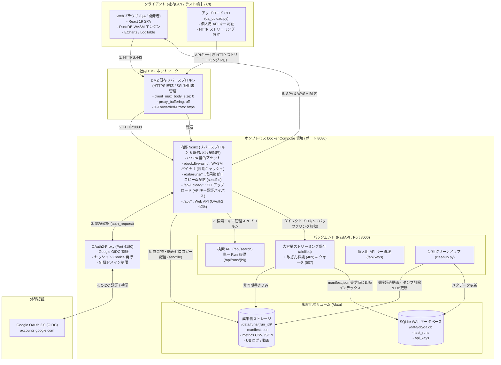
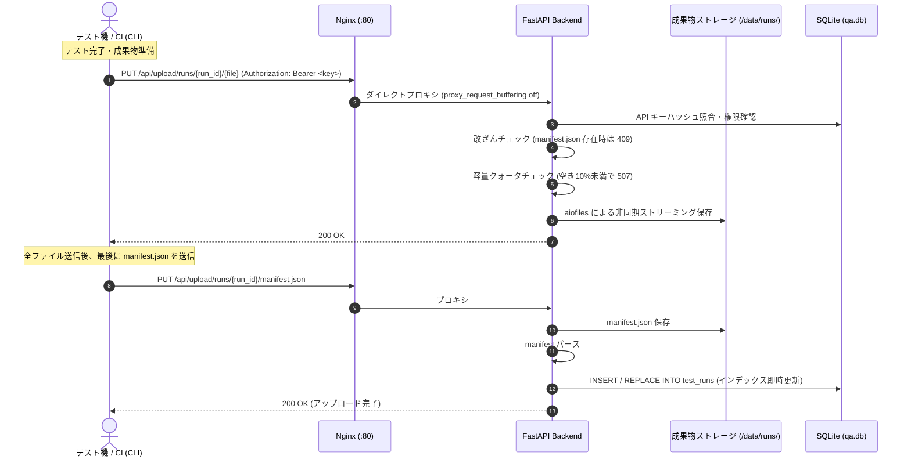
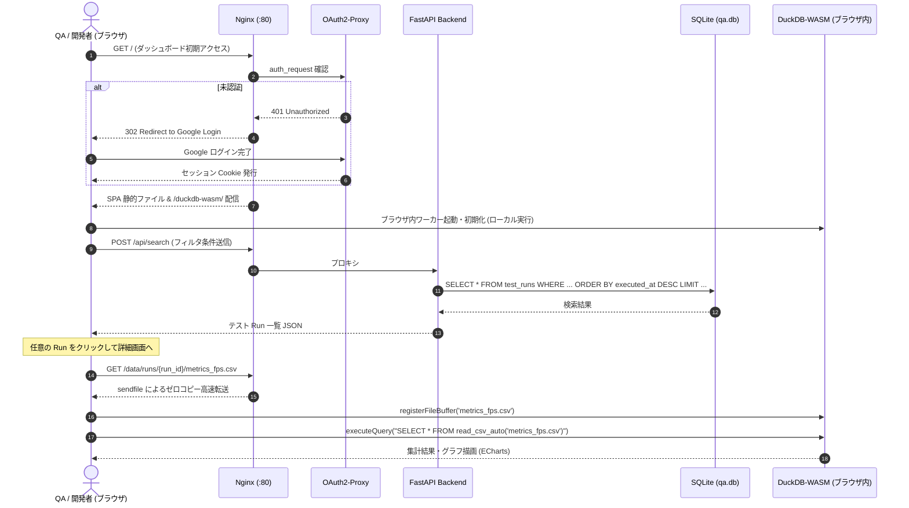

# Game QA Analytics Dashboard — システムアーキテクチャ設計書

本ドキュメントは、Game QA Analytics Dashboard（`game-db`）のシステムアーキテクチャ、コンポーネント構成、データモデル、および運用仕様を定義する設計資料です。

---

## 1. システム概要

### 1.1 目的
Game QA Analytics Dashboard は、ゲーム開発における日々の自動テスト（スモークテスト、長時間ソークテスト、性能ベンチマーク、ボット自動プレイ等）から出力されるログ、プロファイルデータ（FPS・メモリ使用量）、画面キャプチャ動画、クラッシュダンプ等を中央集約し、Web ブラウザ上で横断的に検索・分析・可視化するための統合プラットフォームです。

### 1.2 コア設計思想
- **クライアントサイド超高速分析 (DuckDB-WASM)**:
  サーバー側で大容量メトリクスやログの集約処理を行わず、ブラウザ内の DuckDB-WASM 仮想ファイルシステムに生データ（CSV/JSON/ログ）を直接読み込み、クライアント端末の CPU/メモリを活用してミリ秒単位で SQL 集計・フィルタリングを実行します。
- **完全自律型オンプレミス運用**:
  社内 DMZ リバースプロキシ配下の Docker Compose（Nginx + OAuth2-Proxy + FastAPI + SQLite）により、社内 LAN 帯域（1Gbps〜10Gbps+）を最大限に活かした大容量動画・成果物の高速配信と安全なデータ保持を実現します。
- **大容量ファイル対応 (サイズ制限なし & ゼロコピー配信)**:
  数十GBを超えるゲームプレイキャプチャ動画やダンプファイルも、Nginx の `sendfile` および HTTP Range リクエスト対応により、ブラウザから即時シーク・ストリーミング再生が可能です。
- **データ保全とストレージ自動防護**:
  確定済みテスト結果の改ざん防止（409 Conflict）、ディスク空き容量監視に基づくアップロード遮断（507 Insufficient Storage）、保持期間を超過した大容量成果物のみを自動パージするクリーンアップ機構を備えます。

---

## 2. 全体システム構成

### 2.1 システム構成図



---

## 3. 主要コンポーネント仕様

### 3.1 フロントエンド (`my-qa-dashboard/`)
- **技術スタック**: React 19, TypeScript, Vite 8, Tailwind CSS v4, ECharts (`echarts-for-react`), Lucide React
- **DuckDB-WASM データエンジン (`src/hooks/useDuckDB.ts`)**:
  - DuckDB-WASM 公式バイナリを `public/duckdb-wasm/` にセルフホストし、同一オリジンから Blob Worker 経由で初期化。
  - リモートデータ（Nginx から配信される CSV/JSON）を `fetch` して `registerFileBuffer` で DuckDB 仮想ファイルシステムに登録。
  - `read_csv_auto` や `read_json_auto` を用いて、ブラウザ上で直接 SQL クエリ（`executeQuery<T>()`）を実行。
- **画面機能**:
  - **SearchPage**: 日付範囲、プラットフォーム、ゲームバージョン、テスト名、成否結果による複合検索とソート・ページネーション。
  - **FpsChart / MemoryChart**: テスト実行中のフレームレートおよびメモリ使用量の推移をミリ秒単位で可視化。
  - **LogTable**: Unreal Engine ログの全文検索・レベル別フィルタ。ローカル UE ログファイルの手動インポート・解析対応（`ueLogParser.ts`）。
  - **VideoPlayer**: HTTP Range リクエストによる長時間の高解像度キャプチャ動画のシーク再生。
  - **ApiKeyModal**: CLI アップロード用の個人用 API キー発行・一覧・失効管理。
- **動作モード切り替え**:
  - `VITE_USE_MOCK=true`（デフォルト）: 完全ローカル開発モード。ログイン認証をバイパスし、`public/mock_data/runs.json` および `public/sample_data/` のサンプルデータで動作。
  - `VITE_USE_MOCK=false`: 社内本番結合モード。FastAPI バックエンドおよび OAuth2-Proxy と連携。

### 3.2 内部リバースプロキシ (`onprem/nginx/`)
- **SPA & アセット配信**:
  - `/`: React ビルド成果物（`index.html`, JS, CSS）を静的配信。HTML5 History API のため `try_files $uri $uri/ /index.html` を設定。
  - `/duckdb-wasm/`: WASM バイナリおよび Worker スクリプトを `Cache-Control: "public, max-age=31536000, immutable"` で配信。
- **大容量データ配信 (`/data/runs/`)**:
  - `sendfile on`, `tcp_nopush on`, `tcp_nodelay on`, `aio threads` を有効化し、カーネル空間からネットワークソケットへゼロコピー転送。
  - Range リクエスト対応により、動画シーク時の部分取得（HTTP 206 Partial Content）を低遅延で処理。
  - DuckDB-WASM および動画プレイヤー向けの CORS ヘッダー（`Access-Control-Allow-Origin`, `Range`, `Accept-Ranges` 等）を付与。
- **認証保護連携 (`auth_request`)**:
  - SPA、大容量データ、一般 API に対するアクセスを `auth_request /oauth2/auth` により OAuth2-Proxy に問い合わせて保護。
  - 未認証時は OAuth2-Proxy のログイン開始エンドポイントへリダイレクト。
- **CLI アップロード用パス (`/api/upload/`)**:
  - Web セッション Cookie を持たない CLI クライアント向けに OAuth2-Proxy をバイパスし、バックエンドへ直接プロキシ。
  - `proxy_request_buffering off` および `proxy_buffering off` により、ディスク書き込みを挟まずバックエンドへリアルタイムにストリーム転送。
  - `client_max_body_size 0`（無制限）および `proxy_read_timeout 3600s` により大容量転送のタイムアウトを防止。

### 3.3 Web 認証基盤 (`oauth2-proxy`)
- **Google OIDC 連携**:
  - Google Cloud Console で発行した OAuth 2.0 Web アプリケーション認証情報を使用。
  - `--email-domain` による自社ドメイン（例: `@company.com`）制限。
  - 認証成功時にセッション暗号化 Cookie をクライアントへ発行。

### 3.4 バックエンド API (`onprem/backend/`)
- **技術スタック**: Python >= 3.10, FastAPI, Uvicorn, SQLite3, aiofiles
- **API エンドポイント仕様**:
  - `PUT /api/upload/runs/{run_id}/{file_name}`:
    - 大容量ファイルストリーミング受信。`aiofiles` によりイベントループを阻害せずディスクに保存。
    - **改ざん保護**: 対象 Run に `manifest.json` が既に存在する場合、`?overwrite=true` クエリパラメータがない限り `HTTP 409 Conflict` を返却。
    - **ストレージクォータ監視**: ディスク空き容量が 10% 未満または 1GB 未満の場合、`HTTP 507 Insufficient Storage` で拒絶。
    - **自動インデックス**: `manifest.json` の保存完了を検知すると、自動的に内容をパースして SQLite の `test_runs` テーブルへ登録・更新。
  - `POST /api/search`:
    - SQLite `test_runs` テーブルに対する複合条件検索（日付範囲、プラットフォーム、バージョン、テスト名、ステータス、ページネーション）。
  - `GET /api/runs/{run_id}`:
    - 指定した Run の詳細メタデータおよび各成果物 URL の返却。
  - `POST /api/keys`, `GET /api/keys`, `DELETE /api/keys/{key_id}`:
    - 個人用 API キーの発行・一覧・失効管理。
- **定期ストレージクリーンアップ (`cleanup.py`)**:
  - 指定日数（デフォルト: 30日）を超過した Run を走査。
  - 成果物のうち、大容量の動画（`.mp4`）やダンプ（`.dmp`）を安全に削除。
  - CSV メトリクス、ログファイル、`manifest.json`、および SQLite インデックスレコードは恒久保持。
  - 削除された動画に対応する SQLite の `video_url` カラムをクリア。

### 3.5 アップロード CLI (`cli/qa_upload.py`)
- **機能**:
  - テスト実行マシンや CI/CD パイプラインからワンアクションでテスト結果を送信。
  - ディレクトリ内の成果物を自動スキャンし、メトリクス（CSV/JSON）、ログ、動画、スクリーンショット等を分類して `manifest.json` を生成。
  - 大容量ファイルの HTTP ストリーミング PUT 送信。
  - ffmpeg による Web 最適化動画（H.264/AAC `faststart`）の自動トランスコード機能。
  - 確定済み Run を再実行・上書きするための `--overwrite` フラグ対応。

---

## 4. データベース設計 (SQLite WAL モード)

### 4.1 接続設定
- **データベースファイル**: `/data/db/qa.db`
- **PRAGMA 設定**:
  - `PRAGMA journal_mode = WAL;` (Write-Ahead Logging による読み取り・書き込みの同時実行)
  - `PRAGMA synchronous = NORMAL;` (WAL モードにおける十分な整合性と高速化の両立)
  - `PRAGMA foreign_keys = ON;`

### 4.2 テーブルスキーマ

#### 1. `test_runs` テーブル（テスト実行インデックス）
| カラム名 | 型 | 制約 | 説明 |
| --- | --- | --- | --- |
| `run_id` | TEXT | PRIMARY KEY | テスト実行の一意識別子 (例: `run-20260907-001`) |
| `executed_at` | TEXT | NOT NULL | 実行日時 (ISO 8601 UTC) |
| `game_version` | TEXT | NOT NULL | ゲームバージョン (例: `v1.2.0`) |
| `platform` | TEXT | NOT NULL | 実行プラットフォーム (例: `PS5`, `Windows`, `XSX`) |
| `test_name` | TEXT | NOT NULL | テストケース名 (例: `BossFight_Stress`) |
| `status` | TEXT | NOT NULL | 結果 (`PASSED`, `FAILED`, `ABORTED`) |
| `avg_fps` | REAL | | 平均フレームレート |
| `min_fps` | REAL | | 最低フレームレート |
| `peak_memory_mb` | REAL | | 最大メモリ使用量 (MB) |
| `duration_seconds` | REAL | | テスト走行時間（秒） |
| `device_model` | TEXT | | 実行ハードウェア/GPUモデル名 (例: `PlayStation 5 CFI-1200`, `GeForce RTX 4080`) |
| `triggered_by` | TEXT | | 実行契機 (例: `nightly`, `pr_check`, `manual`) |
| `total_size_bytes`| INTEGER | | Run 全成果物の合計ディスク使用量 (バイト) |
| `artifacts_json` | TEXT | NOT NULL | 全アーティファクト情報の JSON 文字列 |
| `fps_data_url` | TEXT | | FPS CSV/JSON の配信 URL パス |
| `memory_data_url`| TEXT | | メモリ CSV/JSON の配信 URL パス |
| `logs_data_url` | TEXT | | UE ログの配信 URL パス |
| `video_url` | TEXT | | Web 向け動画の配信 URL パス |
| `created_at` | TEXT | DEFAULT `(datetime('now'))` | レコード登録日時 |
| `updated_at` | TEXT | | レコード最終更新日時 (クリーンアップや上書き時) |

**インデックス設計**:
- `idx_runs_executed_at`: `(executed_at DESC)` — 全体時系列ソート用
- `idx_runs_platform_date`: `(platform, executed_at DESC)` — プラットフォーム別絞り込み用
- `idx_runs_status_date`: `(status, executed_at DESC)` — 成否結果別絞り込み用
- `idx_runs_version_date`: `(game_version, executed_at DESC)` — ゲームバージョン別絞り込み用
- `idx_runs_test_name`: `(test_name)` — テスト名検索用

#### 2. `api_keys` テーブル（アップロード認証キー）
| カラム名 | 型 | 制約 | 説明 |
| --- | --- | --- | --- |
| `key_id` | TEXT | PRIMARY KEY | API キーの一意識別子 (`key_` + 8文字hex) |
| `key_hash` | TEXT | NOT NULL UNIQUE | 平文キーの SHA-256 ハッシュ値 |
| `name` | TEXT | NOT NULL | キーの用途・表示名 |
| `email` | TEXT | NOT NULL | 発行者メールアドレス |
| `prefix` | TEXT | NOT NULL | 識別用プレフィックス (例: `gqa_live_abcd...`) |
| `created_at` | TEXT | NOT NULL | 発行日時 (ISO 8601 UTC) |
| `expires_at` | TEXT | | 有効期限日時 (NULL の場合は無期限) |

**インデックス設計**:
- `idx_keys_hash`: `(key_hash)` — API 認証時の高速照合用
- `idx_keys_email`: `(email)` — ユーザー別所有キー一覧取得用

---

## 5. ストレージ構成とディレクトリ仕様

### 5.1 マウント構造
ホストマシン上のストレージ（ローカル高速 SSD または社内 NAS）を Docker ボリュームとしてバインドします。

```text
/data/
├── db/
│   ├── qa.db           # SQLite データベース本体
│   ├── qa.db-wal       # WAL ログファイル
│   └── qa.db-shm       # 共有メモリファイル
└── runs/
    └── {run_id}/       # 各 Run のアーティファクト格納ディレクトリ
        ├── manifest.json       # テストメタデータおよび成果物一覧
        ├── metrics_fps.csv     # フレームレート時系列 CSV
        ├── metrics_memory.csv  # メモリ使用量時系列 CSV
        ├── ue_output.log       # Unreal Engine ログ
        ├── capture.mp4         # オリジナル録画動画
        └── capture_web.mp4     # Web 再生用トランスコード済み動画
```

### 5.2 `manifest.json` 仕様
各 Run の成果物ディレクトリ直下に格納される標準メタデータフォーマットです。

```json
{
  "run_id": "run-20260907-001",
  "executed_at": "2026-09-07T12:00:00Z",
  "game_version": "v1.2.0",
  "platform": "PS5",
  "test_name": "BossFight_Stress",
  "status": "PASSED",
  "device_model": "PlayStation 5 CFI-1200",
  "triggered_by": "nightly",
  "duration_seconds": 300.0,
  "total_size_bytes": 173012992,
  "summary": {
    "avg_fps": 59.8,
    "min_fps": 45.2,
    "peak_memory_mb": 4250.0
  },
  "artifacts": [
    {
      "type": "fps",
      "path": "metrics_fps.csv",
      "size_bytes": 1048576
    },
    {
      "type": "memory",
      "path": "metrics_memory.csv",
      "size_bytes": 524288
    },
    {
      "type": "log",
      "path": "ue_output.log",
      "size_bytes": 15728640
    },
    {
      "type": "video",
      "path": "capture_web.mp4",
      "size_bytes": 21474836480
    }
  ]
}
```

---

## 6. データフロー

### 6.1 テスト結果アップロードフロー (CLI / CI パイプライン)



### 6.2 Web 閲覧・分析フロー (ブラウザ)



---

## 7. 運用・保守設計

### 7.1 個人用 API キーのライフサイクル
1. **発行**:
   - ユーザーがブラウザでダッシュボードにログイン後、「API Keys」モーダルからキー名を入力して作成。
   - バックエンドが暗号学的に安全なランダムトークン（`gqa_live_` + 40文字hex）を生成。
   - トークンの SHA-256 ハッシュ値を SQLite の `api_keys` テーブルに保存。
   - 平文トークンは発行時のモーダルに一度だけ表示され、サーバー上には保存されない。
2. **利用**:
   - CLI または HTTP クライアントの `Authorization: Bearer <token>` ヘッダーとして送信。
   - バックエンドは受信したトークンの SHA-256 ハッシュを計算し、`api_keys` テーブルを照合して認証。
3. **失効**:
   - Web 画面の一覧から不要になったキーを削除（`DELETE /api/keys/{key_id}`）。
   - 削除されたキーは即時無効となり、以降のアップロードは 401 Unauthorized となる。

### 7.2 ディスク容量管理と自動クリーンアップ
1. **アップロード遮断（クォータ保護）**:
   - `/data` パーティションの空き容量が **10% 未満** または **1GB 未満** に達した時点で、アップロード API は新規受付を直ちに停止し `HTTP 507 Insufficient Storage` を返却。
2. **期限切れアーティファクトの自動パージ (`cleanup.py`)**:
   - cron または定期タスクにより `python cleanup.py --days <日数>` を実行。
   - 保持期間（例: 30日）を過ぎた Run を検索し、成果物ディレクトリ内の容量の大きい動画（`.mp4`）やダンプ（`.dmp`）を物理削除。
   - 軽量かつ分析価値の高い CSV メトリクス、ログ、`manifest.json` は恒久保持。
   - SQLite `test_runs` テーブルの `video_url` を NULL に更新し、ダッシュボード上の動画プレイヤーを安全に非表示化。
