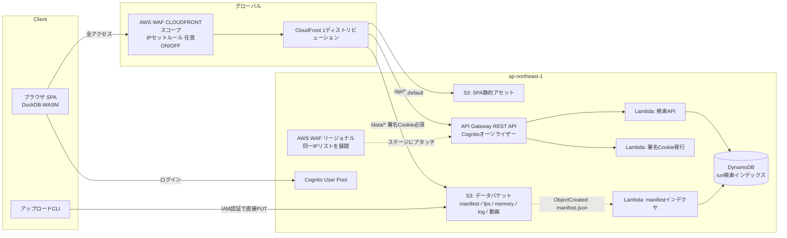

# AWS デプロイ構成案 — Game QA Analytics Dashboard

作成日: 2026-08-02

## 要件

- 単一リージョン（ap-northeast-1）
- ユーザー認証必須
- IPアドレスによるブロックを任意でかけられる
- データはS3に保存
- テスト実行完了（manifest.jsonアップロード）時に検索用インデックスへ自動反映し、検索条件で一覧に表示
- ログ / FPS / テスト結果は別ファイルだが、検索画面では同一実行を1件として扱う
- アップロード用CLIが必要
- データ表示はS3直接ではなくCloudFront経由（特に動画などの大容量ファイル。エグレス料金もCloudFront経由の方が低い）

## 全体像



## コンポーネント

### 1. 認証 — Cognito User Pool + CloudFront署名Cookie

- SPAのログインは Cognito（OIDC / Hosted UI）。APIは API Gateway（REST API）の **Cognitoオーソライザー** で保護。
- データファイル（特に動画）はAPI経由にせず CloudFront から直接配信するため、ログイン後に
  `/api/auth/cookie` を叩いて **CloudFront署名Cookie** を発行し、以降の `/data/*` GETはCookieで認可。
- 署名URLでなくCookieにする理由: 1つの実行で fps/memory/log/動画と複数ファイルを引くこと、
  動画のRangeリクエストとの相性が良いこと。
- SPA・データ・APIを **1つのCloudFrontディストリビューション** に同居させ（behavior分割）、
  Cookieドメインを揃えて署名Cookie運用を単純化する。
  - `/`（default）→ SPA用S3バケット
  - `/data/*` → データバケット（署名Cookie必須）
  - `/api/*` → API Gateway

### 2. IPブロック — AWS WAF（CloudFront + REST APIステージの2箇所）

- IPセット + ブロックルールを用意し、普段は空 or ルール無効。
- 必要になったらIPセットにIPを追加するだけで即時反映。
- Web ACLは2箇所にアタッチする:
  - **CLOUDFRONTスコープ**（us-east-1）: ディストリビューションにアタッチ。SPA / `/data/*` / `/api/*` の通常経路をカバー。
  - **REGIONALスコープ**（ap-northeast-1）: REST APIステージに直接アタッチ。CloudFrontを介さない
    `execute-api` デフォルトエンドポイントへの直アクセスもIPブロック対象にする（直URLでのWAF迂回対策）。
- WAFのIPセットは **スコープをまたいで共有できない** ため、ブロックIPリストはCDKで一元定義し、
  両スコープのIPセットへ展開する（どちらも追加は即時反映）。
- このため API Gateway は **REST API（リージョナルエンドポイント）** を採用する。
  WAFをステージに直接アタッチできるのはREST APIのみ（HTTP API不可）。認証はHTTP APIの
  JWTオーソライザーの代わりにCognitoオーソライザーを使う。
- 拡張: Cognito User Pool（Hosted UI）にもリージョナルWeb ACLを関連付ければ、ログイン入口も
  同じIPブロックでカバーできる。

### 3. データ格納レイアウト — テスト結果ファイル = マニフェスト方式

```
s3://qa-data/runs/{run_id}/
    manifest.json        ← テスト結果 + 付随データのS3キー一覧
    fps_metrics.csv
    memory_metrics.csv
    ue.log
    capture.mp4
```

- `manifest.json` が結果サマリと子ファイル（fps/memory/log/動画）のS3キーを持つ。
  「run 1件 = manifest 1オブジェクト」になり、検索時の集約処理が不要。
- CLIは **子ファイルを先に、manifestを最後に** PUTする。
  「manifestが存在する = runが完全」という不変条件になり、アップロード途中のrunが検索に出ない。

### 4. 検索 — S3イベント通知 + Lambda + DynamoDB

- CLIは子ファイル → `manifest.json` の順でPUTするだけでよい（annotation付与などの追加API呼び出しは不要）。
- データバケットの **S3 Event Notification**（`s3:ObjectCreated:*`、`suffix: manifest.json`）が
  **manifestインデクサLambda** を起動し、以下を行う:
  1. 対象の `manifest.json` を読み込みパース
  2. 検索用フィールド（`runId` / `gameVersion` / `platform` / `testName` / `status` /
     `executedAt` / 各データファイルのS3キー）を **DynamoDBテーブル** に1アイテムとして `PutItem`
  3. `runId` をパーティションキーにすることで、再アップロード・イベント再送があっても冪等（上書き）
- 反映は**数秒以内**（S3イベント通知はほぼリアルタイム）。Annotation Table + Athena方式のような
  分単位の遅延・バックフィル待ちが発生しない。

DynamoDBテーブル設計（`SearchFilter` の `gameVersion` / `platform` / `testName` / `status` は
いずれも等価フィルタなので、GSIによる `Query` だけで完結できる）:

| テーブル/GSI | パーティションキー | ソートキー | 用途 |
| --- | --- | --- | --- |
| メインテーブル | `runId` | — | `runId` 指定での直接取得（run詳細表示など） |
| GSI `platform-index` | `platform` | `executedAt` | platform絞り込み＋時系列ソート |
| GSI `status-index` | `status` | `executedAt` | status絞り込み＋時系列ソート |
| GSI `all-index` | 固定値 `"ALL"` | `executedAt` | フィルタ未指定時の最新run一覧 |

- `testName` / `gameVersion` など、選んだGSIのパーティションキーに含まれない残りの条件は、
  `Query` 結果に対して `FilterExpression` で追加絞り込みする。
- 検索Lambda（`ApiSearchService` の接続先）は `SearchFilter` の指定値から最も選択的な
  フィールドで使用するGSIを選び、`Query` → 残り条件は `FilterExpression`、という単純なロジックになる
  （AthenaのSQL組み立て・クエリ実行のポーリングが不要）。
- run詳細表示（アーティファクト一覧を含む完全な情報）が必要な画面では、引き続き
  CloudFront経由で `manifest.json` を直接フェッチする。DynamoDBアイテムは検索用の
  フラットな要約のみを持ち、`artifacts` の全量は複製しない。
- 将来、QA担当が「トリアージ済み」「既知バグ #1234」等のステータスを追加したい場合は、
  DynamoDBアイテムに属性を追加する（または別テーブル/別GSIにする）ことで対応できる。

必要なセットアップ:

1. **DynamoDBテーブル**: オンデマンドキャパシティ、PK=`runId`、上記GSI群。
2. **S3 Event Notification**: データバケットの `manifest.json` サフィックスにマッチする
   `ObjectCreated` イベントをLambdaへ通知（Lambdaリソースポリシーで `s3.amazonaws.com` からの
   invokeを許可）。
3. **manifestインデクサLambdaの権限**: 対象オブジェクトへの `s3:GetObject`、
   DynamoDBテーブルへの `dynamodb:PutItem`。
4. **検索Lambdaの権限**: DynamoDBテーブル・各GSIへの `dynamodb:Query` / `dynamodb:GetItem`。

### 5. アップロードCLI

- 利用者はテスト実行マシン/CIなので、認証は **IAMロール（CI）または IAM Identity Center（人間）**。
  Cognitoは不要（Cognitoはダッシュボード閲覧者用）。
- 機能:
  - 大容量動画のマルチパートアップロード、リトライ
  - 子ファイル → manifest の順でPUT
- CLIはS3への書き込み権限のみで完結する。検索インデックスへの反映はS3イベント通知経由で
  manifestインデクサLambdaが行うため、CLI側に追加のAPI呼び出しやIAM権限（annotation付与等）は不要。

### 6. データ配信 — CloudFront経由

- データバケットは **OAC（Origin Access Control）でCloudFrontからのみ読み取り可** にし、S3直アクセスを遮断。
- 動画: CloudFrontはRange GET・キャッシュが効き、エグレス単価もS3直より低い。
  コスト最適化として Price Class（日本中心なら PriceClass_200 等）も検討。
- フロント側は `TestRunSummary` のURLを `/data/runs/{run_id}/...` にするだけで、
  既存の `loadRemoteFile` → DuckDB登録のフローがそのまま使える（署名Cookieは同一オリジンなので自動送信）。

## 留意点

- **S3イベント通知は基本的に高信頼だが、稀に重複配信・欠落があり得る**前提で設計する。
  DynamoDB書き込みは `runId` をキーにした冪等な `PutItem`（同じ内容での上書きは無害）にしておく。
  取りこぼし対策として、定期的（例: 日次）に全 `manifest.json` を棚卸ししてDynamoDBと
  突き合わせるバックフィルLambdaを用意すると安心（オプション）。
- DynamoDBはオンデマンドキャパシティにしておけば、テスト実行数の増減に対してスループット面の
  事前チューニングはほぼ不要。GSIのパーティションキー（`platform` / `status` 等）に値の偏りが
  大きい場合はホットパーティションに注意。
- 将来「run横断の集計・トレンド分析」（例: 直近半年のFPS推移）のような自由なSQL分析が
  必要になった場合は、DynamoDBからS3への定期エクスポート + Athena/QuickSightなど
  別の分析経路を追加する2段構えが現実的（検索UXの経路とは分離する）。
- CloudFront/WAFはグローバルサービスだが、**CloudFront用ACM証明書は us-east-1** に必要。
- REST APIはHTTP APIよりリクエスト単価が高いが、WAF直アタッチ（IPブロックの直URL迂回対策）を
  優先して採用。リクエスト数規模的にコスト差は誤差。
- 動画・ログはライフサイクルルールで一定期間後に S3 Glacier Instant Retrieval 等へ移行し、
  ストレージコストを抑える。
- IaCはCDK等でスタック化する想定（上記セットアップ一式を含める）。

## 既存コードとの対応

| 既存コード | AWS構成での役割 |
| --- | --- |
| `src/services/ApiSearchService.ts`（スタブ） | `/api/search` を呼ぶ実装に置き換え |
| `src/services/SearchService.ts` の `SearchFilter` | 検索LambdaのDynamoDB `Query`/`FilterExpression` 条件にマップ |
| `TestRunSummary` の `*DataUrl` | CloudFrontの `/data/runs/{run_id}/...` を指す |
| `useDuckDB.loadRemoteFile` | そのまま（CloudFront経由URLをfetch） |
| `VITE_USE_MOCK` | 本番ビルドで `'false'` にして `ApiSearchService` に切替 |
