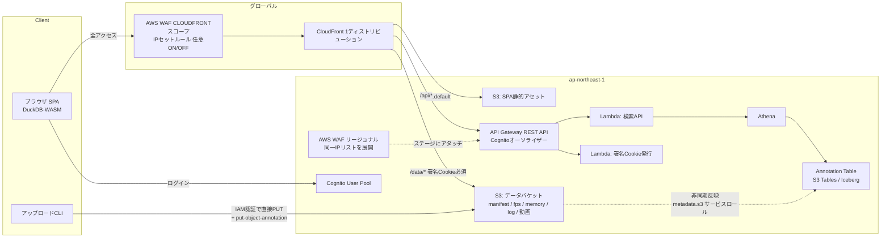

# AWS デプロイ構成案 — Game QA Analytics Dashboard

作成日: 2026-08-02

## 要件

- 単一リージョン（ap-northeast-1）
- ユーザー認証必須
- IPアドレスによるブロックを任意でかけられる
- データはS3に保存
- S3 Annotations を付与し、それを検索して検索一覧に表示
- ログ / FPS / テスト結果は別ファイルだが、検索画面では同一実行を1件として扱う
- アップロード用CLIが必要
- データ表示はS3直接ではなくCloudFront経由（特に動画などの大容量ファイル。エグレス料金もCloudFront経由の方が低い）

## 全体像



## コンポーネント

### 1. 認証 — Cognito User Pool + CloudFront署名Cookie

- SPAのログインは Cognito（OIDC / Hosted UI）。APIは API Gateway（REST API）の **Cognitoオーソライザー** で保護。
- データファイル（特に動画）はAPI経由にせず CloudFront から直接配信するため、ログイン後に
  `/api/auth/cookie` を叩いて **CloudFront署名Cookie** を発行し、以降の `/data/*` GETはCookieで認可。
- 署名URLでなくCookieにする理由: 1つの実行で fps/memory/log/動画と複数ファイルを引くこと、
  動画のRangeリクエストとの相性が良いこと。
- SPA・データ・APIを **1つのCloudFrontディストリビューション** に同居させ（behavior分割）、
  Cookieドメインを揃えて署名Cookie運用を単純化する。
  - `/`（default）→ SPA用S3バケット
  - `/data/*` → データバケット（署名Cookie必須）
  - `/api/*` → API Gateway

### 2. IPブロック — AWS WAF（CloudFront + REST APIステージの2箇所）

- IPセット + ブロックルールを用意し、普段は空 or ルール無効。
- 必要になったらIPセットにIPを追加するだけで即時反映。
- Web ACLは2箇所にアタッチする:
  - **CLOUDFRONTスコープ**（us-east-1）: ディストリビューションにアタッチ。SPA / `/data/*` / `/api/*` の通常経路をカバー。
  - **REGIONALスコープ**（ap-northeast-1）: REST APIステージに直接アタッチ。CloudFrontを介さない
    `execute-api` デフォルトエンドポイントへの直アクセスもIPブロック対象にする（直URLでのWAF迂回対策）。
- WAFのIPセットは **スコープをまたいで共有できない** ため、ブロックIPリストはCDKで一元定義し、
  両スコープのIPセットへ展開する（どちらも追加は即時反映）。
- このため API Gateway は **REST API（リージョナルエンドポイント）** を採用する。
  WAFをステージに直接アタッチできるのはREST APIのみ（HTTP API不可）。認証はHTTP APIの
  JWTオーソライザーの代わりにCognitoオーソライザーを使う。
- 拡張: Cognito User Pool（Hosted UI）にもリージョナルWeb ACLを関連付ければ、ログイン入口も
  同じIPブロックでカバーできる。

### 3. データ格納レイアウト — テスト結果ファイル = マニフェスト方式

```
s3://qa-data/runs/{run_id}/
    manifest.json        ← テスト結果 + 付随データのS3キー一覧
    fps_metrics.csv
    memory_metrics.csv
    ue.log
    capture.mp4
```

- `manifest.json` が結果サマリと子ファイル（fps/memory/log/動画）のS3キーを持つ。
  「run 1件 = manifest 1オブジェクト」になり、検索時の集約処理が不要。
- CLIは **子ファイルを先に、manifestを最後に** PUTする。
  「manifestが存在する = runが完全」という不変条件になり、アップロード途中のrunが検索に出ない。

### 4. 検索 — S3 Annotations + Annotation Table + Athena

- CLIがアップロード完了時、`manifest.json` に対して annotation 名 `run-summary` で
  フラットな検索用JSONを1つ付与（`put-object-annotation`）:

```json
{
  "run_id": "run-001",
  "executed_at": "2026-08-01T10:00:00Z",
  "game_version": "v1.2.0",
  "platform": "PS5",
  "test_name": "Level1_Playthrough",
  "result": "FAILED",
  "avg_fps": 54.2,
  "fps_key": "runs/run-001/fps_metrics.csv",
  "memory_key": "runs/run-001/memory_metrics.csv",
  "log_key": "runs/run-001/ue.log",
  "video_key": "runs/run-001/capture.mp4"
}
```

- 子ファイル側に annotation は不要。検索は「run 1件 = annotation 1行」。
- 検索Lambda（`ApiSearchService` の接続先）はAthenaでAnnotation Tableをクエリし、
  `TestRunSummary[]` に整形して返す。`SearchFilter` のフィールドがそのまま
  `json_extract_scalar` の条件にマップできる:

```sql
SELECT object_key, text_value
FROM "s3tablescatalog/aws-s3"."b_<データバケット名>"."annotation"
WHERE name = 'run-summary'
  AND json_extract_scalar(text_value, '$.platform') = 'PS5'
  AND json_extract_scalar(text_value, '$.result') = 'FAILED'
  AND CAST(json_extract_scalar(text_value, '$.avg_fps') AS DOUBLE) < 55
```

- annotation は **オブジェクト再PUTなしで個別更新可能**（最大1000個/オブジェクト、各1MB）。
  後からQA担当が「トリアージ済み」「既知バグ #1234」等のステータスを `triage` など
  別名のannotationとして追加する拡張も自然にできる。

必要なセットアップ:

1. **サービスロール**: `metadata.s3.amazonaws.com` がAssumeRoleできるロール
   （`s3:GetObjectAnnotation` / `s3:GetObjectVersionAnnotation` / `s3:ListBucket` 等）。
2. **バケットの Metadata Configuration**: `AnnotationTableConfiguration: ENABLED`
   （Journalは任意、Inventoryは DISABLED で可）。有効化直後は `BACKFILLING` → `ACTIVE` まで数十分。
3. **Glue federated catalog**: S3 Tables用の `s3tablescatalog` を作成し、Athenaから
   `"s3tablescatalog/aws-s3"."b_<bucket>"."annotation"` を参照。
4. **バージョン要件**: boto3 ≥ 1.43.31 / AWS CLI ≥ v2.35.6。

### 5. アップロードCLI

- 利用者はテスト実行マシン/CIなので、認証は **IAMロール（CI）または IAM Identity Center（人間）**。
  Cognitoは不要（Cognitoはダッシュボード閲覧者用）。
- 機能:
  - 大容量動画のマルチパートアップロード、リトライ
  - 子ファイル → manifest の順でPUT
  - manifest への `run-summary` annotation 付与（`put-object-annotation`）
- CLIの `--annotation-payload` はファイルパス直指定（`file://` プレフィックス不可）。
- `aws s3 cp --copy-props all` でannotationごとコピー可能（S3間コピー時）。

### 6. データ配信 — CloudFront経由

- データバケットは **OAC（Origin Access Control）でCloudFrontからのみ読み取り可** にし、S3直アクセスを遮断。
- 動画: CloudFrontはRange GET・キャッシュが効き、エグレス単価もS3直より低い。
  コスト最適化として Price Class（日本中心なら PriceClass_200 等）も検討。
- フロント側は `TestRunSummary` のURLを `/data/runs/{run_id}/...` にするだけで、
  既存の `loadRemoteFile` → DuckDB登録のフローがそのまま使える（署名Cookieは同一オリジンなので自動送信）。

## 留意点

- **Annotation Tableへの反映は非同期**（分単位の遅延）。アップロード直後の即時検索が必要な場合のみ、
  検索Lambdaで直近分を `list_object_annotations` で補完するフォローを検討。QAラン検索なら通常許容範囲。
- Athenaは1クエリ数秒＋スキャン課金。run件数規模ならスキャン量は微小で、
  DynamoDB同期基盤（EventBridge + Lambda + テーブル）を丸ごと省略できるのが利点。
  ミリ秒応答が必要になった時点で初めてDynamoDBキャッシュを検討する。
- CloudFront/WAFはグローバルサービスだが、**CloudFront用ACM証明書は us-east-1** に必要。
- REST APIはHTTP APIよりリクエスト単価が高いが、WAF直アタッチ（IPブロックの直URL迂回対策）を
  優先して採用。リクエスト数規模的にコスト差は誤差。
- 動画・ログはライフサイクルルールで一定期間後に S3 Glacier Instant Retrieval 等へ移行し、
  ストレージコストを抑える。
- IaCはCDK等でスタック化する想定（上記セットアップ一式を含める）。

## 既存コードとの対応

| 既存コード | AWS構成での役割 |
| --- | --- |
| `src/services/ApiSearchService.ts`（スタブ） | `/api/search` を呼ぶ実装に置き換え |
| `src/services/SearchService.ts` の `SearchFilter` | 検索LambdaのAthenaクエリ条件にマップ |
| `TestRunSummary` の `*DataUrl` | CloudFrontの `/data/runs/{run_id}/...` を指す |
| `useDuckDB.loadRemoteFile` | そのまま（CloudFront経由URLをfetch） |
| `VITE_USE_MOCK` | 本番ビルドで `'false'` にして `ApiSearchService` に切替 |
