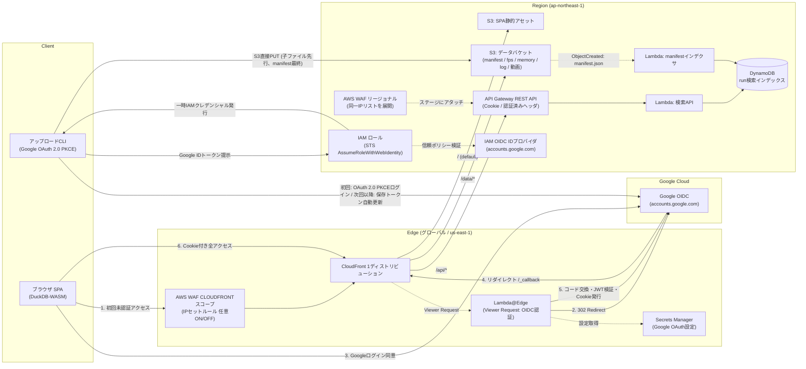

# AWS デプロイ構成案 — Game QA Analytics Dashboard

作成日: 2026-08-02
更新日: 2026-09-06（Googleアカウント認証 / Lambda@Edge OIDC への移行）

## 要件

- 単一リージョン（ap-northeast-1、エッジ認証リソースは us-east-1）
- ユーザー認証必須（**Google アカウント認証**。WebダッシュボードおよびアップロードCLIの双方でGoogle認証を使用）
- IPアドレスによるブロックを任意でかけられる
- データはS3に保存
- テスト実行完了（manifest.jsonアップロード）時に検索用インデックスへ自動反映し、検索条件で一覧に表示
- ログ / FPS / テスト結果は別ファイルだが、検索画面では同一実行を1件として扱う
- アップロード用CLIが必要（Googleアカウント認証に対応。初回のブラウザ操作後は保存済みトークンで非対話自動実行）
- データ表示はS3直接ではなくCloudFront経由（特に動画などの大容量ファイル。エグレス料金もCloudFront経由の方が低い）

## 全体像



## コンポーネント

### 1. 認証 — CloudFront + Lambda@Edge (OIDC / Google Account)

Cognito User Pool は使用せず、CloudFront のエッジで **Lambda@Edge** を用いて Google アカウント（OpenID Connect）による認証を行います（参考: [CloudFront で Lambda@Edge を使って OpenID Connect (OIDC) 認証する](https://zenn.dev/yh1224/articles/f473a9325a48404bd) / `aws-samples/lambdaedge-openidconnect-samples`）。

#### 認証シーケンス

1. **未認証アクセスの検出**: ユーザーがブラウザで CloudFront の任意のパス（SPA、`/data/*`、`/api/*`）にアクセスした際、Viewer Request イベントで Lambda@Edge が起動し、リクエストヘッダ内の認証 Cookie（`TOKEN`）の有無をチェックします。
2. **IdP（Google）へのリダイレクト**: 未認証、または Cookie 内の JWT が期限切れ・署名不正の場合は、Google の OAuth 2.0 認可エンドポイント（`https://accounts.google.com/o/oauth2/v2/auth`）へ HTTP 302 リダイレクトします。
   - コールバック URL: `https://<cloudfront-domain>/_callback`
   - スコープ: `openid email profile`
3. **コールバック処理**: Google でのログイン完了後、ブラウザが `https://<cloudfront-domain>/_callback?code=...&state=...` にリダイレクトされます。
   - Lambda@Edge が `/_callback` パスを検知し、認可コードを Google のトークンエンドポイント（`https://oauth2.googleapis.com/token`）と通信して ID トークンおよびアクセストークンと交換します。
   - Google の JWKS（公開鍵）で ID トークン（JWT）の署名を検証します。
4. **アクセス許可判定（ユーザー制限）**:
   - JWT の `sub` または `email`（および Google Workspace のホストドメイン `hd`）を検証し、許可された特定のユーザーまたはドメインに属しているかチェックします。
   - 許可されていないユーザーの場合は HTTP 401/403 エラー画面を返却します。
5. **セッション Cookie の発行**:
   - 認可が成功した場合、JWT を格納したセッション Cookie（`HttpOnly`, `Secure`, `Path=/`, `SameSite=Lax`）を `Set-Cookie` し、元の要求先 URL へリダイレクトします。
6. **後続アクセスの透過**:
   - 以降のリクエストではブラウザから Cookie が送信され、Lambda@Edge がエッジ上で暗号署名を高速検証してオリジン（S3App, S3Data, APIGW）へ転送します。

#### エッジ認証の利点

- **単一 Cookie による保護**: SPA 静的ファイル（`/`）、データファイル（`/data/*`）、API（`/api/*`）すべてが同一の CloudFront ディストリビューションかつ同一ドメインの Cookie でエッジ保護されます。
- **署名Cookie発行Lambdaが不要**: 従来のアーキテクチャでは Cognito ログイン後に `/api/auth/cookie` を叩いて CloudFront 署名 Cookie を発行していましたが、Lambda@Edge が Viewer Request で認可を行うため、追加の署名 Cookie 発行ステップや RSA 秘密鍵管理が不要になります。
- **Secrets Manager の配置**: Lambda@Edge が使用する Google Client ID / Client Secret などの設定は、CloudFront / Lambda@Edge と同じ **`us-east-1`** の AWS Secrets Manager に格納します。

---

### 2. IPブロック — AWS WAF（CloudFront + REST APIステージの2箇所）

- IPセット + ブロックルールを用意し、普段は空 or ルール無効。
- 必要になったらIPセットにIPを追加するだけで即時反映。
- Web ACLは2箇所にアタッチする:
  - **CLOUDFRONTスコープ**（us-east-1）: ディストリビューションにアタッチ。SPA / `/data/*` / `/api/*` の通常経路をカバー。
  - **REGIONALスコープ**（ap-northeast-1）: REST APIステージに直接アタッチ。CloudFrontを介さない `execute-api` デフォルトエンドポイントへの直アクセスもIPブロック対象にする（直URLでのWAF迂回対策）。
- WAFのIPセットは **スコープをまたいで共有できない** ため、ブロックIPリストはCDKで一元定義し、両スコープのIPセットへ展開する。

---

### 3. データ格納レイアウト — テスト結果ファイル = マニフェスト方式

```
s3://qa-data/runs/{run_id}/
    manifest.json        ← テスト結果 + 付随データのS3キー一覧
    fps_metrics.csv
    memory_metrics.csv
    ue.log
    capture.mp4          ← 元動画（アーカイブ用、最大30GB）
    capture_web.mp4      ← Web配信用軽量動画（1080p, H.264/AAC, +faststart）
```

- `manifest.json` が結果サマリと子ファイル（fps/memory/log/動画）のS3キーを持つ。
  「run 1件 = manifest 1オブジェクト」になり、検索時の集約処理が不要。
- 動画はCLI側でWeb配信用動画（`*_web.mp4`）が自動生成され、マニフェスト内で優先指定されるため、Media Viewerでは即時再生と軽快なシークが可能。
- CLIは **子ファイルを先に、manifestを最後に** PUTする。
  「manifestが存在する = runが完全」という不変条件になり、アップロード途中のrunが検索に出ない。

---

### 4. 検索 — S3イベント通知 + Lambda + DynamoDB

- CLIは子ファイル → `manifest.json` の順でPUTするだけでよい（annotation付与などの追加API呼び出しは不要）。
- データバケットの **S3 Event Notification**（`s3:ObjectCreated:*`、`suffix: manifest.json`）が **manifestインデクサLambda** を起動し、以下を行う:
  1. 対象の `manifest.json` を読み込みパース
  2. 検索用フィールド（`runId` / `gameVersion` / `platform` / `testName` / `status` / `executedAt` / 各データファイルのS3キー）を **DynamoDBテーブル** に1アイテムとして `PutItem`
  3. `runId` をパーティションキーにすることで、再アップロード・イベント再送があっても冪等（上書き）
- 反映は**数秒以内**（S3イベント通知はほぼリアルタイム）。

DynamoDBテーブル設計:

| テーブル/GSI | パーティションキー | ソートキー | 用途 |
| --- | --- | --- | --- |
| メインテーブル | `runId` | — | `runId` 指定での直接取得（run詳細表示など） |
| GSI `platform-index` | `platform` | `executedAt` | platform絞り込み＋時系列ソート |
| GSI `status-index` | `status` | `executedAt` | status絞り込み＋時系列ソート |
| GSI `all-index` | 固定値 `"ALL"` | `executedAt` | フィルタ未指定時の最新run一覧 |

- 検索Lambda（`ApiSearchService` の接続先）は `SearchFilter` の指定値から最も選択的なフィールドで使用するGSIを選び、`Query` → 残り条件は `FilterExpression` で絞り込む。

---

### 5. アップロードCLI — Google アカウント認証 + AWS STS Web Identity Federation

アップロード CLI（`cli/qa_upload.py`）は、**Google アカウント認証** を利用して S3 へのアップロード権限を取得します。テスト実行マシンや開発者PCに AWS IAM アクセスキーを直接設定・配布する必要がありません。

#### 認証の流れ

```
[アップロードCLI] 
  │
  ├─(A) 初回認証 (ユーザー操作あり)
  │     1. ローカルHTTPサーバを一時起動 (http://127.0.0.1:<port>/callback)
  │     2. ブラウザで Google OAuth 認可画面を開く (PKCE S256, access_type=offline, prompt=consent)
  │     3. ユーザーがGoogleアカウントでログイン・同意
  │     4. ローカルコールバックで認可コード受信
  │     5. Googleトークンエンドポイントから id_token, refresh_token を取得
  │     6. ~/.config/game-qa/token.json (パーミッション 0600) にトークンを永続化
  │
  ├─(B) 2回目以降 (保存済み情報で完全自動・非対話)
  │     1. ~/.config/game-qa/token.json からトークンを読み込み
  │     2. id_token が有効期限内であればそのまま使用
  │     3. 期限切れの場合、refresh_token を使って Google から新しい id_token をサイレント取得・更新保存
  │
  └─(C) AWS へのアクセス (STS AssumeRoleWithWebIdentity)
        1. AWS STS に AssumeRoleWithWebIdentity(RoleArn=..., WebIdentityToken=id_token) を発行
        2. AWS IAM OIDC IDプロバイダ (accounts.google.com) がGoogle署名を検証し、一時IAMクレデンシャルを発行
        3. 取得した一時クレデンシャルで boto3 S3 クライアントを初期化
        4. S3 へ子ファイル群 → manifest.json の順で直接 PUT (大容量動画はマルチパートアップロード)
```

#### AWS 側の設定

1. **IAM OIDC ID プロバイダ**:
   - プロバイダ URL: `https://accounts.google.com`
   - 対象者 (Audience): Google Cloud で発行したデスクトップアプリ用クライアント ID
2. **アップロード用 IAM ロール**:
   - 信頼ポリシー:

     ```json
     {
       "Version": "2012-10-17",
       "Statement": [
         {
           "Effect": "Allow",
           "Principal": {
             "Federated": "arn:aws:iam::<account-id>:oidc-provider/accounts.google.com"
           },
           "Action": "sts:AssumeRoleWithWebIdentity",
           "Condition": {
             "StringEquals": {
               "accounts.google.com:aud": "<GOOGLE_CLIENT_ID>"
             }
           }
         }
       ]
     }
     ```

   - 許可ポリシー:
     `s3:PutObject` on `arn:aws:s3:::qa-data/runs/*`
3. **CI環境・ヘッドレス環境での運用**:
   - 人間の操作がない CI マシンでは、IAM ロール（EC2/ECS/GitHub Actions OIDC）による `--profile` または標準 AWS クレデンシャルへのフォールバックも維持。
   - または、事前に取得した `refresh_token` や `GOOGLE_ID_TOKEN` を環境変数経由で渡す運用も可能。

---

### 6. データ配信 — CloudFront経由

- データバケットは **OAC（Origin Access Control）でCloudFrontからのみ読み取り可** にし、S3直アクセスを遮断。
- **CloudFront定額プランの活用**: 社内向けサービスとしてデータ転送量は定額プラン内に収まる見込みであり、エグレス転送料金の予測可能性を確保。
- **30GB 単一ファイル上限**: CloudFrontの単一オブジェクト上限（30GB）を超えるファイルは扱わず、アップロードCLI側で事前に検知・ブロック。
- **動画ストリーミングの最適化**:
  - Web画面（Media Viewer）では、CLIで事前トランスコードされたWeb用軽量動画（`*_web.mp4`、`+faststart` 適用）を優先再生。
  - 数十GBの元動画をブラウザで開く際の初期メタデータ取得遅延やシークのカクつき、ブラウザのOOMクラッシュを防止。
  - 元動画（アーカイブ用）は成果物一覧より直接ダウンロード可能。
- フロント側は `TestRunSummary` のURLを `/data/runs/{run_id}/...` にするだけで、既存の `loadRemoteFile` → DuckDB登録のフローがそのまま動作（Google 認証 Cookie はブラウザから同一オリジンへ自動送信され、Lambda@Edge が検証）。

---

## 留意点

- **Google Cloud Console 設定**:
  - OAuth 同意画面（外部または組織内部 Google Workspace）。
  - **Web アプリケーション クライアント**: CloudFront + Lambda@Edge 用（リダイレクト URI: `https://<cloudfront-domain>/_callback`）。
  - **デスクトップ アプリ クライアント**: アップロード CLI 用（ローカルループバック `http://127.0.0.1` 許可）。
- **Secrets Manager（us-east-1）**:
  - Lambda@Edge が参照する Google Client ID / Secret を格納。
- **Lambda@Edge の制約**:
  - Lambda@Edge は **us-east-1** で作成・バージョン発行（`publish: true`）する必要がある。
  - Viewer Request イベントは実行時間 5 秒、メモリ 128MB〜3008MB、ペイロード 40KB の制限があるが、JWT検証および 302 リダイレクトには十分。
- **S3イベント通知の冪等性**:
  - `runId` をキーにした冪等な `PutItem`（同じ内容での上書きは無害）。
- **CloudFront用ACM証明書**:
  - カスタムドメインを使用する場合、証明書は **us-east-1** に必要。

---

## 既存コードとの対応

| 既存コード / コンポーネント | 変更後の役割 |
| --- | --- |
| `docs/aws-architecture.md` | 本構成案（Google OIDC + Lambda@Edge + CLI STS 連携） |
| `cli/qa_upload.py` | Google OAuth 2.0 PKCE ログイン、トークン保存/リフレッシュ、STS WebIdentity 認証を統合 |
| `cli/README.md` | Google 認証によるアップロード手順、初回ログイン、自動更新の仕様を記載 |
| `my-qa-dashboard/src/services/ApiSearchService.ts` | Cookie 自動送信（`credentials: 'include'`）対応、Bearer トークン併用可能に拡張 |
| `my-qa-dashboard/src/auth/` | CloudFront エッジで認証されるため SPA 側でのリダイレクト処理は不要化（ローカルモック時は透過） |
| `infra/lib/main-stack.ts` | IAM OIDC プロバイダ (`accounts.google.com`) および CLI アップロード用ロール (`CliUploadRole`) を管理 |
