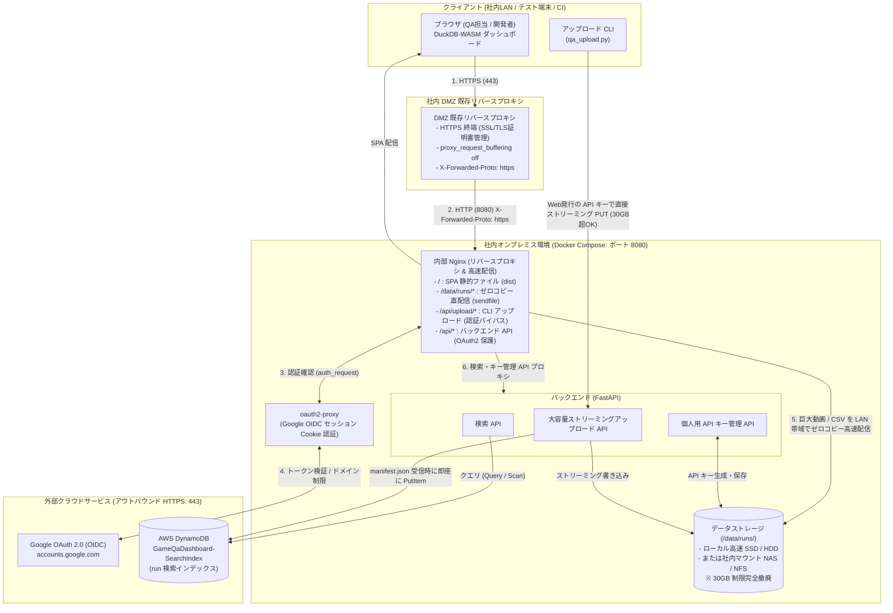

# アーキテクチャ設計書 — Game QA Analytics Dashboard [ARCHIVED / DEPRECATED]

> **注意 / NOTICE: 本ハイブリッド設計（AWS DynamoDB）は廃止されました**  
> `docs/architecture-improvement-plan.md` (Phase 3) に基づき、検索インデックスは AWS DynamoDB からバックエンド組み込みの **SQLite (WALモード)** へ完全移行しました。
> クラウド依存（AWS アカウント、DynamoDB、IAM ユーザー、CDK）は全廃され、完全オンプレミス自律構成として運用されています。
> 現在の推奨アーキテクチャ設計は [`docs/architecture-improvement-plan.md`](architecture-improvement-plan.md) を参照してください。

作成日: 2026-08-02  
改訂日: 2026-09-07（社内DMZオンプレミス移行、CloudFront 30GB制限撤廃、自律型ストレージ・APIキー管理、AWS DynamoDB ハイブリッド連携）
廃止日: 2026-09-07（Phase 3: SQLite WAL完全移行および AWS CDK / DynamoDB の完全廃止）

---

## 1. 背景と移行の目的

本リポジトリは、Unreal Engine 等のゲーム開発におけるテスト結果（FPS、メモリ使用量、UE ログ、キャプチャ動画、プロファイル、クラッシュダンプ）をブラウザ内の **DuckDB-WASM** で超高速に分析・可視化する QA ダッシュボードです。

初期設計では AWS 完全クラウド構成（CloudFront + S3 + Lambda@Edge）を採用していましたが、以下の課題を解決するため、**データ保存と Web サービスホスティングを社内 DMZ / オンプレミス環境へ移行**し、**検索インデックス（AWS DynamoDB）および Google アカウント認証とハイブリッド連携**する新アーキテクチャへ改訂しました。

1. **CloudFront の 30GB 単一ファイルサイズ制限の撤廃**:
   - 長時間のゲームプレイキャプチャ動画や高解像度動画、フルトレースダンプ等では 30GB を超えるファイルが発生しますが、CloudFront の単一オブジェクト上限（30GB）により配信・キャッシュが不可能でした。オンプレミス自律ストレージにより **ファイルサイズ上限を完全撤廃** しました。
2. **クラウド管理コスト・データ転送（エグレス）費用の削減**:
   - 大容量のゲーム動画を日々閲覧・共有することによる S3 ストレージ費用および CloudFront のエグレスデータ転送課金をゼロにしました。社内 LAN 帯域（1Gbps〜10Gbps+）をフル活用した高速配信を実現します。
3. **外部製品（MinIO等）非依存の自律型構成**:
   - サードパーティ製オブジェクトストレージ（MinIOなど）のライセンスリスクや保守終了リスクを排除し、標準的な Linux ディスク / 社内 NAS ＋ Nginx 静的配信により永続的に自社で保守可能な構成としました。

---

## 2. 全体アーキテクチャ概要



---

## 3. 主要コンポーネント仕様

### 1. Web サービスホスティング & 認証

- **DMZ 既存リバースプロキシ**:
  - 社外/社内からの HTTPS アクセスを終端し、SSL/TLS 証明書を一元管理。
  - 本サービス（Docker Compose）へ HTTP でフォワード。`X-Forwarded-Proto: https` を付与。
  - 詳細は [`docs/dmz-reverse-proxy-guide.md`](dmz-reverse-proxy-guide.md) を参照。
- **OAuth2-Proxy**:
  - 社内 Web アクセス時に Google アカウント認証（OpenID Connect）を実行。
  - `--email-domain` により会社ドメイン（例: `@example.com`）のユーザーのみにアクセスを制限。
  - 認証成功時にセッション Cookie を発行し、SPA、データファイル、API を一元保護。
- **内部 Nginx**:
  - `/`: フロントエンド SPA（React 19 + Vite 8 のビルド成果物）を配信。
  - `/data/runs/`: 大容量データファイルを直接配信。
  - `/api/`: バックエンド API へプロキシ。

### 2. 大容量データストレージ (30GB 制限撤廃 & 高速配信)

- **ファイル配置レイアウト**:

  ```text
  /data/runs/{run_id}/
      ├── fps_metrics.csv
      ├── memory_metrics.csv
      ├── ue.log
      ├── capture.mp4          # 元動画 (30GB 超の長時間の生キャプチャも可)
      ├── capture_web.mp4      # Web配信用軽量動画 (H.264/AAC, +faststart)
      └── manifest.json        # テスト結果メタデータ + 成果物一覧
  ```

- **Nginx ゼロコピー配信**:
  - `sendfile on;`, `tcp_nopush on;`, `aio threads;` を有効化。
  - HTTP Range リクエストにネイティブ対応。ブラウザの `<video>` タグによる 30GB〜100GB の 4K/60fps 動画のシーク再生や、DuckDB-WASM によるリモート CSV/JSON の部分フェッチが社内 LAN 帯域をフル活用して超高速に動作。

### 3. バックエンド API (FastAPI)

- **大容量ストリーミングアップロード (`/api/upload/runs/{run_id}/{file_name}`)**:
  - メモリにバッファせず、リクエストボディをディスクへ直接ストリーミング書き込み。
  - 子ファイル群を先行アップロードし、最後に `manifest.json` をアップロード。
  - `manifest.json` 受信完了時に、メタデータを自動抽出して AWS DynamoDB に `PutItem`。
- **個人用 API キー管理 (`/api/keys`)**:
  - Google ログインしているユーザーごとに、CLI アップロード用の個人 API キー（`gqa_live_...`）を発行・一覧・失効。
  - キーは暗号学的ハッシュ（SHA-256）で安全に保持。
- **検索 API (`/api/search`)**:
  - フロントエンドの検索画面からのリクエストに応じ、AWS DynamoDB からテスト実行結果をクエリして返却。

### 4. アップロード CLI (`cli/qa_upload.py`)

- **HTTP ストリーミングアップロード対応**:
  - `--server-url` と `--api-key` を指定することで、オンプレミス環境へ直接アップロード。
  - 毎回 Google ブラウザログインを行う必要がなく、CI や自動テスト端末から非対話で即座に実行可能。
  - 30GB ファイルサイズ制限は自動的にスキップされ、大容量ファイルもそのままアップロード可能。
- **S3 互換アップロードの維持**:
  - 従来の S3 アップロードモード（boto3）も後方互換性として維持。

---

## 4. AWS クラウドリソース（スリム化・最小権限設計）

最新構成において、AWS 側で管理するリソースは **DynamoDB テーブルとオンプレミス連携用 IAM ユーザーのみ** です。CloudFront、S3、Lambda@Edge、API Gateway、WAF 等はすべて廃止・停止対象となります。

### (1) CDK スタック構成 (`infra/lib/main-stack.ts`)

- **スタック名**: `GameQaDashboardStack`（単一リージョン: `ap-northeast-1`）
- **管理リソース**:
  1. **DynamoDB テーブル**: `GameQaDashboard-SearchIndex`
     - パーティションキー: `runId` (String)
     - 課金モード: `PAY_PER_REQUEST`（オンデマンド）
     - ポイントインタイムリカバリ (PITR): 有効
     - GSI:
       - `platform-index` (PK: `platform`, SK: `executedAt`)
       - `status-index` (PK: `status`, SK: `executedAt`)
       - `all-index` (PK: `gsiAllPk`, SK: `executedAt`)
  2. **オンプレミス専用 IAM ユーザー**: `GameQaDashboardOnpremUser`
  3. **最小権限 IAM ポリシー**: `GameQaDashboardOnpremDynamoDbAccess`（[`infra/onprem-dynamodb-policy.json`](../infra/onprem-dynamodb-policy.json)）
     - 上記テーブルおよび GSI に対する `dynamodb:GetItem`, `dynamodb:PutItem`, `dynamodb:Query`, `dynamodb:Scan` 等のみを許可。

---

## 5. 旧構成（AWS完全クラウド）との比較対比表

| 項目 | 旧構成 (AWS 完全クラウド) | **最新構成 (社内DMZオンプレミス + AWS DynamoDB)** |
| --- | --- | --- |
| **単一ファイルサイズ上限** | CloudFront の **30GB 制限** あり（超過ファイルは配信不可） | **制限なし**（サーバー/NASの容量がある限り TB 級まで対応） |
| **データ転送・管理コスト** | S3 ストレージ容量課金 ＋ CloudFront エグレス転送課金 | **転送・ストレージ費用ゼロ**（社内インフラ・LAN を活用） |
| **Web ホスティング** | S3App ＋ CloudFront (us-east-1 + ap-northeast-1) | **社内 DMZ リバースプロキシ ＋ Nginx**（シンプル・高速） |
| **Web 認証** | CloudFront + Lambda@Edge (Viewer Request OIDC) | **DMZ プロキシ ＋ OAuth2-Proxy (Google OIDC)** |
| **CLI 認証** | Google PKCE ログイン ＋ AWS STS WebIdentity (一時クレデンシャル) | Web 画面で発行した **個人用 API キー** による非対話認証 |
| **検索インデックス** | AWS DynamoDB (S3 Event Notification -> Lambda) | **AWS DynamoDB** (オンプレバックエンドから直接 PutItem) |
| **AWS 管理リソース** | CloudFront, Lambda@Edge, S3×2, API GW, Lambda×2, WAF×2, SecretsManager | **DynamoDB テーブル ＋ IAM ユーザーのみ** |
| **デプロイ・反映時間** | CDK デプロイで 10〜15 分（Lambda@Edge エッジ伝播待ち） | **Docker Compose で数秒**（手元で即座に完全再現可能） |

---

## 6. 関連ドキュメント

- [`docs/dmz-reverse-proxy-guide.md`](dmz-reverse-proxy-guide.md): 社内 DMZ 側リバースプロキシ（Nginx / Apache / ALB）の詳細設定ガイド
- [`onprem/.env.example`](../onprem/.env.example): オンプレミス Docker Compose 環境変数設定例
- [`infra/onprem-dynamodb-policy.json`](../infra/onprem-dynamodb-policy.json): オンプレミス連携用 DynamoDB 最小権限 IAM ポリシー
- [`cli/README.md`](../cli/README.md): アップロード CLI の使用手順書
