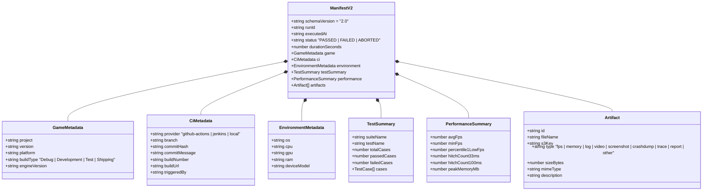
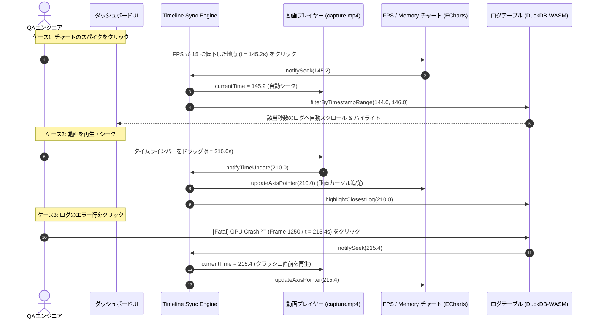
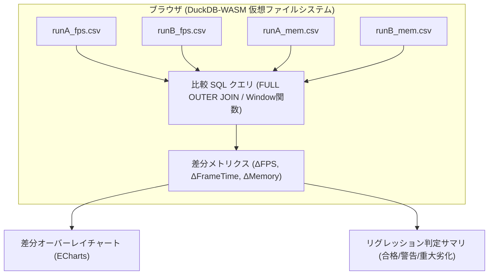
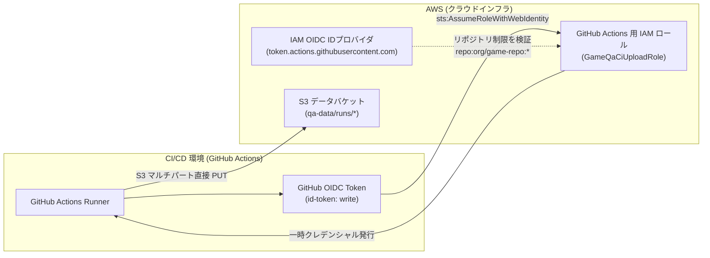
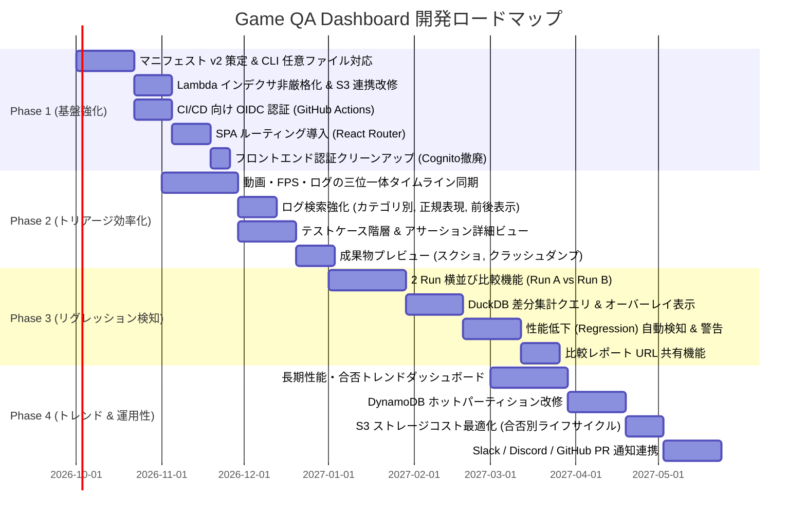

# Game QA Analytics Dashboard — 今後の開発計画書 (Development Plan)

- **作成日**: 2026-09-06
- **改訂日**: 2026-09-07（社内オンプレミス＋AWS DynamoDB ハイブリッド構成への移行注記）
- **ステータス**: ドラフト / 一部実装完了 (Phase 1〜4 先行実装あり)
- **対象プロダクト**: Game QA Analytics Dashboard (`game-db`)
- **想定用途**: ゲーム開発中のログ・プロファイルデータ（FPS、メモリ、描画時間等）および自動テスト結果の収集・蓄積・横断分析Webサービス

> [!IMPORTANT]
> **アーキテクチャ移行に関する注記 (2026-09-07)**:  
> 本計画書作成後、CloudFront の単一ファイル 30GB 制限の完全撤廃およびクラウド転送・ストレージコスト削減のため、データ保存・Web ホスティングを **社内 DMZ / オンプレミス環境（Nginx + OAuth2-Proxy + FastAPI + ローカルストレージ、個人用 API キー連携）** へ移行し、検索インデックス（**AWS DynamoDB**）とハイブリッド連携する構成へ改訂されました。  
> 最新のインフラ・運用構成の詳細は [`docs/aws-architecture.md`](aws-architecture.md) および [`docs/dmz-reverse-proxy-guide.md`](dmz-reverse-proxy-guide.md) を参照してください。本計画書における S3 / CloudFront / Lambda@Edge 前提の記述は、当時の課題分析および S3 互換アップロード運用時の参考情報として保持されています。

---

## 目次

1. [エグゼクティブサマリ](#1-エグゼクティブサマリ)
2. [現行実装の棚卸しと課題分析 (Gap Analysis)](#2-現行実装の棚卸しと課題分析-gap-analysis)
   - [2.1 フロントエンド (`my-qa-dashboard`)](#21-フロントエンド-my-qa-dashboard)
   - [2.2 データ登録 CLI (`cli/qa_upload.py`)](#22-データ登録-cli-cliqa_uploadpy)
   - [2.3 バックエンド & クラウドインフラ (`infra/`, `lambda/`)](#23-バックエンド--クラウドインフラ-infra-lambda)
   - [2.4 テスト & パイプライン検証環境 (`scripts/`)](#24-テスト--パイプライン検証環境-scripts)
   - [2.5 課題マトリクス一覧](#25-課題マトリクス一覧)
3. [目標アーキテクチャ & データモデル刷新](#3-目標アーキテクチャ--データモデル刷新)
   - [3.1 マニフェスト v2 仕様策定 (`manifest.v2.json`)](#31-マニフェスト-v2-仕様策定-manifestv2json)
   - [3.2 タイムライン同期エンジン (Timeline Sync Engine)](#32-タイムライン同期エンジン-timeline-sync-engine)
   - [3.3 DuckDB-WASM を活用した複数 Run 比較アーキテクチャ](#33-duckdb-wasm-を活用した複数-run-比較アーキテクチャ)
   - [3.4 DynamoDB スキーマ & クエリ最適化 (ホットパーティション解消)](#34-dynamodb-スキーマ--クエリ最適化-ホットパーティション解消)
   - [3.5 CI/CD 向け Machine-to-Machine 認証設計](#35-cicd-向け-machine-to-machine-認証設計)
4. [段階的開発ロードマップ (Phase 1 〜 Phase 4)](#4-段階的開発ロードマップ-phase-1--phase-4)
   - [Phase 1: CI/CD 連携基盤の強化 & メタデータ拡張 (基盤整備 / 1〜2ヶ月)](#phase-1-cicd-連携基盤の強化--メタデータ拡張-基盤整備--12ヶ月)
   - [Phase 2: トリアージ効率化 & 時系列同期ビューア (詳細分析の高度化 / 2〜3ヶ月)](#phase-2-トリアージ効率化--時系列同期ビューア-詳細分析の高度化--23ヶ月)
   - [Phase 3: 性能リグレッション検知 & 複数 Run 比較 (パフォーマンス分析 / 3〜4ヶ月)](#phase-3-性能リグレッション検知--複数-run-比較-パフォーマンス分析--34ヶ月)
   - [Phase 4: トレンドダッシュボード & エンタープライズ運用 (集計と運用性 / 4〜6ヶ月)](#phase-4-トレンドダッシュボード--エンタープライズ運用-集計と運用性--46ヶ月)
5. [技術仕様・実装詳細ガイド](#5-技術仕様実装詳細ガイド)
   - [5.1 マニフェスト v2 JSON スキーマ定義](#51-マニフェスト-v2-json-スキーマ定義)
   - [5.2 DuckDB-WASM 複数 Run 差分集計クエリの実装例](#52-duckdb-wasm-複数-run-差分集計クエリの実装例)
   - [5.3 CI/CD 連携設定例 (GitHub Actions ワークフロー)](#53-cicd-連携設定例-github-actions-ワークフロー)
6. [非機能要件・リスク管理・移行方針](#6-非機能要件リスク管理移行方針)
   - [6.1 DuckDB-WASM ブラウザメモリ管理](#61-duckdb-wasm-ブラウザメモリ管理)
   - [6.2 大容量アセットと S3 ストレージコスト最適化](#62-大容量アセットと-s3-ストレージコスト最適化)
   - [6.3 段階的データ移行と後方互換性保証](#63-段階的データ移行と後方互換性保証)
7. [直近のアクションアイテム (Next Steps)](#7-直近のアクションアイテム-next-steps)

---

## 1. エグゼクティブサマリ

### 1.1 プロジェクトのビジョン
本プロジェクト（`game-db`）は、**ゲーム開発における日々の自動テスト（スモークテスト、長時間ソークテスト、性能ベンチマーク、ボット自動プレイ等）から出力される膨大なログ・プロファイルデータ・実行結果を中央集約し、エンジニアや QA 担当者が瞬時に問題箇所を特定・分析できる統合 QA プラットフォーム** です。

従来のゲーム開発では、テスト結果やクラッシュダンプ、数十万行に及ぶエンジンログ（Unreal Engine 等）、CSV 形式のプロファイルメトリクスが各ビルドマシンや共有ファイルサーバに散逸し、以下の問題が発生していました：
- 「夜間テストでクラッシュしたが、どのコミットが原因か特定するのにログと動画を手作業で突き合わせる必要がある」
- 「あるステージでフレームレートが低下したが、前回ビルドと比べてどのスレッド（GameThread / RenderThread / GPU）が重くなったのか即座に比較できない」
- 「長時間の自動テストでメモリリークが発生している兆候に気づくのが遅れる」

本サービスは、**サーバーレス（S3 + CloudFront + DynamoDB）による極めて安価かつスケーラブルなストレージ基盤** と、**ブラウザ内 DuckDB-WASM による超高速なクライアントサイド SQL 分析** を組み合わせることで、サーバー側への重い集計負荷や高額な DB コストをゼロにしつつ、ミリ秒単位の快適なログ検索とメトリクス可視化を実現します。

### 1.2 本計画書の目的
現行リポジトリは、基本的な「ローカル DuckDB-WASM による FPS / メモリ / ログの単一 Run 可視化」「Google OIDC によるエッジ認証」「S3 イベント駆動インデックス」「Python CLI によるアップロード」という主要なアーキテクチャの骨格（MVP）が完成しています。

本計画書は、これを **「実プロダクションの自動テストパイプライン（CI/CD）と本格統合し、開発チーム全体が日常的に利用する QA プラットフォーム」** へと進化させるための課題分析、目標アーキテクチャ、および段階的な開発ロードマップを明確に定義するものです。

---

## 2. 現行実装の棚卸しと課題分析 (Gap Analysis)

### 2.1 フロントエンド (`my-qa-dashboard`)

#### 実装済みの機能
- **基盤技術**: React 19, TypeScript, Vite 8, Tailwind CSS v4, Lucide React, ECharts (`echarts-for-react`), DuckDB-WASM (`@duckdb/duckdb-wasm`).
- **DuckDB-WASM 統合 (`useDuckDB.ts`)**:
  - Web Worker + WASM バンドルによるブラウザ内 SQL エンジン。
  - S3/CloudFront 上の CSV/JSON を仮想ファイルシステムにバッファ登録し、`read_csv_auto` / `read_json_auto` で直接クエリ。
  - 大量行ログの JSON 文字列化オーバーヘッドを回避するバッファチャンク書き込み (`loadRowsAsTable`)。
- **データ可視化**:
  - `FpsChart`: `FPSMs`, `GameThread`, `RenderThread`, `GPUFrame`, `RHIThreadTime` のタイムラインプロット、レベル名ツールチップ、30FPS 基準線、ローカル CSV 読み込み。
  - `MemoryChart`: UE LLM (Low-Level Memory Tracker) CSV からカラムを動的抽出し、`TrackedTotal` + 任意選択系列の描画、ピークメモリ一覧表、ローカル CSV 読み込み。
  - `LogTable`: `ueLogParser.ts` による UE ログの高速パース（タイムスタンプ、フレーム、カテゴリ、ログレベル、メッセージ）。DuckDB テーブルへの格納と SQL `LIKE` / ログレベルフィルタによる検索。
  - `ArtifactsPanel`: 成果物一覧の表示、単一ダウンロード、および `client-zip` を用いたブラウザ内全成果物 ZIP アーカイブダウンロード。
  - `Gameplay Video`: `<video>` タグによる動画プレビュー（`capture.mp4`）。
- **検索 & 画面遷移**:
  - `SearchPage`: Game Version, Platform, Status による一覧検索（モック時は `runs.json`、API モード時は `/api/search` を呼び出し）。

#### 自動テスト運用上の課題 & ギャップ
1. **単一 Run のみの閲覧（比較機能の欠如）**:
   - 最大の課題。自動テストで最も重要な「前回成功した Run と今回の失敗 Run で何が変わったのか」「コミット A とコミット B で FPS やメモリ消費がどう変化したのか」を比較する機能が一切存在せず、1 件ずつ画面を行き来する必要がある。
2. **タイムラインの非同期（動画・メトリクス・ログの分断）**:
   - 動画再生時間、FPS チャートの経過時間（`ElapsedTime`）、ログのタイムスタンプ/フレーム番号が連動していない。動画で「画面がカクついた瞬間」を見ても、その瞬間の FPS スパイクやエラーログへジャンプできない。
3. **URL ルーティング & ディープリンクの未実装**:
   - すべての画面遷移が `App.tsx` 内の `view` state (`'search' | 'dashboard'`) で管理されており、ブラウザの URL は常に `/` のまま。
   - テスターやエンジニアが Slack 等で特定のテスト結果（例: `https://qa.example.com/runs/run-001`）や特定のログ行・特定秒数を共有することができない（リロードすると検索トップに戻る）。
4. **テストケース階層・アサーション詳細ビューの欠如**:
   - テスト結果が `PASSED` または `FAILED` の大まかなステータスしかなく、Gauntlet や UAT が出力する個別テストケース（例: `Maps.LoadTest.Level1: PASS`, `Combat.SpawnBoss: FAIL`）やアサーション失敗理由、コールスタックを表示する専用 UI がない。
5. **認証コードの残債**:
   - インフラ側が CloudFront + Lambda@Edge による Google OIDC エッジ認証へ移行したのに対し、フロントエンドコード（`src/auth/`）には旧 Cognito 時代の PKCE リダイレクトや Hosted UI の残債が残っており、アーキテクチャと不整合が生じている。

---

### 2.2 データ登録 CLI (`cli/qa_upload.py`)

#### 実装済みの機能
- **Google OAuth 2.0 PKCE 認証**: デスクトップアプリ用クライアント ID を用いたローカルループバック認証、トークンキャッシュ (`~/.config/game-qa/token.json`)、リフレッシュトークンによる非対話サイレント自動更新。
- **AWS STS 連携**: `AssumeRoleWithWebIdentity` により Google ID トークンを検証し、一時 IAM クレデンシャルを発行して S3 へ直接アクセス（開発者端末への IAM アクセスキー配布不要）。
- **アップロード制御**: 大容量ファイル（>= 8MB）の自動マルチパートアップロード、子ファイル（FPS/メモリ/ログ/動画）先行アップロード → `manifest.json` 最終アップロードによる原子的登録保証。
- **ローカル検証モード**: `--mock-auth`, `--endpoint-url`, `--profile` による moto / LocalStack 対応。

#### 自動テスト運用上の課題 & ギャップ
1. **固定 4 ファイルに限定された成果物認識**:
   - CLI 内部の `RECOGNIZED_FILES` が `fps_metrics.csv`, `memory_metrics.csv`, `ue.log`, `capture.mp4` の 4 つに固定されている。
   - 実際の自動テストで出力されるスクリーンショット (`screenshot_*.png`)、クラッシュダンプ (`.dmp`)、Unreal Insights トレースファイル (`.utrace`)、MemReport (`.memreport`)、JUnit/JSON テスト結果レポート、複数ログファイルを登録できない。
2. **CI/CD パイプライン向け非対話マシン認証の欠如**:
   - GitHub Actions、Jenkins、GitLab CI、TeamCity などのヘッドレス環境で動かす際、Google OAuth の対話ログインは行えない。
   - 現状は `--profile`（AWS 共有認証ファイル）に頼っているが、クラウドネイティブな CI/CD では **GitHub Actions OIDC (`token.actions.githubusercontent.com`) 連携** や、ビルドマシン向けの IAM ロール、API キー / Presigned URL 方式のサポートが不可欠。
3. **CI メタデータの不足**:
   - 引数が `--game-version`, `--platform`, `--test-name`, `--result`, `--avg-fps` のみ。
   - 自動テストの追跡に必須となる「Git ブランチ名」「コミットハッシュ」「ビルド番号」「ビルドコンフィグ (Debug/Development/Test/Shipping)」「テスト実行環境 (GPU/CPU/OS バージョン)」「失敗理由サマリ」が収集されていない。
4. **CLI 配布・インストールの容易性**:
   - リポジトリ内のスクリプトを直接実行する形式であり、ゲーム開発機やビルドエージェントに pip / uv 経由で手軽にグローバルインストールできるパッケージ（PyPI / wheel / 単一バイナリ）になっていない。

---

### 2.3 バックエンド & クラウドインフラ (`infra/`, `lambda/`)

> [!NOTE]
> 2026-09-07 のアーキテクチャ改訂により、Web ホスティング・大容量データ保存・API（アップロード/検索/キー管理）はオンプレミス環境 (`onprem/`) へ移行し、AWS 側は DynamoDB 検索インデックスのみを利用するハイブリッド構成となりました。以下は初期 AWS 完全クラウド構成時点の棚卸しです。

#### 実装済みの機能 (初期クラウド構成)
- **AWS CDK v2**: TypeScript による Infrastructure as Code。
- **EdgeStack (us-east-1)**:
  - WAFv2 WebACL (CloudFront スコープ)。
  - Secrets Manager による Google OAuth 設定管理。
  - Lambda@Edge (Viewer Request): Node.js 22 標準ライブラリによる Google JWT 検証、認可コード交換、セッション Cookie 発行、未認証時 302 リダイレクト。
- **MainStack (ap-northeast-1)**:
  - S3 SPA バケット & S3 Data バケット (OAC 経由配信、90日 Glacier 移行)。
  - DynamoDB `GameQaDashboard-SearchIndex` テーブル + 3 つの GSI (`platform-index`, `status-index`, `all-index`)。
  - `manifest-indexer` Lambda: S3 `ObjectCreated` (suffix: `manifest.json`) を検知し、DynamoDB へレコード登録。
  - `search` Lambda: `POST /api/search` を受け、GSI クエリとフィルタを実行。
  - CloudFront: SPA、`/data/*`、`/api/*` を単一ドメイン・単一 Cookie でエッジ保護。

#### 自動テスト運用上の課題 & ギャップ
1. **Lambda インデクサの厳格すぎる必須項目バリデーション**:
   - `manifest-indexer/index.py` において、`fps_key`, `memory_key`, `log_key` がすべて非空であることがハードコードされている。
   - 実際には「ログとテスト結果のみ出力される結合テスト」「FPS のみ計測するグラフィックベンチマーク」などがあり、どれか 1 つでも欠けるとインデックス作成が拒絶・スキップされてしまう。
2. **DynamoDB `all-index` のホットパーティション問題**:
   - 全件を新しい順に取得するため、`gsiAllPk = "ALL"` という固定値を全アイテムに設定している。
   - DynamoDB では単一パーティションキーあたりの書き込み/読み込みスループット（1,000 WCU / 3,000 RCU）の上限があり、数万件以上のテスト結果が蓄積されるとスロットリングの原因になる。
3. **検索機能の貧弱さ**:
   - 検索条件として「日付範囲（executedAt の From〜To）」「Git コミット / ブランチ」「テスト名あいまい検索」「所要時間」「ソート順変更」ができない。
   - サーバーサイドのページネーション（Limit & Offset / Cursor）がなく、最大 200 件の固定リミットのみ。
4. **CRUD エンドポイントの不足**:
   - `/api/search` しか存在せず、特定のテスト実行を削除する `/api/runs/{runId}` (DELETE) や、テスト結果に手動でコメントやバグトラッカー（Jira / GitHub Issues）のリンクを紐付けるアノテーション更新 API がない。
5. **S3 ライフサイクル管理の画一性**:
   - 一律 90 日で Glacier Instant Retrieval へ移行する設定になっているが、動画（数十〜数百 MB）や大容量トレースファイルは合格（PASS）したテストについては 14 日〜30 日で自動破棄し、失敗（FAILED）したテストのみ長期間保存するといったきめ細かなコスト最適化ができない。

---

### 2.4 テスト & パイプライン検証環境 (`scripts/`)

#### 実装済みの機能
- `scripts/test_local_pipeline.py`: `moto` を用いた完全ローカル・インメモリのパイプライン統合テスト（CLI → S3 → Indexer → DynamoDB → Search）。
- `my-qa-dashboard/scripts/generate_sample_data.py`: モックデータおよびサンプルデータ（run-001〜run-005）の自動生成。
- `docker-compose.local.yml` + `scripts/init-localstack.sh`: LocalStack によるエミュレーション環境。

#### 改善の余地
- フロントエンド（React）の自動テスト（Vitest / React Testing Library / Playwright）が存在しない。
- マニフェスト形式を変更した際のスキーマ検証テスト（JSON Schema バリデーション）が自動化されていない。

---

### 2.5 課題マトリクス一覧

| 領域 | 現状の実装 | 運用上の課題・制約 | 影響度 | 優先度 |
| :--- | :--- | :--- | :---: | :---: |
| **Frontend** | 単一 Run のメトリクス・ログ表示 | 複数 Run 比較（Diff、性能リグレッション特定）が不可 | **極大** | **P0** |
| **Frontend** | 動画・グラフ・ログが独立 | タイムラインが非同期で、障害発生時の原因特定に時間がかかる | **大** | **P0** |
| **Frontend** | URL ルーティングなし (`/` 固定) | 特定のテスト結果やログ行へのディープリンク共有が不可 | **大** | **P0** |
| **CLI** | 4 ファイル固定アップロード | スクリーンショット、ダンプ、任意成果物の収集が不可 | **大** | **P0** |
| **Backend** | fps/memory/log の全存在を強制 | ログ単体やテスト結果単体の Run がインデックスされない | **大** | **P0** |
| **CLI / Auth** | 対話型 Google OAuth 前提 | GitHub Actions / Jenkins 等のヘッドレス CI で実行困難 | **大** | **P0** |
| **Data Model** | 最小限のメタデータのみ | Git ブランチ、コミット、ビルド番号、ハードウェア情報が欠落 | **大** | **P1** |
| **Frontend** | 合否バッジ表示のみ | 個別テストケース・アサーションの階層結果が見えない | **中** | **P1** |
| **Backend** | DynamoDB `gsiAllPk = "ALL"` | テスト実行数の増加に伴いホットパーティション障害のリスク | **中** | **P1** |
| **Frontend** | 旧 Cognito 認証コード残存 | Lambda@Edge Google OIDC との設計不整合・デッドコード | **小** | **P1** |
| **Backend** | 一律 90 日 Glacier 移行 | 合格した大容量動画の不要な長期保管によるストレージコスト増 | **中** | **P2** |
| **Backend** | 検索 API のフィルタ不足 | 日付範囲、ブランチ、コミットでの絞り込みやソートが不可 | **中** | **P2** |
| **DevOps** | フロントエンド自動テスト不在 | リグレッション検知・UI 品質保証の自動化が不十分 | **中** | **P2** |

---

## 3. 目標アーキテクチャ & データモデル刷新

### 3.1 マニフェスト v2 仕様策定 (`manifest.v2.json`)

現在のマニフェスト（v1）の制約を解消し、あらゆるテストランナー（Unreal Engine Gauntlet, UAT, Custom Python Runner, Unity Test Framework 等）の出力に対応できる **マニフェスト v2** を定義します。



#### v2 の主要な設計原則
1. **成果物（Artifacts）の完全抽象化**:
   - `fps_key` などの固定キーを廃止し、`artifacts: []` 配列で任意の数の成果物を管理。
   - `type` 属性（`fps`, `memory`, `log`, `video`, `screenshot`, `crashdump`, `trace`, `report`, `other`）により、フロントエンド側で適切なビューア（ECharts, ログビューア, 画像モーダル, ダウンローダ）を自動選択。
2. **必須ファイルの撤廃**:
   - FPS や Memory が存在しないテスト（例: 純粋なロジックテストやネットワークテスト）でも、`log` またはテスト結果 JSON があれば正常に登録・閲覧可能。
3. **CI / バージョン管理メタデータの充実**:
   - Git ブランチやコミットハッシュを保持することで、「PR ごとの差分」「ブランチ単位の品質推移」の集計を可能にする。
4. **性能サマリの事前計算**:
   - 単なる `avg_fps` だけでなく、ゲーム開発で極めて重要な指標（**1% Low FPS** や **ヒッチフレーム数 (>= 33.3ms / >= 100ms)**）を CLI またはテスト実行側で事前算出してマニフェストに記録。これにより、大容量 CSV をダウンロードせずとも一覧画面で性能劣化を一目で把握可能。

---

### 3.2 タイムライン同期エンジン (Timeline Sync Engine)

障害調査（トリアージ）を爆速化するため、フロントエンドに **「動画・メトリクス・ログの三位一体タイムライン同期」** を導入します。



#### 実装アプローチ
- **共通時間軸の正規化**:
  - 動画: `currentTime` (秒単位の浮動小数点数)。
  - FPS CSV: `ElapsedTime` (秒単位)。
  - UE ログ: `ueLogParser.ts` で最初のエントリからの経過秒数 `timestamp` を計算済み。
  - すべて「テスト開始からの経過秒数 (sec)」を正規化キーとして保持し、React の Context または軽量イベントバス（`mitt` 等）を介して状態を同期。
- **再生追従とスロットリング**:
  - 動画再生中（`timeupdate` イベント）は高頻度（秒間 4〜10 回）で発火するため、ECharts の `axisPointer` 更新やログスクロールは `requestAnimationFrame` または 100ms スロットルで処理し、描画パフォーマンスを維持。

---

### 3.3 DuckDB-WASM を活用した複数 Run 比較アーキテクチャ

ブラウザ内の DuckDB-WASM を活用し、**サーバー側に負荷をかけずに 2 つ以上のテスト実行をミリ秒単位で比較 (Diff)** します。



#### DuckDB 比較クエリの例
```sql
-- 2つのRunの経過秒数（1秒ごとのバケット）で平均FPSとレンダリング負荷を突合
WITH run_a AS (
    SELECT 
        CAST(ROUND(ElapsedTime) AS INTEGER) AS sec,
        AVG(1000.0 / NULLIF(FPSMs, 0)) AS fps_a,
        AVG(GameThread) AS gt_a,
        AVG(RenderThread) AS rt_a,
        AVG(GPUFrame) AS gpu_a
    FROM read_csv_auto('runA_fps.csv')
    GROUP BY sec
),
run_b AS (
    SELECT 
        CAST(ROUND(ElapsedTime) AS INTEGER) AS sec,
        AVG(1000.0 / NULLIF(FPSMs, 0)) AS fps_b,
        AVG(GameThread) AS gt_b,
        AVG(RenderThread) AS rt_b,
        AVG(GPUFrame) AS gpu_b
    FROM read_csv_auto('runB_fps.csv')
    GROUP BY sec
)
SELECT 
    COALESCE(a.sec, b.sec) AS sec,
    a.fps_a,
    b.fps_b,
    (b.fps_b - a.fps_a) AS delta_fps,
    (b.rt_b - a.rt_a) AS delta_render_thread,
    (b.gpu_b - a.gpu_a) AS delta_gpu
FROM run_a a
FULL OUTER JOIN run_b b ON a.sec = b.sec
ORDER BY sec;
```
これにより、グラフ上で「Run B は 60 秒以降、RenderThread が Run A に比べて一貫して +12ms 重くなっている」といった原因追究が直感的に行えます。

---

### 3.4 DynamoDB スキーマ & クエリ最適化 (ホットパーティション解消)

#### 現状の課題と改定案
- **課題**: 現行の `all-index` (PK: `"ALL"`) は、全書き込み・全取得が単一パーティションに集中するため、大規模運用で必ずスロットリングを起こす。
- **改定設計**:
  1. **プロジェクト別パーティショニング**: パーティションキーに `projectId`（例: `GameA`, `GameB`）を使用。
  2. **時間軸バケット化 (Time-sharded GSI)**: 日付（年-月: `2026-09` 等）をパーティションキーに組み合わせることで、単一パーティションへの負荷を分散しつつ最新の実行を効率的に取得。
  3. **ブランチ別 GSI の新設**: 自動テストの主要ユースケースである「特定のブランチ（`main`, `release/v1.0`）における最新実行一覧」を高速にクエリ可能にする。

| テーブル / GSI 名 | パーティションキー (PK) | ソートキー (SK) | プロジェクション | 主な用途 |
| :--- | :--- | :--- | :--- | :--- |
| **メインテーブル** | `runId` (String) | — | — | Run 詳細・マニフェスト取得 |
| **GSI: `project-date-index`** | `project#yearMonth` (例: `MyGame#2026-09`) | `executedAt` (ISO8601) | ALL | フィルタ未指定時の最新テスト一覧 (ホットパーティション回避) |
| **GSI: `branch-index`** | `project#branch` (例: `MyGame#main`) | `executedAt` (ISO8601) | ALL | ブランチ別の時系列一覧 |
| **GSI: `platform-index`** | `project#platform` (例: `MyGame#PS5`) | `executedAt` (ISO8601) | ALL | プラットフォーム別絞り込み |
| **GSI: `status-index`** | `project#status` (例: `MyGame#FAILED`) | `executedAt` (ISO8601) | ALL | 失敗したテストのみの抽出 |

---

### 3.5 CI/CD 向け Machine-to-Machine 認証設計

開発者の手動実行だけでなく、GitHub Actions や Jenkins 等の自動テストエージェントから安全にアップロードするための認証方式を拡充します。



- **GitHub Actions OIDC 連携**:
  - AWS IAM OIDC ID プロバイダに `token.actions.githubusercontent.com` を追加。
  - GitHub Actions ワークフロー側は AWS シークレットキーを管理することなく、`aws-actions/configure-aws-credentials` で安全に STS クレデンシャルを取得し、CLI を実行可能。
- **ローカルビルドマシン / 社内 Jenkins 向け**:
  - IAM ロール（EC2/ECS インスタンスプロファイル）による既存の `--profile` 運用も完全互換で継続。
  - または、API Gateway 経由の署名付き URL (Presigned URL) 発行エンドポイント (`POST /api/upload-url`) を用意し、AWS SDK のセットアップすら不要な簡易アップロード手段を提供。

---

## 4. 段階的開発ロードマップ (Phase 1 〜 Phase 4)

プロジェクトを確実かつ段階的に進化させるため、以下の 4 フェーズに分割して開発を推進します。



---

### Phase 1: CI/CD 連携基盤の強化 & メタデータ拡張 (基盤整備 / 1〜2ヶ月)

**ゴール**: 自動テストパイプライン（CI）から任意の成果物を制限なく安全に登録でき、Web 画面上で URL 共有できる状態にする。

#### 主なタスク
1. **マニフェスト v2 策定と CLI 汎用ファイル対応**:
   - `manifest.v2.json` スキーマを確定。
   - `cli/qa_upload.py` を改修し、固定 4 ファイル以外のファイル（ワイルドカード `--files "screenshots/*.png"`, `--dir logs/` 等）を任意にアップロード可能にする。
   - CLI 引数に `--branch`, `--commit`, `--build-number`, `--project` などの CI メタデータを追加。
2. **Lambda インデクサ (`manifest-indexer`) の非厳格化**:
   - `REQUIRED_MANIFEST_FIELDS` から `fps_key`, `memory_key`, `log_key` を外し、部分的な成果物（ログのみ、テスト結果のみ）でも正常にインデックスされるように修正。
   - マニフェスト v1 と v2 の双方を透過的に解釈する後方互換レイヤーを実装。
3. **CI/CD 向け Machine 認証の公式導入**:
   - `infra/lib/main-stack.ts` に GitHub Actions OIDC プロバイダおよび CI 用 IAM ロール定義を追加。
   - GitHub Actions 向けワークフロー設定例（`.github/workflows/qa-upload-example.yml`）を提供。
4. **SPA URL ルーティング導入**:
   - `react-router` を導入し、画面遷移を URL と同期（`/` = 検索一覧, `/runs/:runId` = Run 詳細ダッシュボード）。
   - ブラウザのリロードで閲覧中データが保持され、URL をコピーしてチーム内で共有可能にする。
5. **フロントエンド認証コードのクリーンアップ**:
   - 旧 Cognito 向けの残債（`useAuthGuard.ts`, `pkce.ts`, `login.ts`, `CallbackPage.tsx` 等）を削除・整理。
   - Lambda@Edge がエッジで認証を完了している前提とし、未認証リダイレクト処理をシンプル化。

#### 成果物
- 拡張版 `qa_upload.py`
- 改定版 `manifest-indexer/index.py` & `search/index.py`
- ルーティング対応フロントエンド (`/runs/:runId`)
- CI 連携ドキュメント

---

### Phase 2: トリアージ効率化 & 時系列同期ビューア (詳細分析の高度化 / 2〜3ヶ月)

**ゴール**: テスト失敗時の調査時間を 1/10 に短縮する高機能な統合デバッグ UI の提供。

#### 主なタスク
1. **三位一体タイムライン同期エンジン**:
   - 動画再生時間、FPS/メモリチャートのカーソル位置、ログテーブルの行表示をリアルタイムに同期。
   - チャート上のドロップ地点をクリックすると、動画が該当秒数にシークし、ログテーブルがその瞬間のログへジャンプ。
2. **ログ解析機能の強化 (`LogTable.tsx`)**:
   - カテゴリ別チェックボックスフィルタ（`LogRenderer`, `LogMemory`, `LogTemp` 等）。
   - 正規表現による高速全文検索。
   - エラー/ワーニング発生時の「前後 50 行コンテキスト表示」モード。
   - ログのブックマーク / URL パラメータによる特定行ハイライト（`?logLine=1420`）。
3. **階層型テスト結果ビューア**:
   - Gauntlet / UAT / JUnit 形式のテスト結果 JSON をパースし、テストスイート ＞ テストケース別の成否・実行時間・エラー理由をツリー表示する専用パネルを追加。
4. **成果物プレビューアの拡張**:
   - スクリーンショット一覧のモーダル拡大表示。
   - テキスト成果物（設定ファイル、クラッシュログ、MemReport）のインラインテキストビューア。
   - クラッシュダンプ (`.dmp`) のダウンロードおよびスタックトレース表示連携。
5. **検索ページの機能拡張 (`SearchPage.tsx`)**:
   - 日付範囲ピッカー（過去 24 時間、過去 7 日間、カスタム範囲）。
   - ブランチ名・コミットハッシュ・テスト名によるインクリメンタル絞り込み。
   - 合否ステータス別バッジ集計（Passed: 42, Failed: 3）。

#### 成果物
- タイムライン同期 UI コンポーネント
- 強化版 `LogTable`
- テストケースツリービューア
- スクリーンショットギャラリーモーダル

---

### Phase 3: 性能リグレッション検知 & 複数 Run 比較 (パフォーマンス分析 / 3〜4ヶ月)

**ゴール**: 「前回のビルドと比べてどこが重くなったのか」を DuckDB-WASM で瞬時に特定し、性能低下を未然に防ぐ。

#### 主なタスク
1. **2 Run 横並び比較モード (Diff Viewer)**:
   - 検索画面で「比較対象（ベースライン Run と検証 Run）」を 2 件選択し、比較画面へ遷移。
   - サマリ比較: 平均 FPS 差分（例: `-5.2 fps`）、ピークメモリ差分（例: `+180 MB`）、実行時間差分。
2. **メトリックオーバーレイチャート**:
   - ECharts 上に Run A（実線）と Run B（破線）の FPS / レンダリングスレッド時間 / メモリ推移を重ね合わせ表示。
   - 差分系列（`Run B - Run A`）のグラフ表示により、重くなった区間（レベル・シーン）を即座に特定。
3. **DuckDB-WASM 複数データ結合パイプライン**:
   - `loadRemoteFile` で 2 つの Run の CSV を仮想 FS に登録し、ブラウザ内 SQL で `FULL OUTER JOIN` して差分テーブルを動的生成。
4. **性能リグレッションの自動警告**:
   - 事前に設定したしきい値（例: 「ベースライン比で平均 FPS が 5% 以上低下」「ヒッチ数が 20 回以上増加」「メモリ消費が 10% 以上増加」）を超えた場合に自動で警告バッジ・サマリを表示。
5. **比較レポートのワンクリック共有**:
   - 比較状態を URL（`/compare?base=run-001&target=run-002`）で永続化し、エンジニア同士で Slack 共有可能にする。

#### 成果物
- 複数 Run 比較ビュー (`ComparePage.tsx`)
- DuckDB 差分集計フック
- リグレッション自動判定ロジック

---

### Phase 4: トレンドダッシュボード & エンタープライズ運用 (集計と運用性 / 4〜6ヶ月)

**ゴール**: スタジオ全体の品質・性能推移を鳥瞰できるダッシュボードの構築と、大規模運用におけるコスト・安定性の担保。

#### 主なタスク
1. **ブランチ別・長期間パフォーマンストレンドダッシュボード**:
   - `main` ブランチにおける直近 30 日間の平均 FPS 推移、メモリ推移、テスト通過率を折れ線グラフで可視化。
   - ビルド（コミット）ごとの性能推移を一覧表示し、どのコミットで性能劣化が始まったかを追跡可能にする。
2. **DynamoDB スキーマ改定とホットパーティション解消**:
   - `all-index` を廃止し、`project#yearMonth` をパーティションキーとした時間軸分散設計へ移行。
   - 過去データの移行スクリプトを実行。
3. **S3 ストレージライフサイクルのインテリジェント化**:
   - 合格したテストの動画 (`capture.mp4`) および大容量トレースは 14 日で自動削除。
   - 失敗したテストの全成果物は 90 日間保持し、その後 Glacier へ移行。
   - これにより、ストレージコストを最大 70% 削減。
4. **外部通知・CI フィードバック連携**:
   - テスト完了時、特に FAILED またはリグレッション検出時に Slack / Discord チャンネルへ結果サマリとダッシュボード URL を自動通知（Webhook Lambda）。
   - GitHub Pull Request への自動コメント連携（「この PR により FPS が +2.1% 改善しました」等のフィードバック）。
5. **マルチプロジェクト（複数ゲームタイトル）対応**:
   - 単一のダッシュボードで複数のゲームタイトルを切り替えて閲覧・管理できるワークスペース機能の追加。

#### 成果物
- トレンド分析ダッシュボード
- 改定版 CDK スタック (`infra/`)
- Slack / GitHub PR 通知 Lambda
- ストレージライフサイクル最適化ルール

---

## 5. 技術仕様・実装詳細ガイド

### 5.1 マニフェスト v2 JSON スキーマ定義

```json
{
  "$schema": "https://json-schema.org/draft/2020-12/schema",
  "title": "GameQaTestRunManifestV2",
  "type": "object",
  "required": [
    "schema_version",
    "run_id",
    "executed_at",
    "status",
    "game",
    "artifacts"
  ],
  "properties": {
    "schema_version": { "type": "string", "const": "2.0" },
    "run_id": { "type": "string" },
    "executed_at": { "type": "string", "format": "date-time" },
    "status": { "type": "string", "enum": ["PASSED", "FAILED", "ABORTED"] },
    "duration_seconds": { "type": "number" },
    "game": {
      "type": "object",
      "required": ["project", "version", "platform"],
      "properties": {
        "project": { "type": "string" },
        "version": { "type": "string" },
        "platform": { "type": "string" },
        "build_type": { "type": "string", "enum": ["Debug", "Development", "Test", "Shipping"] },
        "engine_version": { "type": "string" }
      }
    },
    "ci": {
      "type": "object",
      "properties": {
        "provider": { "type": "string" },
        "branch": { "type": "string" },
        "commit_hash": { "type": "string" },
        "commit_message": { "type": "string" },
        "build_number": { "type": "string" },
        "build_url": { "type": "string", "format": "uri" },
        "triggered_by": { "type": "string" }
      }
    },
    "environment": {
      "type": "object",
      "properties": {
        "os": { "type": "string" },
        "cpu": { "type": "string" },
        "gpu": { "type": "string" },
        "ram_gb": { "type": "number" },
        "device_model": { "type": "string" }
      }
    },
    "test_summary": {
      "type": "object",
      "properties": {
        "suite_name": { "type": "string" },
        "test_name": { "type": "string" },
        "total_cases": { "type": "integer" },
        "passed_cases": { "type": "integer" },
        "failed_cases": { "type": "integer" },
        "error_message": { "type": "string" }
      }
    },
    "performance": {
      "type": "object",
      "properties": {
        "avg_fps": { "type": "number" },
        "min_fps": { "type": "number" },
        "percentile_1_low_fps": { "type": "number" },
        "hitch_count_33ms": { "type": "integer" },
        "hitch_count_100ms": { "type": "integer" },
        "peak_memory_mb": { "type": "number" }
      }
    },
    "artifacts": {
      "type": "array",
      "items": {
        "type": "object",
        "required": ["file_name", "s3_key", "type"],
        "properties": {
          "file_name": { "type": "string" },
          "s3_key": { "type": "string" },
          "type": {
            "type": "string",
            "enum": [
              "fps",
              "memory",
              "log",
              "video",
              "screenshot",
              "crashdump",
              "trace",
              "report",
              "other"
            ]
          },
          "size_bytes": { "type": "integer" },
          "mime_type": { "type": "string" },
          "description": { "type": "string" }
        }
      }
    }
  }
}
```

---

### 5.2 DuckDB-WASM 複数 Run 差分集計クエリの実装例

フロントエンド（`useDuckDB.ts`）で Run A と Run B の FPS データをそれぞれロードし、1 つの ECharts 用データセットへ整形する TypeScript 関数の実装例です：

```typescript
export interface FpsDiffMetric {
  second: number;
  fpsA: number | null;
  fpsB: number | null;
  deltaFps: number | null;
  renderThreadA: number | null;
  renderThreadB: number | null;
  deltaRenderThread: number | null;
}

export async function queryFpsComparison(
  executeQuery: <T>(sql: string) => Promise<T[]>,
  runAFileName: string,
  runBFileName: string,
): Promise<FpsDiffMetric[]> {
  const sql = `
    WITH a AS (
      SELECT 
        CAST(ROUND(ElapsedTime) AS INTEGER) AS sec,
        AVG(1000.0 / NULLIF(FPSMs, 0)) AS fps,
        AVG(RenderThread) AS rt
      FROM read_csv_auto('${runAFileName}')
      GROUP BY sec
    ),
    b AS (
      SELECT 
        CAST(ROUND(ElapsedTime) AS INTEGER) AS sec,
        AVG(1000.0 / NULLIF(FPSMs, 0)) AS fps,
        AVG(RenderThread) AS rt
      FROM read_csv_auto('${runBFileName}')
      GROUP BY sec
    )
    SELECT 
      COALESCE(a.sec, b.sec) AS second,
      ROUND(a.fps, 2) AS fpsA,
      ROUND(b.fps, 2) AS fpsB,
      ROUND(b.fps - a.fps, 2) AS deltaFps,
      ROUND(a.rt, 2) AS renderThreadA,
      ROUND(b.rt, 2) AS renderThreadB,
      ROUND(b.rt - a.rt, 2) AS deltaRenderThread
    FROM a
    FULL OUTER JOIN b ON a.sec = b.sec
    ORDER BY second ASC;
  `;
  return executeQuery<FpsDiffMetric>(sql);
}
```

---

### 5.3 CI/CD 連携設定例 (GitHub Actions ワークフロー)

GitHub Actions のテストジョブ完了後に、自動的にテスト結果と成果物を S3 へ登録するワークフロー定義例です：

```yaml
name: Nightly Game QA Test & Upload

on:
  schedule:
    - cron: '0 18 * * *' # 日本時間 午前3時
  workflow_dispatch:

permissions:
  id-token: write # AWS STS AssumeRoleWithWebIdentity (OIDC) に必須
  contents: read

jobs:
  run-tests-and-upload:
    runs-on: [self-hosted, windows, game-runner]
    steps:
      - name: Checkout Repository
        uses: actions/checkout@v4

      - name: Configure AWS Credentials via OIDC
        uses: aws-actions/configure-aws-credentials@v4
        with:
          role-to-assume: arn:aws:iam::123456789012:role/GameQaCiUploadRole
          aws-region: ap-northeast-1

      - name: Execute Unreal Engine Gauntlet Tests
        id: run_test
        continue-on-error: true
        run: |
          RunUAT.bat RunUnreal -project="MyGame" -test="Level1_Perf_Test" -build=Shipping -log -savestate -artifactdir="./test_output"

      - name: Set up Python
        uses: actions/setup-python@v5
        with:
          python-version: '3.12'

      - name: Install uv
        uses: astral-sh/setup-uv@v5

      - name: Upload QA Artifacts to S3
        if: always()
        run: |
          uv run cli/qa_upload.py upload \
            --bucket qa-data \
            --run-dir ./test_output \
            --run-id "nightly-${{ github.run_id }}" \
            --project "MyGame" \
            --game-version "v1.3.0" \
            --platform "Windows" \
            --test-name "Level1_Perf_Test" \
            --branch "${{ github.ref_name }}" \
            --commit "${{ github.sha }}" \
            --build-number "${{ github.run_number }}" \
            --result "${{ steps.run_test.outcome == 'success' && 'PASSED' || 'FAILED' }}"
```

---

## 6. 非機能要件・リスク管理・移行方針

### 6.1 DuckDB-WASM ブラウザメモリ管理
- **リスク**: 長時間のテスト（数時間のソークテスト）では、CSV やログファイルが数千万行（数百 MB〜数 GB）に達し、ブラウザの WebAssembly ヒープ上限（4GB）に抵触してクラッシュする恐れがある。
- **対策方針**:
  1. **ダウンサンプリングクエリ**: ECharts での描画用に全件をそのまま渡さず、DuckDB 側で時間バケットごとの集約（`GROUP BY CAST(ElapsedTime * 2 AS INT) / 2.0` など秒間 2 サンプル程度）を行い、JS ヒープへ渡す行数を数千〜数万行に抑制。
  2. **Run 切り替え時の確実な解放**: 新しい Run を開く際は、仮想 FS 上の既存ファイルを `db.dropFile()` で確実に破棄し、DuckDB コネクションをリフレッシュする。
  3. **ファイルサイズ警告**: 100MB を超える大容量ファイルを開く際は、事前にプログレスバーと「集約モードで読み込み中」のトースト通知を表示。

### 6.2 大容量アセットと S3 ストレージコスト最適化
- **リスク**: 毎日数十件の自動テストが動画（1 件あたり 100MB〜1GB）をアップロードし続けると、S3 ストレージ費用が急速に増大する。
- **対策方針**:
  1. **合否によるライフサイクルの分離**:
     - `runs/{runId}/capture.mp4` について、マニフェストインデクサ Lambda がテスト結果を判定し、`status: PASSED` の Run の動画には S3 オブジェクトタグ `Retention=Short`（14日で自動失効）を付与。
     - `status: FAILED` の Run は原因調査のために `Retention=Long`（90日保持後 Glacier 移行）とする。
  2. **動画エンコードの最適化**:
     - テストランナー側で H.264 / 720p / 30fps に圧縮してアップロードする推奨プロファイルを整備。

### 6.3 段階的データ移行と後方互換性保証
- **リスク**: マニフェスト形式を v2 に変更した際、すでに S3 および DynamoDB に登録されている v1 形式のデータが読み込めなくなる。
- **対策方針**:
  1. **デュアルリーダー (Dual-Reader) 設計**:
     - `manifest-indexer/index.py` およびフロントエンドの `SearchService` は、`schema_version` が存在しない場合は自動的に v1 スキーマとしてフォールバックパースを行う。
  2. **DynamoDB の非破壊拡張**:
     - DynamoDB テーブルは NoSQL 特性を活かし、既存属性（`fpsKey` 等）を残しつつ、新規属性（`artifacts`, `branch`, `commitHash` 等）を追加。既存アイテムを破壊することなく段階的に新スキーマへ移行。

---

## 7. 直近のアクションアイテム (Next Steps)

本計画を円滑に始動させるため、直近の 2 週間で着手すべき優先アクションを以下にまとめます：

1. **マニフェスト v2 仕様の確定 & JSON Schema 作成**:
   - `schemas/manifest.v2.schema.json` を配置し、バリデーションスクリプトを作成。
2. **`manifest-indexer` の必須フィールド緩和 (クイックウィン)**:
   - `fps_key`, `memory_key`, `log_key` がなくても DynamoDB へインデックスできるよう `REQUIRED_MANIFEST_FIELDS` を修正し、部分的なテストデータが登録できるようにする。
3. **フロントエンドのルーティング導入 (`react-router`)**:
   - URL を `/runs/:runId` でアクセスできるようにし、テスト結果への直接リンク共有を可能にする。
4. **フロントエンド認証コードの整理**:
   - 旧 Cognito 向けのデッドコードを削除し、エッジ OIDC 前提のクリーンな構造にリファクタリング。
5. **CLI の成果物任意登録オプション拡張**:
   - `--files` または追加引数で任意のファイルを S3 にアップロードし、マニフェスト v2 の `artifacts` 配列に登録可能にする。

---
*以上、Game QA Analytics Dashboard 今後の開発計画書*
